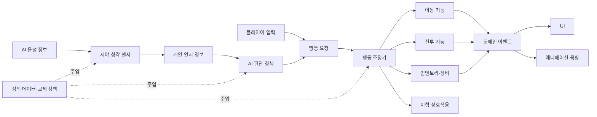

# THE LAST COMBAT — 전투·잠입 기능 구조 기획서

> 문서 목적: 전투·잠입 기능을 구현하기 위한 시스템 책임, 데이터 흐름, 교체 지점과 확장 규칙을 정의한다.  
> 최우선 품질 속성: **기능의 확장성·교체성, 낮은 의존성**  
> 문서 상태: 작업 초안  
> 최종 수정: 2026-07-22  
> 상위 규칙: [전투·잠입 게임플레이 기획서](./전투·잠입%20게임플레이%20기획서.md)

## 1. 문서 경계

이 문서는 플레이 감각이나 최종 밸런스 수치보다 기능 간 책임과 데이터 흐름을 다룬다.

- 게임플레이 기획서: 플레이어가 무엇을 할 수 있고 어떤 결과를 경험하는가
- 기능 구조 기획서: 해당 결과를 만들기 위해 어떤 시스템과 교체 가능한 규칙이 필요한가

규칙이 충돌할 경우 게임플레이 기획서를 우선한다. 아직 확정되지 않은 구현 방식은 특정 기술로 고정하지 않고, 바꿀 수 있는 경계부터 정의한다.

## 2. 최우선 개발 원칙

기획을 살리기 위해 구현 방향이 반복해서 바뀔 가능성이 높다. 따라서 다음 원칙을 기능 수보다 먼저 지킨다.

1. **구성과 상속을 분리한다.** 거대한 플레이어·적 상속 트리를 만들지 않고, 캐릭터에 필요한 기능을 컴포넌트처럼 조합한다.
2. **데이터와 실행 로직을 분리한다.** 수치·에셋·태그는 정의 데이터에, 실제 행동은 교체 가능한 실행 객체에 둔다.
3. **상위 시스템은 구체 클래스가 아니라 역할에 의존한다.** AI 판단은 `권총 클래스`가 아니라 `발사 가능한 무기` 인터페이스를 사용한다.
4. **변경 가능성이 큰 규칙을 정책으로 분리한다.** 감지 계산, 총기 발사, 재장전, 장비 사용, AI 판단과 행동 취소 규칙을 교체 가능한 정책으로 둔다.
5. **상태의 원본은 하나만 둔다.** 탄약, 현재 장비, 체력, 현재 행동과 전투 이력을 여러 시스템이 중복 소유하지 않는다.
6. **시스템 사이 통지는 이벤트로 전달한다.** UI·음향·애니메이션이 전투 로직을 직접 호출하거나 소유하지 않는다.
7. **AI는 항상 개인 단위로 유지한다.** 중앙 그룹 상태나 공용 판단 블랙보드를 만들지 않는다.
8. **패턴을 위한 패턴은 만들지 않는다.** 실제로 교체 가능성이 높은 경계에만 인터페이스와 전략을 둔다.

## 3. 전체 구조



주요 모듈:

| 모듈 | 책임 | 알면 안 되는 것 |
|---|---|---|
| 캐릭터 코어 | 체력, 행동 조정, 기능 보유 여부 | 플레이어 키 배치, 특정 AI 트리 |
| 입력 어댑터 | 실제 입력을 의미 있는 행동 요청으로 변환 | 총기 내부 발사 계산 |
| AI 인지 | 시야·소리·음성 이벤트 생성과 수신 | 어떤 행동을 선택할지 |
| 개인 인지 정보 | AI 한 명이 아는 사실과 이번 판단 입력 | 다른 AI의 내부 상태 |
| AI 판단 정책 | 판단 입력으로 행동 요청 생성 | 애니메이션 재생 방식 |
| 행동 조정기 | 행동 시작·진행·완료·취소와 충돌 관리 | 구체적인 무기 수치 |
| 총기·장비 | 장착, 사용, 소모, 효과 실행 | HUD 배치 |
| UI 표현 | 읽기 전용 상태 표시 | 탄약·체력의 원본 소유 |

## 4. 공통 캐릭터와 기능 조합

플레이어와 AI는 최소한의 공통 캐릭터 코어를 사용한다.

공통 구성 요소:

- 체력·피격 처리
- 이동과 자세
- 행동 조정기
- 인벤토리
- 총기 장착·사용
- 근접전
- 지형 상호작용
- 도메인 이벤트 발행

입력 주체만 다르게 연결한다.

- 플레이어: 입력 어댑터가 행동 요청을 만든다.
- AI: 판단 정책이 행동 요청을 만든다.

플레이어 전용 기능은 `플레이어인가?` 조건문을 공통 캐릭터 곳곳에 넣지 않고 기능 보유 여부로 판정한다.

- 투척 기능
- 붕대 사용 기능
- 붙잡기 기능
- 암살 기능
- 좁은 공간 통과 기능

AI 역시 같은 이동·전투 기능을 사용할 수 있지만, 좁은 공간 통과 기능을 부여하지 않는다. 이 구조에서는 향후 특정 AI에게 새 능력을 허용할 때 캐릭터 상속 구조를 바꿀 필요가 없다.

## 5. 행동 시스템

### 5.1 행동 객체

조준, 발사, 재장전, 이동, 엄폐, 피격, 붙잡힘과 암살을 동일한 행동 수명 주기로 처리한다.

```text
행동 요청
  → 시작 가능 검사
  → 시작
  → 실행
  → 완료 또는 취소
  → 결과 이벤트
  → 재인지·다음 판단
```

행동이 제공해야 할 공통 계약:

```text
CanStart(context)
Start(context)
Tick(deltaTime)
Complete(result)
Cancel(reason)
GetInterruptPolicy()
GetRequiredChannels()
```

행동을 객체로 분리하는 방식은 **Command 패턴**에 해당한다. 캐릭터나 AI 판단 코드가 모든 행동의 세부 구현을 직접 알지 않아도 된다는 장점이 있다.

### 5.2 행동 채널

행동은 자신이 점유할 기능 채널을 선언한다.

- 이동
- 상체
- 손·장비
- 시선·조준
- 전신

예를 들어 이동 사격은 이동과 상체 행동을 함께 허용할 수 있지만, 피격 경직이나 암살은 전신을 점유한다. 어떤 조합을 허용할지는 행동 데이터로 조정한다.

### 5.3 행동 완료 후 재인지

AI의 기본 순환은 다음과 같다.

> 인지 → 판단 → 행동 → 행동 완료 → 재인지

새 시야·소리·음성 정보가 도착하면 `PerceptionInbox`와 개인 인지 정보는 즉시 갱신한다. 그러나 이것만으로 현재 행동을 자동 취소하거나 즉시 새 판단을 실행하지 않는다. 행동이 완료된 뒤 최신 정보를 사용해 다음 판단을 수행한다.

이렇게 하면 “정보는 실시간으로 들어오지만 AI가 매 프레임 결정을 뒤집지는 않는” 동작을 만들 수 있다.

### 5.4 강제 행동과 취소 정책

플레이어가 AI에게 직접 영향을 주는 사건은 높은 우선순위의 강제 행동을 요청한다.

- 피격·경직
- 근접 피격
- 붙잡힘
- 암살
- 사망

예시:

```text
사격 중 피격
  → 사격 행동 Cancel(Hit)
  → 피격 행동 Start
  → 피격 행동 Complete
  → 재인지
  → 판단
```

피격 직후가 아니라 피격 행동 완료 후 재인지한다.

취소 정책은 행동별로 교체 가능하게 둔다.

| 정책 | 의미 | 초기 사용 |
|---|---|---|
| 취소 불가 | 사망 같은 최상위 사건 외에는 끝까지 수행 | 짧은 확정 연출 |
| 강제 취소만 | 피격·붙잡힘 등 강제 사건만 취소 | 대부분의 AI 행동 기본값 |
| 지정 구간 취소 | 애니메이션·이동의 안전한 지점에서만 새 정보로 취소 | 추후 긴 이동 행동에 검토 |
| 상시 취소 | 조건이 바뀌면 즉시 취소 | 초기 버전에서는 사용하지 않음 |

초기 구현은 `강제 취소만`을 기본값으로 삼는다. 기획 변경 시 행동 객체의 취소 정책만 바꾸고 인지·판단 시스템 전체를 수정하지 않도록 한다.

### 5.5 애니메이션과 로직 분리

애니메이션은 행동을 표현하고 특정 시점에 알림을 줄 수 있지만, 전투 규칙의 원본이 되어서는 안 된다.

- 행동 객체가 사용 비용, 피해, 무적과 완료 상태를 소유한다.
- 애니메이션 알림은 효과 적용 프레임이나 전환 가능 구간을 행동 객체에 알려 준다.
- 애니메이션이 교체되어도 행동의 외부 계약은 유지한다.

## 6. 인벤토리와 장비

### 6.1 정의 데이터와 실행 인스턴스

아이템은 두 층으로 나눈다.

- **ItemDefinition:** 이름, 아이콘, 분류, 최대 소지량, 장착 정보처럼 변하지 않는 데이터
- **ItemInstance/RuntimeState:** 현재 수량, 탄약, 내구도, 선택 슬롯처럼 플레이 중 변하는 상태

인벤토리는 다음 상태의 유일한 원본이다.

- 보유 아이템과 수량
- 보유 총기
- 총기 빠른 전환 슬롯 1·2
- 현재 장착 아이템
- 현재 선택한 투척 장비
- 붕대 수량

### 6.2 의미 기반 입력

실제 키는 다음 의미 요청으로 변환된다.

```text
EquipOrToggleFirearm
EquipThrowable
EquipBandage
OpenInventory
UseEquippedItem
```

총기 키 처리:

1. 비총기 장비를 든 상태면 마지막 총기 슬롯을 장착한다.
2. 총기를 든 상태면 슬롯 1과 2를 토글한다.
3. 비어 있는 슬롯은 건너뛰거나 입력 실패 이벤트를 반환한다.

키 배치를 바꿔도 인벤토리와 장비 로직은 바뀌지 않는다.

### 6.3 장비 공통 데이터의 ‘사용 방식’

`사용 방식`은 장비의 구체적인 효과가 아니라 **입력을 받은 뒤 사용이 끝날 때까지의 흐름**이다.

결정하는 내용:

- 조준이 필요한가
- 누르기·홀드·놓기 중 어떤 입력을 쓰는가
- 준비 시간과 사용 시간이 있는가
- 효과가 어느 시점에 발생하는가
- 수량을 어느 시점에 소모하는가
- 이동을 허용하는가
- 취소할 수 있는가
- 취소 시 수량을 돌려주는가

예시:

| 장비 | 사용 흐름 | 실제 효과 |
|---|---|---|
| 투척무기 | 조준 → 누름/홀드 → 놓기 → 투척 | 투사체 생성과 충돌 효과 |
| 붕대 | 홀드 → 사용 시간 진행 → 완료 | 체력 회복 |

사용 흐름과 실제 효과는 분리한다. 단순한 `switch(ItemType)`로 모든 장비를 처리하지 않고, 장비가 `IUseBehavior`를 참조하도록 한다. 이는 **Strategy 패턴**이다.

```text
IUseBehavior
  - CanUse(context)
  - BeginUse(context)
  - UpdateUse(context)
  - CommitEffect(context)
  - CancelUse(context, reason)
```

새 장비를 추가할 때는 정의 데이터와 사용 전략·효과만 등록한다. 캐릭터, 입력, UI의 공통 코드는 수정하지 않는 것을 목표로 한다.

## 7. 총기 시스템

총기는 공통 정의 데이터와 교체 가능한 정책의 조합으로 구성한다.

### 7.1 총기 정의 데이터

- 고유 ID와 표시 이름
- 사용하는 탄약 종류
- 탄창 크기
- 최대 예비 탄약
- 피해량
- 발사 간격
- 유효 거리
- 기본 명중률과 반동
- 조준 속도
- 재장전 시간
- 장착·교체 시간
- 애니메이션과 UI 아이콘
- 발사·재장전·약실 정책 참조

### 7.2 교체 가능한 총기 정책

- `IFirePolicy`: 단발, 연사 등 발사 흐름
- `IReloadPolicy`: 탄창 교체, 한 발씩 장전 등 재장전 흐름
- `IChamberPolicy`: 볼트액션처럼 발사 후 약실 조작이 필요한 규칙
- `IAimPolicy`: 조준 오차와 조준 수렴
- `IRecoilPolicy`: 반동 계산
- `IHitPolicy`: 히트스캔이나 투사체 판정

볼트액션소총과 권총은 같은 총기 계약을 사용하고 서로 다른 데이터·정책을 조합한다. 새 총기를 추가할 때 AI나 플레이어 클래스에 총기 종류별 조건문을 추가하지 않는다.

### 7.3 탄약 원본

- 현재 탄창 탄약은 장착된 총기 인스턴스가 소유한다.
- 예비 탄약은 인벤토리의 탄약 자원이 소유한다.
- UI는 두 원본을 읽기 전용으로 조합해 `탄창 / 예비`를 표시한다.

플레이어와 AI는 동일한 `CanAim`, `CanFire`, `CanReload`, `RequestFire` 계약을 사용한다. 차이는 요청을 만드는 주체와 조준 정책에 둔다.

## 8. 자원·수집·UI

자원 정의 데이터:

- 자원 ID
- 자원 종류
- 최대 소지량
- 줍기 단위
- UI 아이콘
- 관련 탄약·장비 ID

줍기 시스템은 `Inventory.TryAdd(resourceId, amount)` 같은 공통 계약만 호출한다. 최대 소지량이 바뀌어도 픽업 객체는 수정하지 않는다.

UI는 이벤트를 구독해 읽기 전용 표시 모델을 갱신한다.

- `HealthChanged`
- `EquippedItemChanged`
- `MagazineAmmoChanged`
- `ReserveAmmoChanged`
- `ItemQuantityChanged`
- `QuickFirearmSlotsChanged`

UI가 체력·탄약·수량을 직접 변경하지 않는다. 이는 시스템 간 직접 의존성을 줄이는 **Observer/Event 패턴**이다.

## 9. AI 상태 구조

### 9.1 개인 AI 컨텍스트

각 AI는 자기 컨텍스트만 소유한다.

```text
AIContext
  - CurrentMode
  - HasCombatHistory
  - PerceptionInbox
  - PersonalKnowledge
  - CurrentAction
  - CurrentIntent
  - Inventory/WeaponState
```

중앙 그룹 컨텍스트, 그룹 멤버십과 그룹 공용 플레이어 위치는 두지 않는다.

### 9.2 전투 이력 래치

```text
HasCombatHistory: bool
```

- 초기값은 `false`다.
- 직접 발견 또는 신뢰 가능한 전투 정보 수신 시 `true`가 된다.
- 해당 전투 구역이 초기화되기 전에는 다시 `false`가 되지 않는다.

값의 형태는 불리언이지만 매번 켜고 끄는 토글이 아니라 한 번 켜지면 유지되는 **래치**다. 이 값을 전투 이력의 단일 원본으로 사용한다.

### 9.3 상위 상태 전환

```text
Alert
  → 의심 소리·정보 → PreCombatSearch
  → 플레이어 확인·전투 보고 수신 → Combat

PreCombatSearch
  → 제한 시간 동안 단서 없음 → Alert
  → 플레이어 확인·전투 보고 수신 → Combat

Combat
  → 전투 구역 초기화 전까지 Combat 유지
```

기존의 `Combat → Search` 상위 상태 전환은 사용하지 않는다. 전투 후 플레이어를 잃은 상황은 `Combat` 내부 추적 의도로 처리한다.

### 9.4 전투 내부 의도

전투 내부 의도는 상위 상태가 아니라 현재 판단 결과다.

- `Engage`: 직접 사격 가능한 접촉
- `Track`: 마지막 위치·소리·전달 정보를 추적
- `Reposition`: 엄폐나 사격각 확보
- `Pressure`: 위협사격과 진입로 압박
- `CloseCombat`: 근접전과 거리 조절

의도를 고정된 하위 상태 머신으로 구현할 수도 있고, 점수 기반 판단 결과로 매번 도출할 수도 있다. 외부에는 `CurrentIntent` 계약만 노출하여 내부 구현을 교체 가능하게 둔다.

### 9.5 최초 발견 반응

전투 이력이 없는 AI가 플레이어를 처음 확정하면 `놀람/대응` 행동을 먼저 수행한다.

```text
플레이어 확정
  → HasCombatHistory = true
  → Combat 진입
  → 최초 대응 행동
  → 행동 완료
  → 재인지
  → 공격·이동 판단
```

놀라는 행동 길이 자체가 최초 반응 지연이다. 전투 이력이 있는 AI가 플레이어를 재발견할 때는 이 행동을 생략하고, 현재 행동 규칙에 따라 공격·이동을 판단한다.

## 10. 인지 프레임워크

### 10.1 센서 계약

시야와 청각은 동일한 출력 형태를 만드는 독립 센서로 둔다.

```text
IPerceptionSensor
  → PerceptionEvent
```

`PerceptionEvent` 공통 정보:

- 이벤트 ID
- 감각 종류
- 정보 종류
- 발생 위치
- 대상
- 원본 발생 시각
- 수신 시각
- 신뢰도·강도
- 발생 주체
- 선택적 정보 페이로드

시야·청각 계산을 바꿔도 AI 판단은 같은 이벤트 계약을 사용한다.

### 10.2 임시 인지와 개인 지식

- `PerceptionInbox`: 다음 판단에서 소비할 최신 시야·소리·음성 이벤트
- `PersonalKnowledge`: 직접 확인한 플레이어 위치, 마지막 확정 위치, 전투 이력처럼 판단 사이에 유지해야 하는 개인 정보
- `ActionContext`: 현재 행동이 사용 중인 목표 위치와 대상의 스냅샷

장기 소리 기억은 두지 않는다. 소리 이벤트는 판단 때 소비하며, 선택한 조사 위치만 행동 컨텍스트로 복사한다.

새 정보가 들어오면 Inbox와 필요한 개인 지식을 즉시 갱신한다. 현재 행동은 자신의 취소 정책에 따라 유지하거나 취소한다.

### 10.3 최신 정보 규칙

각 AI는 받은 정보 중 원본 발생 시각이 가장 최신인 유효 정보를 우선한다.

- 수신 시각이 아니라 원본 발생 시각을 비교한다.
- 같은 시각이면 직접 시야, 직접 소리, 음성 전달 순으로 신뢰도를 우선한다.
- 같은 종류라면 강도·신뢰도가 높은 정보를 우선한다.
- 이미 처리한 이벤트 ID는 중복 적용하지 않는다.

## 11. 시야 센서

### 11.1 판정 단계

1. 최대 감지 거리의 넓은 후보 검사
2. 수평·수직 시야각 검사
3. 머리·가슴·골반 판정 지점 가시선 검사
4. 보이는 지점과 가중치로 노출 비율 계산
5. 거리·자세·이동·수풀 보정
6. 현재 상태의 시각 감도 프로필 적용
7. 감지 수치 누적 또는 감소
8. 임계값을 넘으면 시각 인지 이벤트 생성

### 11.2 판정 지점

판정 지점은 배열 데이터로 관리한다.

```text
VisionTargetPoint
  - Bone/Socket
  - Weight
  - Enabled
```

초기값은 머리·가슴·골반 3개를 권장한다. 숫자를 코드에 고정하지 않으므로 성능과 플레이 감각에 따라 2개나 5개로 바꿀 수 있다.

### 11.3 상태별 감도 프로필

하나의 시야 센서에 상태별 프로필을 주입한다.

- 최대 거리 보정
- 시야각 보정
- 감지 누적 속도
- 감지 감소 속도
- 확정 임계값

경계·색적·전투마다 별도 센서를 만들지 않는다. 공통 계산과 프로필 데이터를 분리해 튜닝과 교체를 쉽게 한다.

## 12. 청각 센서

### 12.1 소리 이벤트 데이터

```text
SoundEvent
  - EventId
  - SoundType
  - Origin
  - Source
  - BaseRadius
  - BaseIntensity
  - FalloffProfile
  - OcclusionProfile
  - Timestamp
  - OptionalInformationPacket
```

- `BaseRadius`는 후보 AI를 찾는 최대 범위이자 소리의 절대 차단 거리다.
- `BaseIntensity`는 범위 안에서 최종적으로 들리는 강도의 시작값이다.
- `FalloffProfile`은 거리에 따라 얼마나 빨리 약해지는지 정한다.
- `OcclusionProfile`은 벽·문·큰 장애물이 소리를 얼마나 감쇠하는지 정한다.

### 12.2 최종 강도 계산

```text
FinalIntensity
= BaseIntensity
× DistanceFalloff
× ObstacleAttenuation
× MovementSpeedModifier
× PostureModifier
× ListenerStateSensitivity
```

```text
인지 조건:
FinalIntensity >= HearingThreshold + AmbientNoiseFloor
```

거리 감쇠와 장애물 계산은 `IAcousticPropagation` 뒤에 둔다. 초기에는 거리 곡선과 단순 가시선 차폐를 사용하고, 나중에 다중 레이·문 상태·공간 포털 방식으로 교체해도 소리 발생 코드에는 영향이 없게 한다.

### 12.3 사용·제외 규칙

사용:

- 행동별 기본 거리와 강도
- 거리 감쇠
- 장애물 감쇠
- 이동 속도·자세 보정
- 상태별 작은 청각 감도 보정
- 환경 백색 소음과 최종 임계값
- 정확한 소리 위치

제외:

- 바닥 재질 보정
- 일반 주변 물체 충돌음
- 소리 위치 오차
- 장기 소리 기억 타이머

## 13. AI 간 실시간 정보 전달

### 13.1 중앙 그룹 제거

사용하지 않는 구조:

- 동적 그룹 생성·병합·분리
- 그룹 공용 전투 상태
- 그룹 공용 최신 플레이어 위치
- 그룹 단위 행동 배정

모든 AI는 개인 인지 정보만 가진다.

### 13.2 음성 정보 패킷

AI의 보고는 음성 `SoundEvent`에 정보 패킷을 붙여 전달한다.

```text
InformationPacket
  - MessageType
  - Subject
  - WorldPosition
  - Confidence
  - OriginTimestamp
  - SenderId
  - OriginEventId
  - CombatConfirmed
```

메시지 예시:

- 플레이어 발견
- 마지막 확인 위치
- 소리 조사 위치
- 이동·엄폐 요청
- 측면 이동 알림
- 지원 요청

처리 흐름:

```text
AI가 정보 발화
  → 음성 SoundEvent 생성
  → 수신 AI별 청각 계산
  → 임계값을 넘긴 AI만 InformationPacket 수신
  → 각 AI의 PerceptionInbox·PersonalKnowledge 갱신
  → 각 AI가 자기 행동 규칙에 따라 독립 판단
```

정보가 수신되는 즉시 인지 정보는 갱신하지만 현재 행동을 무조건 취소하지는 않는다.

전투 이력이 없는 AI가 `CombatConfirmed` 정보를 유효하게 수신하면 `HasCombatHistory = true`가 되고 전투에 진입한다. 단순 지원 요청이나 불확실한 소리 위치는 자동 전투 진입 조건이 아니다.

같은 보고가 끝없이 전달되는 것을 막기 위해 `OriginEventId`로 중복을 제거한다. 초기 버전에서는 다른 AI에게서 전달받은 정보를 자동으로 재전파하지 않고, 자신이 직접 새 사실을 인지하거나 정보가 의미 있게 바뀐 경우에만 다시 발화한다.

### 13.3 독립적인 협력

협력은 다음 두 종류의 정보로 만든다.

- 들을 수 있는 음성 정보
- 주변 공간의 사용 상태

엄폐물·사격 지점 예약 서비스는 같은 위치를 동시에 선택하는 것을 막는 공간 관리 도구다. 전술 결정을 지시하지 않으며 그룹 블랙보드로 사용하지 않는다.

각 AI는 다음을 보고 독립적으로 행동한다.

- 다른 AI가 이동 중인지
- 주변 엄폐가 예약되어 있는지
- 어느 방향에서 사격·음성이 발생했는지
- 자신이 가진 플레이어 위치 확신도
- 자신에게 가능한 이동·사격각

## 14. AI 판단 정책

### 14.1 교체 가능한 판단기

AI 판단은 다음 계약으로 감싼다.

```text
IDecisionPolicy.Decide(DecisionSnapshot) → ActionRequest
```

`DecisionSnapshot`에는 읽기 전용 정보만 넣는다.

- 현재 상위 상태와 전투 이력
- 현재 전투 의도
- 최신 시야·소리·음성 정보
- 플레이어 위치와 확신도
- 플레이어와의 거리
- 플레이어 조준·사격 방향
- 현재 무기와 탄약
- 주변 엄폐·사격각·이동 가능 지형
- 주변 AI의 보이는 행동과 예약된 위치
- 현재 행동 결과

내부 구현은 Utility AI, Behavior Tree, StateTree 또는 규칙 기반 선택으로 교체할 수 있다. 판단기는 행동을 직접 실행하지 않고 `ActionRequest`만 반환한다. 이 분리는 **Strategy + Adapter 패턴**에 해당한다.

### 14.2 전술 질의

판단기가 월드 구현을 직접 뒤지지 않도록 질의 인터페이스를 둔다.

- `ICoverQuery`
- `IFiringAngleQuery`
- `ITraversalQuery`
- `IThreatQuery`
- `ISpaceReservationQuery`

레벨 탐색 방식이 바뀌어도 판단 정책의 입력과 출력 계약은 유지한다.

### 14.3 주요 판단 결과

- 현재 위치 유지와 견제
- 장거리 엄폐 이동
- 새로운 사격각 확보
- 측면 이동
- 직접 사격
- 위협사격
- 재장전
- 총기 교체
- 전투 내부 추적
- 근접 접근
- 회피와 반격
- 거리 벌리기
- 음성 보고·지원 요청

## 15. 원거리 전투 정책

### 15.1 거리대별 정책

거리대는 데이터 프로필로 분리한다.

- 장거리: 엄폐 위치, 엄폐 간 이동, 열린 사격각 확보를 높게 평가
- 근거리: 이동 사격, 측면 이동, 거리 조절과 근접 전환을 높게 평가

거리 기준은 밸런스 데이터이며 판단 코드에 숫자로 고정하지 않는다.

### 15.2 플레이어 사격 방향 회피

플레이어가 사격 중일 때 이동 후보를 평가한다.

1. 플레이어의 조준·사격 방향을 위험 축으로 만든다.
2. 후보 이동 경로가 위험 축을 향해 정면으로 접근하는지 계산한다.
3. 정면 접근 후보의 점수를 크게 낮추거나 제외한다.
4. 측면 이동과 엄폐 이동을 우선한다.
5. 사격 방향에서 충분히 각이 벌어진 후보는 정면·대각선 이동을 허용한다.

이 규칙은 `IMovementRiskPolicy`로 분리해 각도와 가중치를 교체 가능하게 둔다.

### 15.3 위협사격 행동

`ThreatFireAction`의 기본 시작 조건:

- 플레이어 위치 확신도가 기준 이상이다.
- 직접 피해 사격각은 없거나 불완전하다.
- 엄폐 가장자리, 예상 노출 통로 또는 마지막 확인 지점에 안전한 탄도가 있다.
- 아군 오사 위험이 허용치 이하이다.
- 사용 가능한 탄약이 있다.

행동 결과:

- 일정 시간 또는 일정 발수만 사격
- 압박한 위치와 시간을 개인 지식에 기록
- 필요하면 이동 음성 정보를 발화
- 완료 후 재인지·판단

단단한 장애물 너머의 플레이어에게 직접 피해를 주는 사격으로 구현하지 않는다. 위협사격 위치 선택, 확신도 기준과 탄약 소비는 각각 정책·데이터로 분리한다.

## 16. 근접·붙잡기·암살 구조

### 16.1 근접전

공격, 회피, 피격 경직과 런지는 독립 행동으로 만든다. 연속 공격은 여러 공격 행동을 연결하는 콤보 정의 데이터로 구성한다.

- 공격 활성 구간
- 회피 가능 구간
- 피격 경직과 후딜레이
- 런지 거리
- 연속 공격 연결 조건
- 회피 후 반격 가능 시점

### 16.2 암살 질의

플레이어의 암살 기능은 `IAssassinationQuery`에 다음을 요청한다.

- 대상이 전투 상태가 아닌가
- 대상과의 거리가 기준 이내인가
- 대상 후방 각도 안인가
- 대상이 플레이어를 현재 시각 확정하지 않았는가
- 대상이 다른 강제 행동 중이 아닌가

조건이 맞지 않으면 일반 근접 공격 요청으로 전환한다.

### 16.3 붙잡기와 무적 범위

붙잡기는 플레이어와 피해자의 행동 조정기를 함께 잠그는 결합 행동이다.

- 플레이어 이동 속도 배율 적용
- 피해자는 이동 동기화와 암살만 허용
- 플레이어 피격 시 두 캐릭터의 붙잡기 행동 취소
- 피해자에게 `Release` 행동 실행

암살 무적은 전역 불리언을 직접 켜고 끄지 않고 범위가 명확한 핸들로 관리한다.

```text
AssassinationAction.Start
  → AcquireInvulnerabilityToken

AssassinationAction.Complete/Cancel
  → ReleaseInvulnerabilityToken
```

붙잡고 이동하는 동안에는 토큰을 발급하지 않는다. 암살 확정 후 조작 잠금 시점부터 종료 후 조작 반환 시점까지만 적용한다.

## 17. 지형 상호작용

지형은 구체 클래스 이름보다 기능 태그와 이동 링크를 제공한다.

```text
TraversalLink
  - TraversalType
  - RequiredCapability
  - EntryTransform
  - ExitTransform
  - MovementProfile
```

기능 태그 예시:

- `Cover.Low`
- `Cover.High`
- `Traversal.Vault`
- `Traversal.Climb`
- `Traversal.CrawlSpace`
- `Concealment.Grass`

플레이어는 `Traversal.CrawlSpace` 기능을 가지지만 AI는 가지지 않는다. 새 지형 행동을 추가할 때 캐릭터 종류별 조건문보다 기능 보유 여부를 확인한다.

## 18. 적용할 디자인 패턴과 역할

| 패턴·원칙 | 적용 위치 | 얻는 효과 |
|---|---|---|
| 컴포지션 우선 | 캐릭터 능력, 무기, 장비 | 상속 트리 변경 없이 기능 추가·제거 |
| Strategy | AI 판단, 감지 계산, 장비 사용, 발사·재장전 | 규칙 구현을 통째로 교체 가능 |
| Command/Action | 이동, 공격, 재장전, 피격, 암살 | 공통 수명 주기와 취소 규칙 |
| State/계층 상태 | 경계·색적·전투와 행동 상태 | 전투 전 상태와 전투 내부 의도 분리 |
| Observer/Event | UI, 음향, 애니메이션, 인지 통지 | 시스템 간 직접 참조 감소 |
| Factory/Registry | 총기·장비·행동 생성 | 종류별 거대 `switch` 제거 |
| Adapter | 플레이어 입력, AI 판단기, 엔진 기능 연결 | 내부 구현이 바뀌어도 공통 계약 유지 |
| Dependency Inversion | 상위 AI·캐릭터가 인터페이스에 의존 | 구체 구현을 테스트 대역이나 새 구현으로 교체 |

### 18.1 새 총기 추가 예시

1. 총기 정의 데이터를 만든다.
2. 기존 발사·재장전·조준 정책을 조합한다.
3. 필요한 특수 규칙만 새 정책으로 구현한다.
4. 총기 레지스트리에 ID를 등록한다.
5. 플레이어·AI·UI 공통 코드는 수정하지 않는다.

### 18.2 AI 판단 방식 교체 예시

1. 기존 `IDecisionPolicy` 입력과 `ActionRequest` 출력을 유지한다.
2. 규칙 기반 판단기를 새 Utility AI 또는 Behavior Tree 어댑터로 교체한다.
3. 행동 객체와 인지 센서는 그대로 재사용한다.
4. 동일한 판단 스냅샷으로 두 구현을 비교 테스트한다.

## 19. 피해야 할 구조

- 플레이어와 AI의 모든 기능을 하나의 거대 캐릭터 클래스에 작성
- 총기·장비 종류마다 곳곳에 `switch` 또는 형변환 추가
- AI 판단 코드가 애니메이션을 직접 재생하고 완료를 소유
- UI가 체력·탄약·아이템 수량을 직접 변경
- 시야 센서가 공격 행동을 직접 실행
- 정보 수신 즉시 모든 행동을 무조건 취소
- 중앙 그룹 객체가 모든 AI의 전투 상태와 목표 위치를 강제
- 같은 상태를 인벤토리, 무기, UI가 각각 따로 저장
- 아직 필요하지 않은 모든 경우를 추상화해 복잡도만 늘리는 구조

## 20. 진단과 테스트 지원

기획 변경과 튜닝을 빠르게 하려면 결과뿐 아니라 판단 근거를 화면에서 확인할 수 있어야 한다.

필수 디버그 표시:

- 현재 상위 상태, 전투 이력과 전투 의도
- 현재 행동, 점유 채널, 취소 정책과 남은 시간
- 머리·가슴·골반 시야선과 지점별 노출 결과
- 시야 감지 누적값과 적용된 보정
- 소리 기본 강도, 거리·장애물·자세·상태 보정과 최종 강도
- 청각 임계값과 인지 성공 여부
- 마지막으로 받은 정보의 종류·발신자·원본 시각
- 플레이어 위치 확신도와 정보 출처
- 이동 후보 점수와 탈락 이유
- 위협사격 시작·실패 이유
- 엄폐·사격 지점 예약 상태

최소 자동 테스트:

- 전투 이력이 한 번 생기면 구역 초기화 전까지 해제되지 않는다.
- 전투 이력이 있는 AI가 경계·전투 전 색적으로 전환하지 않는다.
- 피격이 사격을 취소하고 피격 행동 완료 후에만 재판단한다.
- 임계값 미만 소리는 인지 정보를 만들지 않는다.
- 같은 정보 이벤트를 중복 수신해도 한 번만 적용한다.
- 음성을 듣지 못한 AI는 전달 정보를 얻지 못한다.
- 새 총기·장비 등록이 캐릭터 코드 변경 없이 가능하다.
- UI 탄약 표시가 총기 탄창과 인벤토리 예비 탄약 원본을 따른다.

## 21. 구현 순서

한 번에 모든 추상화를 만들지 않고 작은 수직 기능 단위로 검증한다.

1. 공통 캐릭터, 행동 조정기와 강제 피격 흐름
2. 인벤토리, 총기 슬롯, 권총과 탄약 UI
3. 볼트액션소총과 교체 가능한 총기 정책 검증
4. 시야·청각 센서와 개인 인지 정보
5. 경계·전투 전 색적·전투 상태와 전투 이력
6. 직접 사격, 엄폐 이동과 전투 내부 추적
7. 음성 정보 전달과 독립 판단
8. 위협사격, 측면 이동과 공간 예약
9. 근접전, 붙잡기와 암살
10. 투척무기, 붕대와 추가 장비 확장 검증
11. 디버그 시각화, 자동 테스트와 밸런스 튜닝

각 단계에서 최소 한 개의 실제 구현으로 인터페이스가 충분한지 검증한 뒤 다음 추상화를 추가한다.

## 22. 결정해야 할 데이터

### 캐릭터·행동

- 행동별 점유 채널
- 행동별 취소 정책과 취소 가능 구간
- 피격·근접 경직과 후딜레이
- 붙잡기 이동 속도 배율
- 암살 거리, 후방 각도와 무적 프레임

### 총기·장비·자원

- 총기별 탄창, 예비 탄약과 세부 수치
- 자원별 최대 소지량
- 장착·교체·사용·재장전 시간
- 여러 투척 장비의 선택 방식
- 장비별 사용 흐름과 비용 소모 시점

### AI 상태와 판단

- 전투 전 색적에서 경계로 돌아가는 시간
- 최초 대응 행동 길이
- 전투 내부 의도별 선택 기준
- 장거리·근거리 경계값
- 위치 확신도 증가·감소 규칙
- 전투 구역과 추적 반경 확장 규칙

### 시야

- 최대·즉시 감지 거리와 시야각
- 판정 지점 수·가중치·최소 노출 조건
- 자세·이동·수풀·거리 보정
- 감지 누적·감소 속도와 임계값
- 상태별 시각 감도 프로필

### 청각·정보 전달

- 행동·음성별 기본 거리와 강도
- 거리 감쇠 곡선과 장애물 감쇠
- 이동 속도·자세 보정
- 상태별 청각 감도
- 환경 백색 소음과 인지 임계값
- 메시지 종류별 신뢰도와 전투 확정 여부
- 정보 재발화 조건

### 전투 전술

- 플레이어 사격 방향의 정면 위험 각도
- 정면 이동을 다시 허용하는 최소 이탈 각도
- 위협사격 확신도·안전각·사격 시간·발수
- 엄폐·사격 지점 예약 유지 시간
- AI 간 최대 거리 안전장치가 실제로 필요한지 여부

## 23. 확정 결정 기록

### 2026-07-22

- 프로젝트 게임 제목을 `THE LAST COMBAT`으로 확정했다.
- 기본 전투 경험을 도주 중심이 아닌 장기 총격전으로 정의했다.
- 전투 후 수색은 별도 상위 `Search`가 아니라 `Combat` 내부 추적으로 처리한다.
- 전투 이력은 구역 초기화 전까지 유지되는 불리언 래치로 관리한다.
- 중앙 그룹 상태·그룹 공용 정보 구조를 제거했다.
- 정보는 음성 소리 이벤트로 전달하고, 수신한 AI가 개인 인지를 갱신해 독립 판단한다.
- 정보 수신은 즉시 인지 정보를 갱신하지만 기본적으로 현재 행동을 취소하지 않는다.
- 초기 행동 취소는 강제 사건 중심으로 사용하며, 일반 취소는 행동별 정책으로 확장 가능하게 둔다.
- 위치를 확신한 적은 완전한 직접 사격각이 없어도 안전한 방향으로 위협사격할 수 있다.
- 장거리는 엄폐 이동과 사격, 근거리는 이동 사격과 거리 조절을 우선한다.
- 시야는 머리·가슴·골반의 다중 판정 지점을 사용한다.
- 청각은 기본 거리·강도, 거리·장애물 감쇠, 이동·자세·상태 보정과 최종 임계값을 사용한다.
- 바닥 재질, 일반 물체 충돌음, 소리 위치 오차와 장기 소리 기억은 사용하지 않는다.
- 기능의 확장성·교체성과 낮은 의존성을 구현의 최우선 기준으로 둔다.
