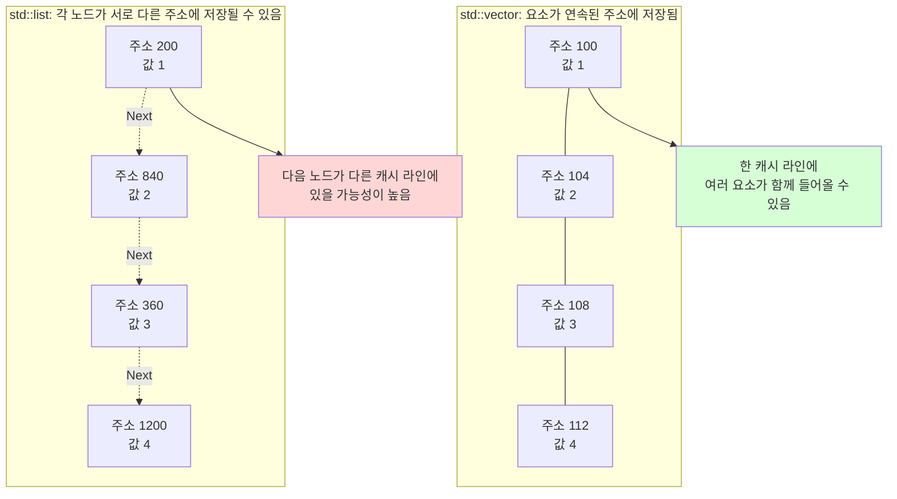

# Cache Locality(캐시 지역성)

> [!summary]
> **Cache Locality(캐시 지역성)**는 프로그램이 최근 사용한 데이터나 그 주변 데이터를 다시 사용할 가능성이 높은 성질이다.
> `vector`는 요소가 연속적으로 배치되어 공간적 지역성과 하드웨어 프리페칭에 유리하다. 반면 `list`는 노드가 서로 떨어져 있을 수 있고 포인터를 따라가야 하므로 순회 시 캐시를 효율적으로 사용하기 어렵다.

---

## 지역성의 종류

- **시간적 지역성(Temporal Locality)**: 최근 접근한 데이터에 가까운 시점에 다시 접근할 가능성이 높다.
- **공간적 지역성(Spatial Locality)**: 접근한 데이터와 인접한 메모리에 곧 접근할 가능성이 높다.

### 캐시 계층

CPU는 메인 메모리인 RAM보다 훨씬 빠르게 동작한다. CPU가 매번 RAM의 데이터를 기다리면 많은 시간이 낭비되므로, 자주 사용할 데이터를 CPU 가까이에 있는 작은 캐시에 보관한다.

일반적으로 캐시는 다음과 같은 계층으로 구성된다.

| 계층 | 특징 |
| :--- | :--- |
| **L1 Cache** | CPU 코어와 가장 가깝다. 가장 빠르지만 용량이 가장 작다. |
| **L2 Cache** | L1보다 크지만 조금 느리다. 보통 코어별로 존재한다. |
| **L3 Cache** | L1, L2보다 크고 느리다. 여러 코어가 공유하는 경우가 많다. |
| **RAM** | 캐시보다 훨씬 크지만 CPU가 접근하는 데 더 오래 걸린다. |

CPU가 데이터를 요청하면 보통 가까운 L1부터 확인하고, 없으면 L2, L3, RAM 순서로 더 먼 저장 공간을 확인한다. 가까운 캐시에서 찾으면 **Cache Hit**, 찾지 못해 다음 계층으로 내려가면 **Cache Miss**라고 한다.

> [!note]
> 실제 캐시 구조와 공유 방식은 CPU 아키텍처마다 다르다. 위 표는 계층의 기본 역할을 이해하기 위한 일반적인 설명이다.

### Cache Line

**Cache Line**은 CPU 캐시와 메모리 사이에서 데이터를 옮기는 기본 단위다. CPU는 필요한 변수 하나만 따로 가져오기보다 그 변수가 포함된 주변 메모리를 한 묶음으로 캐시에 가져온다.

예를 들어 `int`가 4바이트이고 캐시 라인이 64바이트라면, 단순하게는 한 캐시 라인에 `int` 16개가 들어갈 수 있다. `vector`의 요소는 연속되어 있으므로 첫 번째 요소를 읽을 때 뒤의 여러 요소도 같은 캐시 라인에 함께 들어올 수 있다.

```text
vector<int>
[0][1][2][3][4][5] ... [15]  ← 하나의 64바이트 캐시 라인에 들어갈 수 있음
```

반면 `list`는 노드가 서로 다른 메모리 위치에 있을 수 있다. 노드 하나를 가져오면서 함께 들어온 주변 데이터에 다음 노드가 없으면, 다음 노드를 읽기 위해 다른 캐시 라인이 필요하다.

캐시 라인 크기는 CPU 아키텍처에 따라 다르며, 현대의 많은 데스크톱 CPU에서는 64바이트가 흔하다. 객체가 캐시 라인 경계에 걸쳐 있거나 정렬 및 부가 데이터가 포함되면 실제로 들어가는 요소 수는 달라질 수 있다.

### 하드웨어 프리페칭

**하드웨어 프리페처(Hardware Prefetcher)**는 CPU가 메모리 접근 패턴을 관찰하다가 순차적이거나 일정한 간격의 접근을 발견하면, 앞으로 필요할 것으로 예상되는 데이터를 캐시에 미리 가져오는 기능이다.

예를 들어 배열을 앞에서부터 차례대로 읽으면 CPU는 다음 주소도 곧 사용할 가능성이 높다고 판단할 수 있다. 데이터가 실제로 필요해지기 전에 캐시에 도착하면 메모리를 기다리는 시간을 줄일 수 있다. 반대로 `list`의 포인터 추적처럼 다음 주소를 미리 예측하기 어려운 접근은 프리페칭의 도움을 받기 어렵다.

> [!note]
> 프리페칭은 성능을 보장하지 않는다. 접근 패턴이 불규칙하거나 예측이 빗나가면 미리 가져온 데이터를 사용하지 않을 수도 있다.



위 주소는 메모리 배치 차이를 보여주기 위한 가상의 예시다. `vector<int>`에서는 4바이트 요소의 주소가 연속해서 증가하지만, `list`는 다음 노드의 주소가 현재 노드와 이어져 있다는 보장이 없다.

- **Vector (연속 메모리)**: 한 요소를 읽을 때 인접한 여러 요소가 같은 캐시 라인에 함께 들어올 수 있다. 순차 접근 패턴은 하드웨어 프리페처도 예측하기 쉬워 이후 접근이 **Cache Hit**가 될 가능성이 높다.
- **List (비연속 메모리)**: 각 노드는 별도로 할당되므로 서로 떨어져 있을 수 있다. 노드마다 포인터와 정렬 여백이 포함되고, 다음 주소가 현재 노드를 읽은 뒤에야 결정되는 포인터 추적 때문에 프리페칭도 어렵다.

> [!note]
> `list`의 노드가 항상 멀리 떨어져 있거나, 노드를 읽을 때마다 반드시 Cache Miss가 발생하는 것은 아니다. 메모리 할당 상태와 접근 패턴에 따라 인접하게 배치되거나 이미 캐시에 들어 있을 수도 있다. 다만 연속 배치를 보장하는 `vector`보다 순회 성능에 불리한 경우가 많다.

---

## vector와 list 비교

| 항목 | std::vector | std::list |
| :--- | :--- | :--- |
| **메모리 배치** | **연속 (Continuous)** | **분산 (Scattered)** |
| **순차 접근의 캐시 효율** | 일반적으로 높음 | 일반적으로 낮음 |
| **인덱스 접근** | `O(1)` (임의 접근 가능) | `O(n)` (순차 탐색 필요) |
| **중간 삽입/삭제** | `O(n)` (뒤쪽 요소 이동) | 반복자로 위치를 알고 있을 때 연결 변경은 `O(1)` |
| **추가 메모리 소모** | 미사용 `capacity`가 생길 수 있음 | 노드마다 포인터와 할당 오버헤드가 있음 |

---

## 코드 예시

```cpp
#include <vector>
#include <list>

// 1. vector 순회 (연속 데이터 접근)
long long TraverseVector(const std::vector<int>& Numbers)
{
    long long Sum = 0;

    // 순차 접근은 하드웨어 프리페처가 다음 데이터를 예측하기 쉬움
    for (int Number : Numbers)
    {
        Sum += Number;
    }

    return Sum;
}

// 2. list 순회 (노드 링크 따라가기)
long long TraverseList(const std::list<int>& Numbers)
{
    long long Sum = 0;

    // 다음 노드의 주소를 따라가는 의존성 때문에 프리페칭이 어려움
    for (int Number : Numbers)
    {
        Sum += Number;
    }

    return Sum;
}
```

두 함수의 알고리즘 시간 복잡도는 모두 `O(n)`이지만, 실제 실행 시간은 메모리 배치와 접근 패턴 때문에 달라질 수 있다. 정확한 차이는 대상 플랫폼과 실제 데이터로 벤치마크해야 한다.

---

## 실무 및 게임 개발 사례

게임은 매 프레임 수많은 캐릭터, 몬스터, 탄막 데이터를 빠르게 루프 돌며 업데이트한다.

```cpp
// TArray는 요소를 연속으로 저장하므로 순차 처리에 유리함
TArray<FEnemyData> Enemies;

for (FEnemyData& Enemy : Enemies)
{
    Enemy.Update();
}
```

> [!tip]
> 1. 게임 루프처럼 **순회가 잦은 데이터**에는 연속 메모리 컨테이너인 `std::vector`나 Unreal의 `TArray`를 우선 검토한다.
> 2. 특정 필드만 반복해서 처리한다면 객체 배열(AoS)보다 필드별 배열(SoA)이 더 적은 데이터를 캐시 라인에 적재해 유리할 수 있다.
> 3. 컨테이너 선택은 Big-O뿐 아니라 요소 크기, 접근 패턴, 삽입·삭제 빈도, 주소 안정성 요구를 함께 고려하고 프로파일링으로 검증한다.

- **AoS(Array of Structures)**: `Enemy` 객체들을 배열에 저장하는 방식이다. 한 객체의 여러 필드를 함께 처리할 때 자연스럽다.
- **SoA(Structure of Arrays)**: 위치, 체력처럼 같은 종류의 필드를 각각 별도 배열에 저장하는 방식이다. 일부 필드만 대량으로 처리할 때 캐시에 불필요한 데이터가 들어오는 것을 줄일 수 있다.

---

## 컨테이너 선택으로 확장하기

### vector의 재할당

`vector`의 `size`가 확보된 `capacity`를 넘도록 요소를 추가하면 더 큰 연속 메모리를 확보하고 기존 요소를 이동하거나 복사한 뒤 이전 저장 공간을 해제한다. 이 과정에는 비용이 들며 기존 요소를 가리키던 반복자, 포인터, 참조가 무효화된다. 필요한 크기를 예측할 수 있다면 `reserve()`로 재할당 횟수를 줄일 수 있다.

### 선택할 때 확인할 것

- **접근 패턴**: 데이터를 어떤 순서와 빈도로 읽거나 수정하는지를 뜻한다. 예를 들어 처음부터 끝까지 순서대로 읽는지, 임의의 요소만 읽는지, 삽입·삭제가 자주 일어나는지를 확인한다.
- **메모리 레이아웃**: 데이터가 실제 메모리에 연속해서 붙어 있는지, 여러 위치에 흩어져 있는지를 뜻한다.

`vector`와 `list`의 전체 순회는 모두 Big-O로 `O(n)`이다. 하지만 `vector`는 요소가 붙어 있어 캐시 라인과 프리페칭을 효율적으로 사용할 수 있고, `list`는 다음 노드의 주소를 따라가야 한다. 따라서 같은 `O(n)`이어도 실제 실행 시간은 다를 수 있다. Big-O는 데이터 수가 커질 때 연산 횟수가 증가하는 형태를 설명하지만, 메모리 접근 비용과 상수 계수까지 보여주지는 않는다.

일반적으로는 `std::vector`를 먼저 고려하고, 요구 사항이 맞지 않을 때 다른 컨테이너를 검토한다. Unreal에서는 같은 역할로 `TArray`를 주로 사용한다.

| 주로 하는 작업 또는 요구 사항 | 먼저 검토할 컨테이너 | 이유 |
| :--- | :--- | :--- |
| 전체 요소를 자주 순회함 | `vector`, `TArray` | 연속 메모리라 캐시 효율이 좋음 |
| 인덱스로 임의 접근함 | `vector`, `deque`, `TArray` | 인덱스 접근이 `O(1)` |
| 앞과 뒤에서 삽입·삭제가 잦음 | `deque` | 양 끝 삽입·삭제에 적합함 |
| 중간 위치의 삽입·삭제가 매우 잦고, 위치를 이미 알고 있음 | `list` 검토 | 해당 위치의 노드 연결 변경은 `O(1)` |
| 기존 요소의 주소나 반복자 안정성이 중요함 | 컨테이너별 무효화 규칙 확인 | 삽입·삭제 방식에 따라 규칙이 다름 |

> [!example]
> 적 1,000개를 생성한 뒤 매 프레임 전부 갱신한다면 가장 자주 하는 작업은 **전체 순회**다. 이 경우 `vector` 또는 `TArray`가 자연스럽다.
>
> 요소가 크다는 이유만으로 `list`를 선택하지는 않는다. 큰 요소를 옮기는 비용보다 전체 요소를 반복해서 읽는 비용이 더 자주 발생할 수 있기 때문이다. 객체 이동 비용이 걱정된다면 객체 자체 대신 소유 스마트 포인터나 핸들처럼 작은 값을 연속 컨테이너에 저장하는 방법도 검토할 수 있다.
>
> 단, 포인터가 연속으로 저장되어도 포인터가 가리키는 객체들은 메모리에 흩어져 있을 수 있다. 따라서 간접 참조가 많은 구조는 객체 자체를 연속 저장한 구조보다 캐시 지역성이 낮을 수 있다.

마지막에는 예상만으로 결정하지 않고 실제 데이터 규모와 작업 빈도로 프로파일링한다.

---

## 정리

1. CPU는 메모리를 효율적으로 쓰기 위해 **Cache Line** 단위로 데이터를 로드한다.
2. `vector`는 연속된 메모리 구조 덕분에 일반적으로 순회 연산의 **캐시 지역성**이 좋다.
3. `list`는 포인터 추적과 비연속적인 메모리 배치 때문에 순회 시 **Cache Miss**가 발생하기 쉽다.
4. 같은 Big-O 복잡도라도 데이터를 읽는 방식과 메모리 배치에 따라 실제 성능은 달라질 수 있다.

---

관련 키워드: `C++`, `STL 컨테이너`, `vector`, `CPU Cache`
