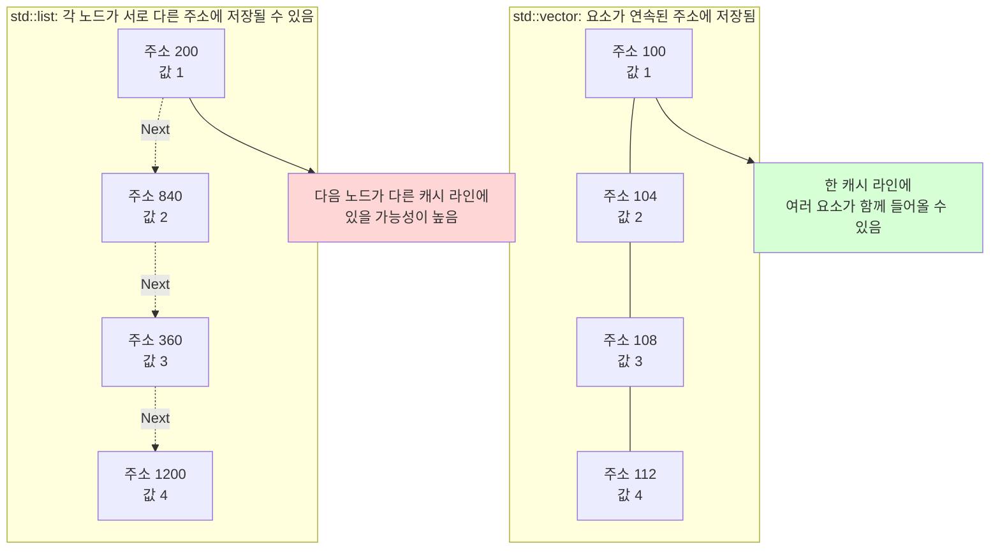

# Cache Locality(캐시 지역성)

> [!summary]
> **Cache Locality(캐시 지역성)**는 CPU가 이미 가져온 데이터와 그 주변 데이터를 계속 사용하여, 느린 RAM 접근을 줄이는 성질이다.
>
> Unreal에서는 **전체 순회가 중심이면 `TArray`**, **key 검색이나 중복 방지가 중심이면 `TMap`/`TSet`**을 먼저 검토한다.
> `TSet`/`TMap`의 평균 `O(1)`이 언제나 `TArray`의 `O(n)`보다 빠른 것은 아니다. 실제 속도는 데이터 수 하나가 아니라 **접근 패턴, 요소 크기, 해시 비용, 캐시 효율**에 따라 결정된다.

## 핵심 정리

```text
매 프레임 전체를 순회한다
→ TArray가 유리한 경우가 많다.

key로 계속 찾거나 중복을 막아야 한다
→ TMap / TSet을 검토한다.

몇 개부터 더 빠른가?
→ 100개, 1,000개 같은 고정 기준은 없다. 실제 작업으로 측정한다.
```

> [!important]
> Big-O는 비교 횟수의 증가 형태를 보여준다. 캐시 미스, 해시 계산, 메모리 사용량 같은 실제 비용까지 보여주지는 않는다.

## 핵심 흐름

```text
연속된 데이터
→ 한 Cache Line에 여러 요소 적재
→ 다음 주소를 예측하기 쉬움
→ Cache Hit 가능성 증가

흩어진 데이터 + 포인터 추적
→ 다음 주소를 읽기 전까지 알기 어려움
→ Cache Miss 가능성 증가
```

| 개념 | 의미 |
| --- | --- |
| 시간적 지역성 | 최근 사용한 데이터를 다시 사용할 가능성 |
| 공간적 지역성 | 방금 사용한 데이터 주변에 접근할 가능성 |
| Cache Line | 메모리와 캐시 사이에서 데이터를 옮기는 묶음 |
| Prefetch | 다음에 필요할 데이터를 CPU가 미리 가져오는 기능 |

---

## 지역성의 종류

- **시간적 지역성(Temporal Locality)**: 최근 접근한 데이터에 가까운 시점에 다시 접근할 가능성이 높다.
- **공간적 지역성(Spatial Locality)**: 접근한 데이터와 인접한 메모리에 곧 접근할 가능성이 높다.

---

## 캐시 계층

CPU는 메인 메모리인 RAM보다 훨씬 빠르게 동작한다. 이 CPU 처리 속도와 메모리 접근 속도의 격차를 **Memory Wall**이라고 부른다. CPU가 매번 RAM의 데이터를 기다리면 많은 시간이 낭비되므로, 자주 사용할 데이터를 CPU 가까이에 있는 작은 캐시에 보관한다.

일반적으로 캐시는 다음과 같은 계층으로 구성된다.

| 계층 | 특징 |
| :--- | :--- |
| **L1 Cache** | CPU 코어와 가장 가깝다. 가장 빠르지만 용량이 가장 작다. |
| **L2 Cache** | L1보다 크지만 조금 느리다. 보통 코어별로 존재한다. |
| **L3 Cache** | L1, L2보다 크고 느리다. 여러 코어가 공유하는 경우가 많다. |
| **RAM** | 캐시보다 훨씬 크지만 CPU가 접근하는 데 더 오래 걸린다. |

CPU가 데이터를 요청하면 보통 가까운 L1부터 확인하고, 없으면 L2, L3, RAM 순서로 더 먼 저장 공간을 확인한다.

- 가까운 캐시에서 찾음: **Cache Hit**
- 찾지 못해 다음 계층으로 내려감: **Cache Miss**

> [!note]
> 실제 캐시 구조와 공유 방식은 CPU 아키텍처마다 다르다. 위 표는 계층의 기본 역할을 이해하기 위한 일반적인 설명이다.

---

## Cache Line

**Cache Line**은 CPU 캐시와 메모리 사이에서 데이터를 옮기는 기본 단위다. CPU는 필요한 변수 하나만 따로 가져오기보다 그 변수가 포함된 주변 메모리를 한 묶음으로 캐시에 가져온다.

예를 들어 `int`가 4바이트이고 캐시 라인이 64바이트라면, 단순하게는 한 캐시 라인에 `int` 16개가 들어갈 수 있다.

`vector`의 요소는 연속되어 있으므로 첫 번째 요소를 읽을 때 뒤의 여러 요소도 같은 캐시 라인에 함께 들어올 수 있다.

```text
vector<int>
[0][1][2][3][4][5] ... [15]  ← 하나의 64바이트 캐시 라인에 들어갈 수 있음
```

반면 `list`는 노드가 서로 다른 메모리 위치에 있을 수 있다. 노드 하나를 가져오면서 함께 들어온 주변 데이터에 다음 노드가 없으면, 다음 노드를 읽기 위해 다른 캐시 라인이 필요하다.

캐시 라인 크기는 CPU 아키텍처에 따라 다르며, 현대의 많은 데스크톱 CPU에서는 64바이트가 흔하다.

객체가 캐시 라인 경계에 걸쳐 있거나 정렬 및 부가 데이터가 포함되면 실제로 들어가는 요소 수는 달라질 수 있다.

---

## 하드웨어 프리페칭

**하드웨어 프리페처(Hardware Prefetcher)**는 CPU가 메모리 접근 패턴을 관찰하다가 순차적이거나 일정한 간격의 접근을 발견하면, 앞으로 필요할 것으로 예상되는 데이터를 캐시에 미리 가져오는 기능이다.

배열을 앞에서부터 차례대로 읽으면 CPU는 다음 주소도 곧 사용할 가능성이 높다고 판단할 수 있다. 데이터가 실제로 필요해지기 전에 캐시에 도착하면 메모리를 기다리는 시간을 줄일 수 있다.

반대로 `list`의 포인터 추적처럼 다음 주소를 미리 예측하기 어려운 접근은 프리페칭의 도움을 받기 어렵다.

> [!note]
> 프리페칭은 성능을 보장하지 않는다. 접근 패턴이 불규칙하거나 예측이 빗나가면 미리 가져온 데이터를 사용하지 않을 수도 있다.
>
> 필요한 주소에 접근했을 때 그 주소가 포함된 Cache Line을 가져오는 것은 기본적인 **캐시 라인 채움**이다. 프리페칭은 접근 패턴을 보고 아직 요청하지 않은 다음 Cache Line까지 미리 가져오려는 별도 동작이다.


```mermaid
flowchart TB
    subgraph Vector["std::vector: 요소가 연속된 주소에 저장됨"]
        direction LR
        V1["주소 100<br/>값 1"] --- V2["주소 104<br/>값 2"] --- V3["주소 108<br/>값 3"] --- V4["주소 112<br/>값 4"]
    end

    V1 --> VC["한 캐시 라인에<br/>여러 요소가 함께 들어올 수 있음"]

    subgraph List["std::list: 각 노드가 서로 다른 주소에 저장될 수 있음"]
        direction LR
        L1["주소 200<br/>값 1"] -.->|Next| L2["주소 840<br/>값 2"]
        L2 -.->|Next| L3["주소 360<br/>값 3"]
        L3 -.->|Next| L4["주소 1200<br/>값 4"]
    end

    L1 --> LC["다음 노드가 다른 캐시 라인에<br/>있을 가능성이 높음"]

    style VC fill:#d6ffd6
    style LC fill:#ffd6d6
```

위 주소는 메모리 배치 차이를 보여주기 위한 가상의 예시다. `vector<int>`에서는 4바이트 요소의 주소가 연속해서 증가하지만, `list`는 다음 노드의 주소가 현재 노드와 이어져 있다는 보장이 없다.

- **Vector (연속 메모리)**: 한 요소를 읽을 때 인접한 여러 요소가 같은 캐시 라인에 함께 들어올 수 있다. 순차 접근 패턴은 하드웨어 프리페처도 예측하기 쉬워 이후 접근이 **Cache Hit**가 될 가능성이 높다.
- **List (비연속 메모리)**: 각 노드는 별도로 할당되므로 서로 떨어져 있을 수 있다. 노드마다 포인터와 정렬 여백이 포함되고, 다음 주소가 현재 노드를 읽은 뒤에야 결정되는 포인터 추적 때문에 프리페칭도 어렵다.

> [!note]
> `list`의 노드가 항상 멀리 떨어져 있거나, 노드를 읽을 때마다 반드시 Cache Miss가 발생하는 것은 아니다. 메모리 할당 상태와 접근 패턴에 따라 인접하게 배치되거나 이미 캐시에 들어 있을 수도 있다. 다만 연속 배치를 보장하는 `vector`보다 순회 성능에 불리한 경우가 많다.

---

## vector와 list 비교

| 항목 | std::vector | std::list |
| :--- | :--- | :--- |
| **메모리 배치** | **연속 (Continuous)** | **분산 (Scattered)** |
| **순차 접근의 캐시 효율** | 일반적으로 높음 | 일반적으로 낮음 |
| **인덱스 접근** | `O(1)` (임의 접근 가능) | `O(n)` (순차 탐색 필요) |
| **중간 삽입/삭제** | `O(n)` (뒤쪽 요소 이동) | 반복자로 위치를 알고 있을 때 연결 변경은 `O(1)` |
| **추가 메모리 소모** | 미사용 `capacity`가 생길 수 있음 | 노드마다 포인터와 할당 오버헤드가 있음 |

---

## 코드 예시

```cpp
#include <vector>
#include <list>

// 1. vector 순회 (연속 데이터 접근)
long long TraverseVector(const std::vector<int>& Numbers)
{
    long long Sum = 0;

    // 순차 접근은 하드웨어 프리페처가 다음 데이터를 예측하기 쉬움
    for (int Number : Numbers)
    {
        Sum += Number;
    }

    return Sum;
}

// 2. list 순회 (노드 링크 따라가기)
long long TraverseList(const std::list<int>& Numbers)
{
    long long Sum = 0;

    // 다음 노드의 주소를 따라가는 의존성 때문에 프리페칭이 어려움
    for (int Number : Numbers)
    {
        Sum += Number;
    }

    return Sum;
}
```

두 함수의 알고리즘 시간 복잡도는 모두 `O(n)`이지만, 실제 실행 시간은 메모리 배치와 접근 패턴 때문에 달라질 수 있다. 정확한 차이는 대상 플랫폼과 실제 데이터로 벤치마크해야 한다.

---

## Unreal 컨테이너 선택 기준

| 컨테이너 | 내부 배치와 탐색 | 먼저 고르는 상황 |
| :--- | :--- | :--- |
| `TArray` | 요소를 연속해서 저장한다. `Find`는 선형 탐색이므로 `O(n)`이다. | 순서, 인덱스 접근, 전체 순회가 중요할 때 |
| `TSet` | `TSparseArray`에 요소를 두고 해시 버킷으로 찾는다. 검색은 평균 `O(1)`이다. | 중복 없는 값의 존재 여부를 자주 확인할 때 |
| `TMap` | `TSet`과 비슷한 해시 구조에 key-value 쌍을 저장한다. 검색은 평균 `O(1)`이다. | key로 값을 자주 찾을 때 |

`TSet`/`TMap`의 `O(1)`은 해시가 적절히 분산된다는 전제의 **평균 복잡도**다. 충돌이 심하면 후보 key를 더 많이 비교해야 하며 최악에는 `O(n)`까지 나빠질 수 있다.

`TSet`과 `TMap`을 단순히 "노드들이 각각 따로 할당된 연결 리스트"라고 설명하면 정확하지 않다. Unreal의 구현은 **희소 배열(`TSparseArray`) + 해시 버킷**에 가깝다.

다만 `TArray`처럼 모든 유효 요소가 빈틈없이 연속된다고 보장하지 않는다. 삭제로 빈 슬롯이 생길 수 있고, 해시를 계산한 뒤 버킷과 요소를 확인하는 추가 접근도 필요하다. 이 때문에 전체 순회에서는 `TArray`가 더 단순하고 캐시 친화적인 경우가 많다.

메모리도 공짜가 아니다. `TArray`에는 미리 확보한 여유 공간이 생길 수 있고, `TSet`/`TMap`에는 여기에 더해 해시 버킷과 희소 배열 관리 정보가 필요하다. 따라서 자료 개수뿐 아니라 `GetAllocatedSize()`와 할당 횟수도 함께 비교한다.

```text
TArray 검색
첫 요소 → 다음 요소 → 다음 요소 ...
연속된 메모리를 차례대로 읽음

TSet / TMap 검색
key 해시 계산 → 버킷 확인 → 후보 key 비교
평균 비교 횟수는 적지만 접근 과정과 메모리 비용이 추가됨
```

## 고정된 개수 기준은 없다

"200개 이하면 `TArray`, 1,000개 이상이면 `TSet`"처럼 외울 수 있는 공통 경계값은 없다.

결과를 바꾸는 조건이 많기 때문이다.

- 요소와 key의 크기
- `GetTypeHash` 계산 비용과 해시 충돌 정도
- 찾는 값이 앞쪽에 많은지, 없는 값을 자주 찾는지
- 검색 횟수와 전체 순회 횟수
- 삽입·삭제 빈도와 순서 유지 필요 여부
- 실행하는 CPU와 빌드 설정

작은 배열은 선형 탐색이더라도 연속된 메모리를 빠르게 훑어서 해시 컨테이너보다 빠를 수 있다. 반대로 같은 배열을 key로 수천 번 검색한다면 요소 수가 비교적 작아도 `TSet`이나 `TMap`이 유리할 수 있다.

삽입·삭제도 개수만으로 결정하지 않는다. `TArray::RemoveAt`은 순서를 유지하려고 뒤 요소를 당겨 `O(n)`이지만, 삭제할 인덱스를 이미 알고 있고 순서가 필요 없다면 `RemoveAtSwap`으로 이동 비용을 줄일 수 있다. key로 대상을 찾고 자주 추가·삭제하는 작업이라면 `TSet`/`TMap`의 평균 `O(1)` 연산이 더 자연스럽다.

## `TArray<UObject*>`가 항상 객체까지 연속인 것은 아니다

```cpp
TArray<TObjectPtr<AEnemy>> Enemies;
```

이 배열에서 연속으로 저장되는 것은 `AEnemy` 객체 자체가 아니라 **객체를 가리키는 포인터 값**이다. 각 `AEnemy` 객체는 메모리의 서로 다른 위치에 있을 수 있다.

```text
TArray 안의 포인터:  [P1][P2][P3][P4]  ← 연속
실제 UObject:         P1↘ P2↗ P3→ P4↙  ← 흩어져 있을 수 있음
```

따라서 포인터 목록을 순회하는 부분은 캐시 친화적이지만, 각 포인터를 역참조해 큰 객체의 데이터를 읽을 때는 Cache Miss가 생길 수 있다. 대량 연산이 중요하다면 필요한 값만 `TArray<FEnemyData>`처럼 연속된 값 데이터로 모으거나, 일부 필드를 별도 배열로 분리하는 SoA 구조도 검토한다.

- **AoS(Array of Structures)**: 객체별 데이터를 한 구조체에 모아 배열로 저장한다. 한 객체의 여러 필드를 함께 처리할 때 자연스럽다.
- **SoA(Structure of Arrays)**: 위치, 체력처럼 같은 필드끼리 별도 배열에 저장한다. 일부 필드만 대량으로 처리할 때 불필요한 데이터 로드를 줄일 수 있다.

## `TArray`와 `TMap`을 같이 쓰는 경우

전체 순회와 빠른 key 검색이 모두 중요하면 저장용 `TArray`와 검색용 `TMap`을 함께 유지할 수 있다.

```text
TArray<FEnemyData>       → 빠른 전체 순회
TMap<FEnemyId, int32>    → ID를 배열 인덱스로 변환
```

검색은 빨라지지만 추가 메모리가 들고, 추가·삭제할 때 두 컨테이너를 항상 함께 갱신해야 한다. 실제로 두 요구가 모두 병목일 때 선택한다.

---

## 성능과 별개로 지켜야 할 것

GC와 스레드 안전성은 캐시 지역성과는 다른 문제다. 컨테이너가 빠르더라도 아래 규칙을 지키지 않으면 잘못된 참조나 경쟁 상태가 생길 수 있다.

### UObject 참조와 GC

멤버로 UObject를 강하게 참조하고 GC, 직렬화, 리플리케이션의 추적을 받아야 한다면 다음 형태를 우선 사용한다.

```cpp
UPROPERTY()
TArray<TObjectPtr<AEnemy>> Enemies;
```

중요한 것은 `TArray`냐 `TSet`/`TMap`이냐가 아니라 **리플렉션에 보이는 `UPROPERTY`인지, 어떤 포인터 형식을 사용했는지**다. `UPROPERTY`가 없는 raw `UObject*` 컨테이너는 종류와 관계없이 그 참조만으로 객체를 살려 두지 못하며, GC가 참조를 자동으로 추적하거나 갱신해 주지도 않는다.

> [!note]
> 짧게 사용하는 지역 변수와 비소유 참조에는 raw pointer나 `TWeakObjectPtr`가 맞을 수 있다. 모든 UObject 포인터를 무조건 강한 `UPROPERTY` 참조로 만들라는 뜻은 아니다.

### 스레드 안전성

`TArray`, `TSet`, `TMap`은 공유 접근을 자동으로 동기화해 주는 동시성 컨테이너가 아니다.

- 여러 스레드가 서로 다른 컨테이너를 사용함: 별도 잠금이 필요하지 않다.
- 같은 컨테이너를 읽기만 하고 수정하는 스레드가 없음: 동시에 읽을 수 있다.
- 같은 컨테이너를 한 스레드라도 수정하고 다른 스레드가 접근함: 잠금, 작업 순서 보장, 스레드별 복사본 같은 동기화가 필요하다.

여러 값을 한 번에 보호해야 하면 `FCriticalSection`과 `FScopeLock`, 읽기가 많고 쓰기가 적다면 `FRWLock`과 read/write scope lock을 검토한다. 단순히 Async 코드라는 이유만으로 모든 컨테이너에 무조건 lock을 붙이지는 않는다.

### 순회 중 삭제

`RemoveAt`은 뒤 요소를 앞으로 당기므로 정방향 루프에서 그대로 호출하면 다음 요소를 건너뛸 수 있다. 역순 순회만이 유일한 해결책은 아니다.

| 상황 | 적합한 방법 |
| :--- | :--- |
| 조건에 맞는 요소를 한 번에 삭제 | `RemoveAll` |
| 남은 순서가 중요하지 않음 | `RemoveAllSwap`, `RemoveAtSwap` |
| 삭제 인덱스로 별도 작업도 해야 함 | 역순 인덱스 순회 + `RemoveAt` |

```cpp
Enemies.RemoveAll([](const FEnemyData& Enemy)
{
    return Enemy.bDead;
});
```

`RemoveAtSwap`은 마지막 요소를 삭제 위치로 옮겨 중간 요소 전체를 당기는 비용을 피한다. 대신 남은 요소의 순서는 바뀐다.

---

## 측정하는 방법

1. 실제 게임에서 반복되는 작업을 고른다. 예: 매 프레임 전체 갱신, ID 검색 1,000회.
2. 같은 데이터와 결과를 사용하는 `TArray` 버전과 `TSet`/`TMap` 버전을 만든다.
3. Development나 Test 빌드의 실제 대상 플랫폼에서 여러 번 측정한다.
4. Unreal Insights로 실행 시간과 할당 횟수·크기를 비교한다.
5. Cache Miss 자체가 필요하면 대상 플랫폼의 하드웨어 성능 카운터를 지원하는 전용 프로파일러를 사용한다.

> [!important]
> Unreal Insights는 CPU scope 시간과 메모리 할당을 확인하는 데 유용하다. 일반적인 Insights 기록만으로 Cache Miss 비율이 자동 측정된다고 단정하면 안 된다.

---

## 재할당과 여유 공간

`TArray`에 확보된 공간보다 많은 요소를 추가하면 더 큰 연속 메모리를 확보하고 기존 요소를 옮긴다. 이때 기존 요소를 가리키던 포인터와 참조는 무효가 될 수 있다.

필요한 개수를 예상할 수 있다면 미리 공간을 확보한다.

```cpp
TArray<FEnemyData> Enemies;
Enemies.Reserve(ExpectedEnemyCount);
```

`TSet`과 `TMap`도 `Reserve`로 반복되는 재할당과 해시 구조 확장 비용을 줄일 수 있다. 삭제가 반복되면 희소 배열에 빈 슬롯이 남을 수 있으며, 메모리를 실제로 정리해야 할 때 `Compact`와 `Shrink`를 검토한다. 이 정리 함수에도 비용이 있으므로 삭제할 때마다 호출하지는 않는다.

---

## 정리

1. CPU는 메모리를 효율적으로 쓰기 위해 **Cache Line** 단위로 데이터를 로드한다.
2. `TArray`는 연속된 메모리 덕분에 전체 순회와 인덱스 접근에 유리하다.
3. `TSet`/`TMap`은 해시를 이용한 평균 `O(1)` 검색이 필요할 때 선택한다.
4. 컨테이너가 바뀌는 정확한 기준 개수는 없다. 실제 접근 패턴으로 측정한다.
5. UObject GC, 스레드 동기화, 순회 중 삭제는 캐시 지역성과 별도로 지켜야 하는 정확성 문제다.

---

## 검증 자료

- [Epic Games: TArray](https://dev.epicgames.com/documentation/en-us/unreal-engine/array-containers-in-unreal-engine)
- [Epic Games: TMap](https://dev.epicgames.com/documentation/en-us/unreal-engine/map-containers-in-unreal-engine)
- [Epic Games: Object Pointers](https://dev.epicgames.com/documentation/en-us/unreal-engine/object-pointers-in-unreal-engine)
- [Epic Games: Unreal Insights 성능 프로파일링](https://dev.epicgames.com/documentation/en-us/unreal-engine/introduction-to-performance-profiling-and-configuration-in-unreal-engine)

관련 키워드: `C++`, `Unreal Engine`, `TArray`, `TSet`, `TMap`, `CPU Cache`

[[C++ 정리 목차]] · [[Race Condition]] · [[그래프 표현 방법과 컨테이너 선택]] · [[STL 컨테이너 선택 기준]]
