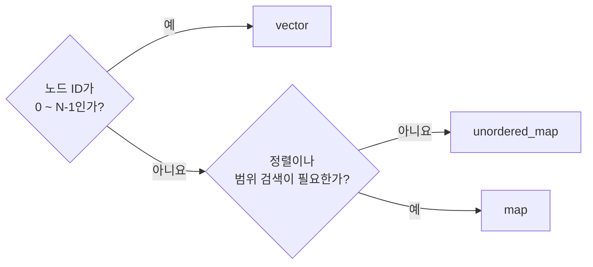

> [!summary]
> ## 이것만 알면 된다
>
> 1. 대부분의 그래프는 **인접 리스트**로 표현한다.
> 2. 노드 ID가 `0 ~ N-1`이면 `vector`를 사용한다.
> 3. ID가 듬성듬성하면 `unordered_map`, 정렬이 필요하면 `map`을 검토한다.

---

## 1. 그래프를 어떻게 표현할까?

### 인접 리스트

각 노드마다 **연결된 노드 목록**을 저장한다.

```text
0: [1, 2]
1: [0]
2: [0]
```

- 대부분의 그래프에서 기본 선택
- 연결된 간선을 순회하기 좋음
- C++에서는 주로 `vector<vector<int>>`로 구현

### 인접 행렬

두 노드의 연결 여부를 **2차원 표**로 저장한다.

```text
    0  1  2
0 [ 0, 1, 1 ]
1 [ 1, 0, 0 ]
2 [ 1, 0, 0 ]
```

- 두 노드의 연결 여부를 즉시 확인: `O(1)`
- 노드가 `N`개면 항상 `N × N` 공간 필요
- 간선이 매우 많은 조밀 그래프에서 검토

### 간선 리스트

연결된 노드 쌍만 저장한다.

```text
[(0, 1), (0, 2)]
```

- 구조가 단순함
- 모든 간선을 한 번씩 처리하는 알고리즘에 적합
- 특정 노드의 이웃을 반복해서 찾는 작업에는 불편함

| 필요한 작업 | 표현 방식 |
| :--- | :--- |
| 일반적인 탐색, 길찾기 | **인접 리스트** |
| 연결 여부를 매우 자주 확인 | 인접 행렬 |
| 모든 간선을 순서대로 처리 | 간선 리스트 |

---

## 2. 인접 리스트의 컨테이너는?



### ID가 `0 ~ N-1`: vector

```cpp
std::vector<std::vector<int>> Graph(NodeCount);
Graph[0].push_back(1);
```

ID를 그대로 인덱스로 사용한다. 구조가 단순하고 조회가 빠르므로 **먼저 고려할 기본 형태**다.

### ID가 희소함: unordered_map

```cpp
std::unordered_map<int, std::vector<int>> Graph;
Graph[105].push_back(3009);
```

ID가 `105`, `3009`처럼 크게 흩어져 있을 때 존재하는 ID만 저장한다. 평균 조회는 `O(1)`이지만 해시 테이블 비용이 있다.

### ID 정렬이 필요함: map

```cpp
std::map<int, std::vector<int>> Graph;
```

ID 순서대로 순회하거나 특정 ID 범위를 찾아야 할 때 사용한다. 조회는 `O(log n)`이다.

---

## 헷갈리기 쉬운 점

### 희소 ID도 vector를 사용할 수 있다

외부 ID를 내부 인덱스로 변환하면 된다.

```text
외부 ID: 105, 3009, 80000
내부 ID:   0,    1,     2
```

이 방식을 **ID 압축**이라고 한다. 그래프 연산이 많다면 해시 맵을 계속 조회하는 것보다 내부에서는 조밀한 ID와 `vector`를 사용하는 편이 유리할 수 있다.

### vector<vector<int>> 전체가 연속인 것은 아니다

각 내부 `vector`의 요소는 연속이지만, 내부 `vector`들의 저장 공간은 서로 떨어져 있을 수 있다.

---

## 정리

```text
그래프 표현
├─ 대부분의 경우                → 인접 리스트
├─ 연결 여부 확인이 핵심         → 인접 행렬
└─ 모든 간선을 순서대로 처리     → 간선 리스트

인접 리스트의 바깥 컨테이너
├─ ID가 0 ~ N-1                 → vector
├─ ID가 희소하고 정렬 불필요     → unordered_map
└─ ID 정렬 또는 범위 검색 필요   → map
```
