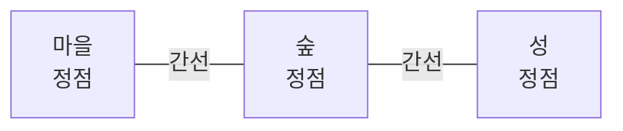
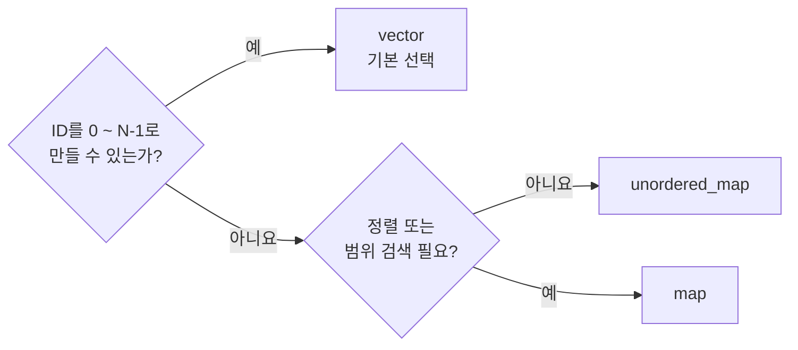

# 그래프 표현 방법과 컨테이너 선택

> [!summary]
> 그래프의 핵심은 **정점(Vertex)과 간선(Edge)으로 관계를 표현한다**는 것이다.
> C++에서 일반적인 그래프는 정점에 `0 ~ N-1` 번호를 붙이고, **인접 리스트를 `vector<vector<int>>`로 저장하는 방식부터 고려한다.**

## 그래프가 무엇인가

그래프(Graph)는 여러 대상과 대상 사이의 연결 관계를 나타내는 자료구조다.

- **정점(Vertex, Node)**: 연결의 대상
- **간선(Edge)**: 두 정점 사이의 연결

게임 맵에서는 장소가 정점이고, 장소 사이의 이동 경로가 간선이다.



| 종류 | 의미 | 예시 |
| --- | --- | --- |
| **방향 그래프** | 간선에 방향이 있음 | 퀘스트 A를 완료해야 B 진행 |
| **무방향 그래프** | 양쪽으로 연결됨 | 두 장소 사이의 양방향 길 |
| **가중 그래프** | 간선에 거리·비용이 있음 | 마을에서 숲까지 5km |

---

## 왜 표현 방법이 필요한가

그림으로 그린 그래프를 코드에서 사용하려면 정점과 간선을 메모리에 저장해야 한다. 저장 방식에 따라 메모리 사용량과 탐색 방법이 달라진다.

| 표현 방법 | 핵심 | 주로 사용할 때 |
| --- | --- | --- |
| **인접 리스트** | 정점마다 이웃 목록 저장 | 일반적인 탐색과 길찾기 |
| **인접 행렬** | 모든 정점 쌍의 연결 여부 저장 | 연결 여부를 자주 확인 |
| **간선 리스트** | 연결된 정점 쌍만 저장 | 모든 간선을 차례로 처리 |

---

## 1. 인접 리스트

> **핵심: 각 정점마다 직접 연결된 이웃만 저장한다. 일반적인 그래프의 기본 선택이다.**

```text
그래프                  인접 리스트
0 --- 1                0: [1, 2]
|                      1: [0]
2                      2: [0]
```

```cpp
std::vector<std::vector<int>> Graph(3);

Graph[0] = {1, 2};
Graph[1] = {0};
Graph[2] = {0};
```

`Graph[0]`은 “정점 0과 직접 연결된 정점 목록”이다.

무방향 간선 `0 - 1`은 양쪽 목록에 모두 저장하고, 방향 간선 `0 → 1`은 `Graph[0]`에 `1`만 저장한다.

가중 그래프라면 이웃 번호만 저장하지 않고 `{이웃 번호, 가중치}`를 함께 저장한다.

```cpp
using Edge = std::pair<int, int>; // {이웃 정점, 가중치}
std::vector<std::vector<Edge>> Graph(NodeCount);

Graph[0].push_back({1, 5});
```

---

## 2. 인접 행렬

> **핵심: 연결 여부 확인은 빠르지만 정점 수의 제곱만큼 공간을 사용한다.**

```text
    0  1  2
0 [ 0, 1, 1 ]
1 [ 1, 0, 0 ]
2 [ 1, 0, 0 ]
```

`Matrix[0][1] == 1`이면 정점 0과 1이 연결되었다는 뜻이다.

- 연결 여부 확인: `O(1)`
- 필요한 공간: `O(N²)`

정점이 많고 실제 연결이 적다면 빈칸이 많아지므로 인접 리스트가 보통 더 적합하다.

---

## 3. 간선 리스트

> **핵심: 존재하는 간선만 `(출발, 도착)` 쌍으로 저장한다.**

```cpp
std::vector<std::pair<int, int>> Edges =
{
    {0, 1},
    {0, 2}
};
```

모든 간선을 한 번씩 처리할 때 편리하다. 반면 특정 정점의 이웃을 찾으려면 전체 간선을 확인해야 한다.

---

## 표현 방법 복잡도 비교

`V`는 정점 수, `E`는 간선 수, `deg(v)`는 정점 `v`에 연결된 간선 수다.

| 표현 방법 | 공간 | 특정 간선 확인 | 정점 `v`의 이웃 순회 | 모든 간선 순회 |
| --- | --- | --- | --- | --- |
| **인접 리스트** | `O(V + E)` | 보통 `O(deg(v))` | `O(deg(v))` | `O(V + E)` |
| **인접 행렬** | `O(V²)` | `O(1)` | `O(V)` | `O(V²)` |
| **간선 리스트** | `O(E)` | `O(E)` | `O(E)` | `O(E)` |

> [!note]
> 인접 리스트의 간선 확인 비용은 이웃을 `vector`에 저장했을 때의 일반적인 기준이다. 이웃 목록을 정렬해 이진 탐색하거나 `unordered_set`으로 저장하면 조회 특성은 달라지지만, 정렬·해시·메모리 비용이 추가된다.

---

## 인접 리스트의 컨테이너 선택

인접 리스트에는 두 종류의 컨테이너 선택이 있다.

1. **바깥 컨테이너**: 정점 ID로 이웃 목록을 찾는 방법
2. **안쪽 컨테이너**: 한 정점의 이웃들을 저장하는 방법

먼저 바깥 컨테이너를 선택한다. **ID는 정점을 구분하기 위해 붙인 번호나 키**다.



### `vector`: 기본 선택

ID가 `0, 1, 2, ... N-1`이면 ID를 그대로 인덱스로 사용한다.

```cpp
std::vector<std::vector<int>> Graph(NodeCount);
Graph[2].push_back(5);
```

별도의 키 검색이 필요 없고 구조가 단순하다. 그래프 내부 ID를 직접 정할 수 있다면 이 형태부터 고려한다.

### `unordered_map`: 희소한 ID

ID가 `105`, `3009`, `80000`처럼 크게 흩어져 있고 정렬이 필요 없다면 존재하는 ID만 저장한다.

```cpp
std::unordered_map<int, std::vector<int>> Graph;
Graph[105].push_back(3009);
```

평균 조회는 `O(1)`이지만 해시 계산과 버킷을 위한 추가 비용이 있다.

### `map`: 정렬이 필요한 ID

ID 순서대로 순회하거나 특정 ID 범위를 찾아야 할 때 사용한다. 키가 정렬된 상태로 유지되며 조회는 `O(log N)`이다.

---

## 이웃 목록의 컨테이너 선택

대부분은 이웃 목록도 `vector`로 시작한다. 메모리가 연속적이고 순회가 빠르며, 그래프 탐색은 이웃을 차례로 읽는 일이 많기 때문이다.

| 요구 사항 | 먼저 고려할 컨테이너 |
| --- | --- |
| 이웃을 주로 순회 | `vector` |
| 이웃을 정렬된 순서로 유지 | 정렬된 `vector` 또는 `set` |
| 연결 존재 여부를 자주 확인하고 삽입·삭제도 잦음 | `unordered_set` 검토 |

`set`이나 `unordered_set`은 중복 방지와 조회에는 편하지만 메모리 오버헤드와 순회 비용이 커질 수 있다. 실제로 필요한 연산이 무엇인지 확인한 뒤 선택한다.

---

## 희소한 ID도 vector로 바꿀 수 있다

외부 ID에 `0 ~ N-1`의 내부 번호를 새로 붙이는 방식을 **ID 압축(ID Compression)**이라고 한다.

```text
외부 ID: 105, 3009, 80000
내부 ID:   0,    1,     2
```

그래프 탐색이 많다면 외부 ID를 한 번 내부 ID로 변환한 뒤 `vector`를 사용하는 방식이 유리할 수 있다.

---

## 실전 선택 기준

| 상황 | 먼저 고려할 방식 |
| --- | --- |
| 일반적인 BFS, DFS, 게임 길찾기 | 인접 리스트 + `vector` |
| 연결 여부를 매우 자주 확인 | 인접 행렬 |
| 모든 간선을 순서대로 처리 | 간선 리스트 |
| 희소한 외부 ID를 그대로 사용 | 인접 리스트 + `unordered_map` |
| ID 정렬 또는 범위 검색 필요 | 인접 리스트 + `map` |

---

## 정리

그래프에서 먼저 정할 것은 **무엇이 정점이고 무엇이 간선인지**다.

일반적인 시작점은 다음과 같다.

```text
정점에 0 ~ N-1 번호 부여
        ↓
정점마다 연결된 이웃 저장
        ↓
vector<vector<int>> 인접 리스트
```

- 기본 표현: 인접 리스트
- 기본 컨테이너: `vector<vector<int>>`
- 연결 확인 중심: 인접 행렬
- 간선 전체 처리 중심: 간선 리스트
- 희소한 외부 ID: `unordered_map` 또는 ID 압축 검토
