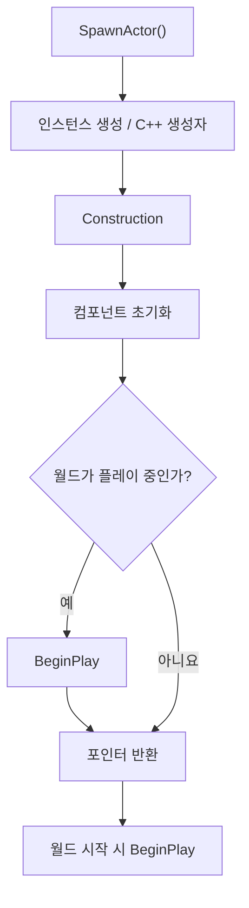

# Actor Spawn 생명주기

> [!summary]
> ## 실무 핵심
>
> ```text
> 생성자
> → Construction
> → 컴포넌트 초기화
> → BeginPlay
> ```
>
> - **생성자**: 기본값과 기본 컴포넌트 구성
> - **OnConstruction**: 현재 프로퍼티로 외형·구성 조정
> - **PostInitializeComponents**: 준비된 컴포넌트 연결
> - **BeginPlay**: 실제 게임 로직 시작
>
> **Construction이나 BeginPlay 전에 값을 넣어야 한다면 Deferred Spawn을 사용한다.**

## 이것을 왜 알아야 할까?

생성자가 `BeginPlay()`보다 먼저라는 사실만 알아도 단순한 Actor는 문제없이 만들 수 있다. 중간 과정은 엔진이 자동으로 처리하기 때문이다.

생명주기를 더 알아야 하는 이유는 다음 세 가지 실수를 피하기 위해서다.

| 실수 | 필요한 지식 |
| --- | --- |
| 생성자에서 `GetWorld()`나 다른 Actor를 사용 | 생성자는 CDO를 만들 때도 실행됨 |
| `SpawnActor()` 뒤에 넣은 값을 Construction이나 BeginPlay에서 기대 | 일반 스폰은 해당 단계가 이미 끝났을 수 있음 |
| 준비되지 않은 컴포넌트를 연결 | `PostInitializeComponents()` 이후 사용 |

---

## 꼭 알아야 하는 네 단계

### 1. C++ 생성자

> **역할: 모든 인스턴스가 공통으로 가질 기본값과 기본 컴포넌트를 만든다.**

```cpp
AMyProjectile::AMyProjectile()
{
    PrimaryActorTick.bCanEverTick = false;

    Root = CreateDefaultSubobject<USphereComponent>(TEXT("Root"));
    SetRootComponent(Root);

    Mesh = CreateDefaultSubobject<UStaticMeshComponent>(TEXT("Mesh"));
    Mesh->SetupAttachment(Root);
}
```

**기본 컴포넌트(Default Subobject)**는 해당 클래스의 모든 인스턴스가 기본으로 가지는 컴포넌트다.

```text
AMyProjectile
├─ Root
└─ Mesh
```

생성자에서 적합한 작업:

- 멤버 기본값 설정
- `CreateDefaultSubobject()` 호출
- 기본 컴포넌트 부착 관계 설정

생성자에서 피할 작업:

- `GetWorld()`에 의존하는 로직
- 다른 Actor 검색·스폰
- 플레이 상태가 필요하거나 한 번만 실행되어야 하는 로직

그 이유는 생성자가 실제 스폰 인스턴스뿐 아니라 **CDO(Class Default Object)**를 만들 때도 실행되기 때문이다. CDO는 새 인스턴스가 사용할 기본값을 보관하는 클래스별 기본 객체다.

> [!note]
> 생성자가 객체의 “메모리 레이아웃을 만든다”는 뜻은 아니다. 메모리 배치는 C++ 클래스와 컴파일러가 정하고, 생성자는 값과 기본 컴포넌트를 구성한다.

### 2. Construction

> **역할: 스폰 위치와 현재 프로퍼티 값을 이용해 Actor의 외형과 구성을 완성한다.**

Construction 단계에는 다음 작업이 포함된다.

```text
Blueprint 컴포넌트 생성·등록
→ Blueprint Construction Script
→ C++ OnConstruction()
```

```cpp
void AMyProjectile::OnConstruction(const FTransform& Transform)
{
    Super::OnConstruction(Transform);

    // 현재 Damage, MeshType 등의 값으로 외형 구성
}
```

`OnConstruction()`은 에디터에서 프로퍼티를 변경하거나 Actor를 움직일 때도 반복 실행될 수 있다.

따라서 다음 작업에는 적합하지 않다.

- 한 번만 실행되어야 하는 게임 로직
- 네트워크 요청
- 저장 파일 변경
- 무거운 연산

### 3. `PostInitializeComponents()`

> **역할: 컴포넌트 초기화가 끝난 뒤 컴포넌트 사이의 연결을 마무리한다.**

```cpp
void AMyActor::PostInitializeComponents()
{
    Super::PostInitializeComponents();

    // 초기화된 컴포넌트 참조 연결·캐싱
}
```

대부분의 단순한 Actor에서는 직접 사용할 필요가 없다. 여러 컴포넌트가 서로 의존하고 `BeginPlay()`보다 먼저 연결되어야 할 때 사용한다.

### 4. `BeginPlay()`

> **역할: Actor의 실제 게임 플레이를 시작한다.**

```cpp
void AMyProjectile::BeginPlay()
{
    Super::BeginPlay();

    // 타이머 시작, 게임 상태 조회, 런타임 로직 실행
}
```

다음 작업은 보통 `BeginPlay()`에 둔다.

- 월드와 다른 Actor 접근
- 타이머·AI·게임 로직 시작
- 일회성 런타임 초기화

월드가 이미 플레이 중일 때 Actor를 스폰하면 `BeginPlay()`가 `SpawnActor()`가 반환되기 전에 호출될 수 있다. 월드가 아직 플레이 전이면 월드 시작 시 나중에 호출된다.

---

## 일반 SpawnActor의 핵심 흐름



일반적인 플레이 중 스폰에서는 함수가 반환될 때 Construction과 컴포넌트 초기화가 끝나 있고, `BeginPlay()`까지 실행됐을 수 있다.

```cpp
AMyProjectile* Projectile = GetWorld()->SpawnActor<AMyProjectile>(
    ProjectileClass,
    SpawnTransform
);

Projectile->Damage = 100.f;
```

위 대입은 스폰이 끝난 뒤 실행된다. 따라서 `OnConstruction()`이나 `BeginPlay()`가 `Damage`를 필요로 했다면 이미 늦다.

---

## Deferred Spawn이 필요한 이유

> [!summary]
> **Deferred Spawn은 인스턴스만 먼저 만든 뒤 Construction 직전에 멈추는 2단계 스폰이다.**

```text
SpawnActorDeferred()
→ 생성자
→ 포인터 먼저 반환
→ 필요한 값 설정
→ FinishSpawningActor()
→ Construction
→ 컴포넌트 초기화
→ BeginPlay
```

Construction이나 `BeginPlay()`가 스폰마다 다른 초기값을 사용해야 할 때 필요하다.

```cpp
AMyProjectile* Projectile =
    GetWorld()->SpawnActorDeferred<AMyProjectile>(
        ProjectileClass,
        SpawnTransform,
        GetOwner(),
        GetInstigator()
    );

if (Projectile)
{
    // Construction과 BeginPlay보다 먼저 값 설정
    Projectile->Damage = 100.f;
    Projectile->TeamId = TeamId;

    UGameplayStatics::FinishSpawningActor(Projectile, SpawnTransform);
}
```

`SpawnActorDeferred()`가 반환한 Actor는 존재하지만 아직 스폰이 끝난 상태가 아니다. 값을 설정한 뒤 `FinishSpawningActor()`를 호출해야 Construction부터 나머지 과정이 진행된다.

호출하지 않으면 Actor가 중간 상태로 남으므로 정상 경로에서는 반드시 완료해야 한다.

---

## 일반 스폰과 Deferred Spawn 선택

| 상황 | 선택 |
| --- | --- |
| 생성자 기본값만으로 초기화 가능 | 일반 `SpawnActor()` |
| 스폰 후 게임 로직에서만 값 사용 | 일반 `SpawnActor()` 후 설정 가능 |
| `OnConstruction()`이 스폰별 값을 사용 | Deferred Spawn |
| `BeginPlay()`가 스폰별 값을 즉시 사용 | Deferred Spawn |
| Blueprint의 Expose on Spawn 값 전달 | Deferred Spawn 방식 사용 |

---

## 참고용 주요 내부 순서

다음 함수 이름을 모두 외울 필요는 없다. 엔진 내부 흐름을 추적하거나 초기화 문제를 디버깅할 때 참고한다.

```text
UWorld::SpawnActor()
→ UObject 인스턴스 생성 / C++ 생성자
→ PostSpawnInitialize
→ 네이티브 컴포넌트 생성 알림·등록
→ PostActorCreated
→ ExecuteConstruction
  → Blueprint 컴포넌트 생성·등록
  → Blueprint User Construction Script
  → OnConstruction
→ PostActorConstruction
→ PreInitializeComponents
→ UActorComponent::InitializeComponent
→ PostInitializeComponents
→ UWorld::OnActorSpawned 알림
→ BeginPlay
```

| 내부 단계 | 알아둘 의미 |
| --- | --- |
| `PostSpawnInitialize` | Transform, Owner, Instigator 등 스폰 정보 설정 |
| `PostActorCreated` | 저장된 Actor 로드가 아닌 신규 생성 경로 알림 |
| `ExecuteConstruction` | Blueprint와 C++ Construction 실행 |
| `PostActorConstruction` | Construction 뒤 컴포넌트 초기화 경로 연결 |
| `PreInitializeComponents` | 컴포넌트 초기화 직전 |
| `InitializeComponent` | 조건을 만족하는 각 컴포넌트 초기화 |
| `PostInitializeComponents` | 컴포넌트 초기화 뒤 Actor 마무리 |

컴포넌트 등록 시점은 구성에 따라 나뉜다. 네이티브 RootComponent가 있는 Actor는 Construction 전에 등록 흐름이 진행될 수 있고, Blueprint 컴포넌트는 Construction 중 생성·등록된다.

`UWorld::OnActorSpawned`는 Actor가 오버라이드하는 함수가 아니라 월드가 스폰 사실을 알리는 델리게이트다.

`BeginPlay()`는 월드, 네트워크, Child Actor 상태에 따라 늦춰질 수 있다.

---

## 최종 정리

```text
평소에는 이것만 기억

생성자             기본값·기본 컴포넌트
OnConstruction     프로퍼티 기반 외형·구성
PostInitialize     컴포넌트 연결이 필요할 때
BeginPlay          실제 게임 로직
Deferred Spawn     Construction 전에 값 주입
```

정확한 내부 함수 순서는 외우기보다 초기화 타이밍 문제가 생겼을 때 참고하면 된다.

---

## 참고

- [Unreal Engine Actor Lifecycle](https://dev.epicgames.com/documentation/unreal-engine/unreal-engine-actor-lifecycle)
- [AActor API](https://dev.epicgames.com/documentation/unreal-engine/API/Runtime/Engine/AActor)
- [Creating Objects in Unreal Engine](https://dev.epicgames.com/documentation/en-us/unreal-engine/creating-objects-in-unreal-engine)
- [UWorld::SpawnActorDeferred](https://dev.epicgames.com/documentation/unreal-engine/API/Runtime/Engine/UWorld/SpawnActorDeferred)
