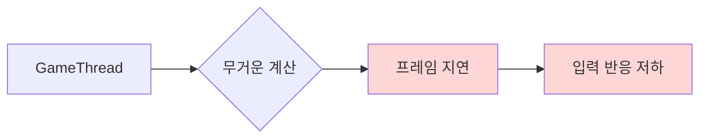
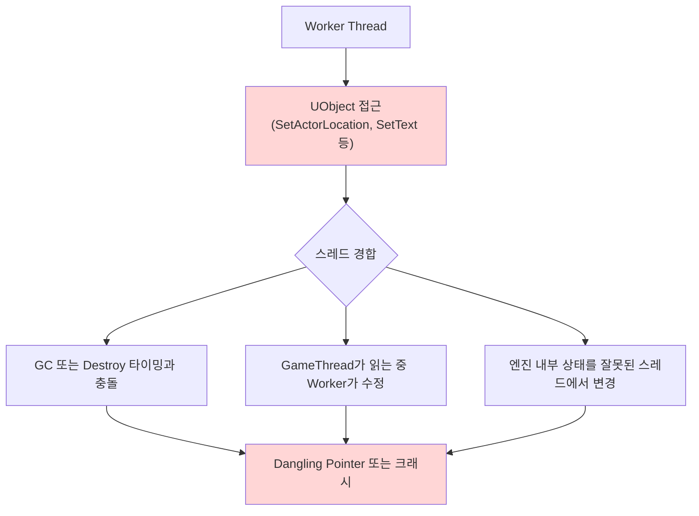
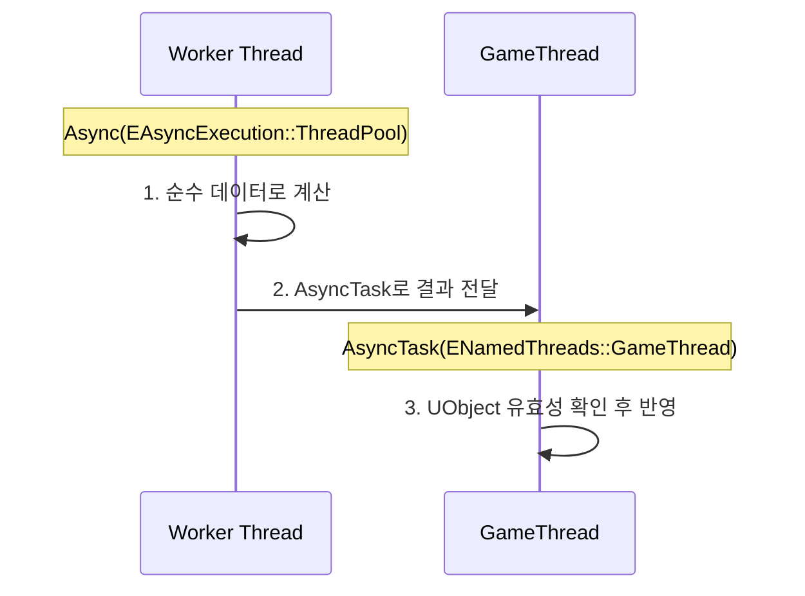

# Async와 ThreadPool

> [!summary]
> Unreal Engine에서 비동기 작업을 사용할 때 가장 중요한 원칙은 **UObject는 기본적으로 Thread-Safe하지 않다**는 점이다.
> 무거운 계산이나 파일 I/O는 Worker Thread에서 처리하고, 계산이 끝난 결과만 GameThread로 돌려보내 UObject에 반영해야 한다.

> [!note]
> 이 글은 UE5 계열의 일반적인 사용 원칙을 설명한다. 실제 프로젝트에서는 사용하는 엔진 버전의 API와 스레드 안전성 문서를 함께 확인한다.

## 왜 Async와 ThreadPool이 필요한가

`GameThread`는 Tick, 게임 로직, Actor/Component 처리, UI 갱신처럼 프레임마다 필요한 일을 담당한다. 여기에 오래 걸리는 계산이나 파일 처리가 끼어들면 프레임이 밀리고 화면이 멈춘 것처럼 보일 수 있다.



해결 방향은 명확하다.

1. 오래 걸리는 순수 계산은 Worker Thread에서 처리한다.
2. 계산 중에는 `UObject`, `AActor`, `UActorComponent`, `UWorld`를 직접 조작하지 않는다.
3. 결과 적용은 `AsyncTask(ENamedThreads::GameThread, ...)`로 GameThread에 넘긴다.

---

## 1. Worker Thread에서 UObject를 조심해야 하는 이유

`UObject`는 단순한 C++ 객체가 아니다. [[GC]]와 [[Reflection]] 시스템이 생명주기, 프로퍼티, 타입 정보를 추적하는 Unreal 런타임 객체다.

Worker Thread에서 UObject를 직접 읽거나 수정하면 매번 바로 실패하지는 않더라도, 다음 문제가 발생할 수 있다.



> [!caution]
> Worker Thread 안에서 `SpawnActor()`, `Destroy()`, `SetActorLocation()`, UI 위젯 수정, 컴포넌트 추가/삭제 같은 작업은 피해야 한다. 이런 작업은 GameThread에서 수행하는 것이 Unreal의 기본 규칙이다.

Worker Thread에서 안전하게 다루기 좋은 값은 UObject 생명주기와 독립적이고, 다른 스레드와 동시에 수정하지 않는 데이터다.

- `int32`, `float`, `bool`
- `FVector`, `FRotator`, `FTransform`
- Worker 전용으로 복사된 `TArray`, `TMap`, `FString`
- 직접 만든 순수 데이터 구조체

값 타입이라도 같은 인스턴스를 여러 스레드가 동시에 읽고 쓰면 데이터 레이스가 생길 수 있다. “UObject가 아니다”와 “자동으로 Thread-Safe하다”는 같은 뜻이 아니다.

---

## 2. 기본 패턴: 계산은 뒤에서, 적용은 앞에서

가장 안전한 구조는 **계산과 적용을 분리**하는 것이다.



잘못된 패턴:

```cpp
Async(EAsyncExecution::ThreadPool, [Actor, Pos]()
{
    // Worker Thread에서 UObject를 직접 조작한다.
    Actor->SetActorLocation(Pos);
});
```

권장 패턴:

```cpp
TWeakObjectPtr<AActor> WeakActor = Actor;
const FVector StartLocation = Actor->GetActorLocation();

Async(EAsyncExecution::ThreadPool, [WeakActor, StartLocation]()
{
    // Worker Thread: 순수 데이터만 사용해서 계산한다.
    const FVector Result = CalculateHeavyMath(StartLocation);

    AsyncTask(ENamedThreads::GameThread, [WeakActor, Result]()
    {
        // GameThread: UObject가 아직 유효한지 확인한 뒤 반영한다.
        if (!WeakActor.IsValid())
        {
            return;
        }

        WeakActor->SetActorLocation(Result);
    });
});
```

> [!tip]
> 람다에 `AActor*`를 그대로 캡처하면, 비동기 작업이 끝나기 전에 Actor가 삭제됐을 때 위험하다. `TWeakObjectPtr`로 캡처하고 GameThread에서 `IsValid()`를 확인하는 습관이 안전하다.
> 단, `TWeakObjectPtr`을 쓴다고 해서 Worker Thread에서 UObject를 역참조해도 된다는 뜻은 아니다.

---

## 3. ThreadPool의 역할

`ThreadPool`은 작업마다 새 스레드를 만드는 구조가 아니다. 미리 준비된 Worker Thread 묶음을 두고, 작업이 들어오면 비어 있는 스레드가 하나씩 가져가 처리하는 구조다.

| 구분 | 주된 역할 | UObject 접근 |
| --- | --- | --- |
| **GameThread** | Tick, 게임 로직, Actor/Component 생성과 삭제, UI 수정 | 가능 |
| **Worker Thread** | 무거운 계산, 파일 I/O, 압축/파싱 등 순수 작업 | 직접 조작 금지 |

ThreadPool을 쓰면 스레드 생성 비용을 줄이고 여러 비동기 작업을 효율적으로 나눠 처리할 수 있다. 다만 작업 수가 너무 많거나 각 작업이 너무 오래 걸리면 ThreadPool 자체가 포화될 수 있으므로, 작업 단위를 너무 잘게 쪼개거나 무한 대기 작업을 넣는 것은 피해야 한다.

특히 오래 막히는 파일 I/O나 네트워크 대기를 공용 ThreadPool에 많이 넣으면 계산 작업까지 기다릴 수 있다. 장시간 블로킹 작업은 엔진이 제공하는 비동기 I/O 기능이나 용도에 맞는 별도 실행 경로가 있는지 먼저 확인한다.

---

## 4. 실전 체크리스트

| 우선순위 | 규칙 | 이유 |
| --- | --- | --- |
| 1 | Worker Thread에서 UObject 조작 금지 | GC, 생명주기, 스레드 경합 문제를 피하기 위해 |
| 2 | 필요한 값은 GameThread에서 미리 복사 | Worker Thread가 UObject를 읽지 않도록 하기 위해 |
| 3 | 결과 적용은 GameThread로 복귀 | Unreal 객체 시스템은 GameThread 기준으로 동작하기 때문에 |
| 4 | UObject 참조는 `TWeakObjectPtr` 사용 | 비동기 작업 중 객체가 삭제될 수 있기 때문에 |
| 5 | 오래 붙잡는 작업은 취소/중단 조건 고려 | 레벨 전환, 객체 삭제, 게임 종료 시 안전하게 빠져나오기 위해 |
| 6 | 작업 완료 순서에 의존하지 않기 | 먼저 시작한 작업이 먼저 끝난다는 보장이 없기 때문에 |

> [!note]
> 결과가 도착한 순서가 중요하다면 요청 ID나 세대 번호를 함께 전달한다. GameThread에서 현재 요청과 일치하는 결과만 적용하면 오래된 작업이 최신 상태를 덮어쓰는 문제를 막을 수 있다.

---

## 정리

Async와 ThreadPool을 사용할 때의 핵심은 스레드를 많이 쓰는 것이 아니라, **UObject를 건드리는 시점과 순수 계산을 수행하는 시점을 분리하는 것**이다.

- Worker Thread: 순수 데이터 기반 계산
- GameThread: UObject 검증과 결과 반영
- 연결부: `AsyncTask(ENamedThreads::GameThread, ...)`

이 원칙을 지키면 Unreal 비동기 코드에서 발생하는 대부분의 위험한 크래시를 줄일 수 있다.

---

[[GC]] · [[Reflection]]
