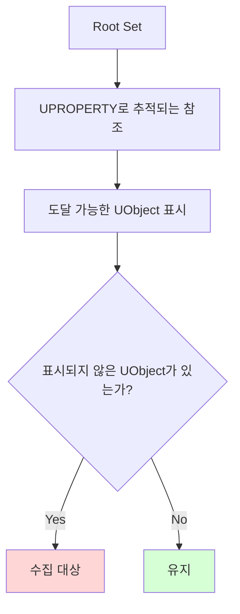

> [!summary]
> Unreal Engine의 **GC(Garbage Collection)**는 더 이상 도달할 수 없는 `UObject`를 찾아 정리하는 메모리 관리 시스템이다.
> C++ 자체에는 일반적인 의미의 GC가 없기 때문에, Unreal은 `UObject`, [[Reflection]], `UPROPERTY`를 기반으로 자체 런타임 메모리 관리 체계를 만든다.

## 왜 Unreal에는 GC가 있을까

기본 C++에서는 개발자가 직접 메모리를 소유하고 해제해야 한다. 하지만 게임에서는 Actor, Component, UI, 에셋 참조처럼 수많은 객체가 계속 생성되고 사라진다. 이 모든 생명주기를 수동으로 관리하면 메모리 누수나 Dangling Pointer가 쉽게 생긴다.

Unreal은 C++의 성능을 유지하면서도 엔진 객체를 안정적으로 관리하기 위해 `UObject` 기반 GC를 제공한다.

| 환경 | 런타임 타입 정보 | Reflection | GC |
| --- | --- | --- | --- |
| **순수 C++** | 제한적 RTTI 제공 | 일반적인 런타임 Reflection 없음 | 수동 관리 |
| **C# / Java** | 언어 차원에서 제공 | 언어 차원에서 제공 | 언어/런타임 차원에서 제공 |
| **Unreal C++** | `UCLASS` 기반 제공 | UHT와 메타데이터로 제공 | `UObject` 참조 그래프로 제공 |

---

## GC는 어떻게 객체를 판단할까

Unreal GC의 핵심은 **참조 그래프를 따라가며 도달 가능한 UObject를 표시하는 것**이다.



GC는 Root Set에서 시작해 `UPROPERTY`로 노출된 UObject 참조, 컨테이너 안의 UObject 참조, `AddReferencedObjects`로 보고된 참조 등을 따라간다. 이 그래프에서 도달할 수 없는 UObject는 수집 대상이 된다.

> [!caution]
> UObject 포인터를 일반 C++ 멤버 변수로만 들고 있으면 GC가 그 참조를 추적하지 못한다. 객체를 살려야 하는 소유 참조라면 `UPROPERTY()` 또는 UE5의 `TObjectPtr` 기반 멤버로 노출해야 한다.

예시:

```cpp
// GC가 추적하지 못하는 일반 포인터
UObject* CachedObject;

// GC가 추적할 수 있는 UObject 참조
UPROPERTY()
TObjectPtr<UObject> CachedObjectForGC;
```

`UPROPERTY()`가 붙었다고 해서 모든 포인터가 무조건 영원히 살아남는 것은 아니다. 중요한 점은 **도달 가능한 객체에서 이어지는 UPROPERTY 참조만 GC 그래프에 포함된다**는 것이다.

---

## Actor와 UObject의 차이

`AActor`도 `UObject`의 자식이지만, Actor 생명주기는 월드와 레벨 시스템의 영향을 강하게 받는다. `Destroy()`를 호출하면 보통 즉시 메모리가 해제되는 것이 아니라, 파괴 예정 상태가 되고 이후 엔진 흐름과 GC를 통해 정리된다.

따라서 비동기 작업에서 Actor를 오래 붙잡을 때는 생 포인터 대신 `TWeakObjectPtr<AActor>`를 사용하고, GameThread로 돌아온 뒤 `IsValid()`를 확인하는 것이 안전하다.

---

## GC와 멀티스레드

Unreal의 UObject 생명주기와 GC는 GameThread 중심으로 설계되어 있다. Worker Thread에서 UObject를 직접 읽거나 수정하면 GC, Destroy, 레벨 전환, GameThread의 상태 변경과 충돌할 수 있다.

이것이 [[Async & ThreadPool]] 작업에서 Worker Thread가 UObject를 직접 조작하면 안 되는 핵심 이유다.

---

## 정리

- GC는 `UObject` 참조 그래프를 기반으로 수집 대상을 판단한다.
- `UPROPERTY()` / `TObjectPtr`는 GC가 참조를 추적할 수 있게 해주는 표식이다.
- 일반 C++ 포인터만으로 들고 있는 UObject 참조는 GC 보호가 되지 않는다.
- Actor는 `Destroy()`와 월드 생명주기를 함께 고려해야 한다.
- 비동기 코드에서는 UObject 참조를 `TWeakObjectPtr`로 다루고 GameThread에서 유효성을 확인한다.

---

[[언리얼 엔진]] · [[C++]] · [[Reflection]] · [[Async & ThreadPool]]
