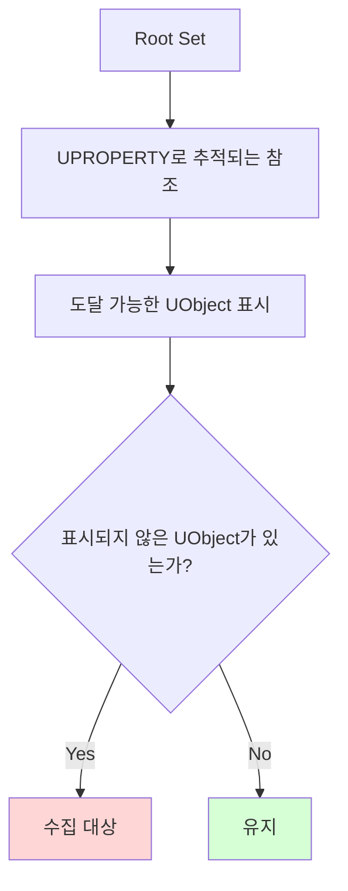

# Unreal Engine GC

> [!summary]
> Unreal Engine의 **GC(Garbage Collection)**는 더 이상 도달할 수 없는 `UObject`를 찾아 정리하는 메모리 관리 시스템이다.
> C++ 자체에는 일반적인 의미의 GC가 없기 때문에, Unreal은 `UObject`, [[Reflection]], `UPROPERTY`를 기반으로 자체 런타임 메모리 관리 체계를 만든다.

> [!note]
> 이 글은 UE5 계열의 일반적인 개념을 기준으로 한다. 포인터 권장 형태와 GC 구현 세부 사항은 엔진 버전에 따라 달라질 수 있다.

## 왜 Unreal에는 GC가 있을까

기본 C++에서는 자동 저장 기간, RAII, 스마트 포인터와 명시적인 소유권으로 객체 수명을 설계한다. 하지만 도달 불가능한 객체를 자동으로 찾아 정리하는 일반적인 추적 GC는 제공하지 않는다. 게임에서는 Actor, Component, UI, 에셋 참조처럼 수많은 객체가 계속 생성되고 사라지므로 소유 관계를 잘못 설계하면 메모리 누수나 Dangling Pointer가 생기기 쉽다.

Unreal은 C++의 성능을 유지하면서도 엔진 객체를 안정적으로 관리하기 위해 `UObject` 기반 GC를 제공한다.

| 환경 | 런타임 타입 정보 | Reflection | GC |
| --- | --- | --- | --- |
| **순수 C++** | 제한적 RTTI 제공 | 일반적인 런타임 Reflection 없음 | RAII·스마트 포인터·명시적 소유권, 일반적인 추적 GC 없음 |
| **C# / Java** | 언어 차원에서 제공 | 언어 차원에서 제공 | 언어/런타임 차원에서 제공 |
| **Unreal C++** | `UCLASS` 기반 제공 | UHT와 메타데이터로 제공 | `UObject` 참조 그래프로 제공 |

---

## GC는 어떻게 객체를 판단할까

Unreal GC의 핵심은 **참조 그래프를 따라가며 도달 가능한 UObject를 표시하는 것**이다.

> [!note]
> **참조 그래프**는 "누가 누구를 붙잡고 있는지 그린 지도"라고 보면 된다.
> Unreal GC는 Root Set에서 출발해 `UPROPERTY`로 이어진 UObject들을 따라가며 아직 사용 중인 객체를 찾는다.
> 선을 따라 도달할 수 있는 객체는 유지되고, 도달할 수 없는 객체는 수집 대상이 된다.



GC는 Root Set에서 시작해 `UPROPERTY`로 노출된 UObject 참조, 컨테이너 안의 UObject 참조, `AddReferencedObjects`로 보고된 참조 등을 따라간다. 이 그래프에서 도달할 수 없는 UObject는 수집 대상이 된다.

> [!caution]
> UObject 포인터를 일반 C++ 멤버 변수로만 들고 있으면 GC가 그 참조를 추적하지 못한다. 객체를 살려야 하는 소유 참조라면 `UPROPERTY()`를 붙이거나 UE5에서는 `UPROPERTY()`와 `TObjectPtr` 조합을 사용한다.

예시:

```cpp
// GC가 추적하지 못하는 일반 포인터
UObject* CachedObject;

// 기존 코드에서 볼 수 있는 UPROPERTY raw pointer 형태
UPROPERTY()
UObject* CachedObjectForGC;

// UE5의 새 코드에서 우선 고려할 멤버 포인터 형태
UPROPERTY()
TObjectPtr<UObject> CachedObjectForGCInUE5;
```

`UPROPERTY()`가 붙은 raw pointer의 허용 여부와 권장 수준은 엔진 버전 및 UHT 설정에 따라 달라질 수 있다. UE5의 새 코드에서는 `UPROPERTY()`와 `TObjectPtr` 조합을 우선 확인한다.

### 왜 UE5에서는 TObjectPtr을 권장할까

`TObjectPtr<T>`는 UObject를 가리키는 멤버 포인터라는 의도를 엔진에 더 명확하게 알려주는 래퍼 타입이다. 겉으로는 일반 포인터처럼 `CachedObject->DoSomething()` 형태로 사용할 수 있지만, 내부적으로는 Unreal의 객체 핸들 시스템과 더 잘 맞게 설계되어 있다.

| 구분 | 일반 UObject 포인터 | `TObjectPtr` |
| --- | --- | --- |
| 사용 방식 | `UObject*` | `TObjectPtr<UObject>` |
| GC 추적 | `UPROPERTY()`가 있어야 추적 | `UPROPERTY()`와 함께 쓰면 추적 |
| 의도 표현 | C++ 포인터인지 UObject 참조인지 덜 명확함 | UObject 멤버 참조라는 의도가 명확함 |
| UE5 방향성 | 기존 코드 호환용으로 여전히 사용 | 새 UObject 멤버 변수에 권장 |

> [!important]
> `TObjectPtr`만 쓴다고 GC가 자동으로 추적하는 것은 아니다. 멤버 변수로 UObject를 살려야 한다면 여전히 `UPROPERTY()`와 함께 써야 한다.

`UPROPERTY()`가 붙었다고 해서 모든 포인터가 영원히 살아남는 것은 아니다. 중요한 점은 **도달 가능한 객체에서 이어지는 UPROPERTY 참조만 GC 그래프에 포함된다**는 것이다.

---

## UObject 참조 유형 선택

| 참조 유형 | 객체를 살려두는가 | 주된 용도 |
| --- | --- | --- |
| `UPROPERTY() TObjectPtr<T>` | 예 | `UObject`/`USTRUCT` 멤버의 소유 참조 |
| `TWeakObjectPtr<T>` | 아니요 | 사라질 수 있는 객체의 비소유 참조와 캐시 |
| `TSoftObjectPtr<T>` | 아니요 | 경로를 보관하고 필요할 때 로드할 에셋 참조 |
| `TStrongObjectPtr<T>` | 예 | `UPROPERTY`를 쓸 수 없는 비-UObject 소유자에서 강한 참조가 필요할 때 |

> [!note]
> “강한 참조”는 참조가 유지되는 동안 GC가 대상을 수집하지 못하게 한다는 뜻이다. `TWeakObjectPtr`과 `TSoftObjectPtr`은 대상을 살려두지 않으므로 사용 전에 유효성이나 로드 상태를 확인해야 한다.

---

## Actor와 UObject의 차이

`AActor`도 `UObject`의 자식이지만, Actor 생명주기는 월드와 레벨 시스템의 영향을 강하게 받는다. `Destroy()`를 호출하면 보통 즉시 메모리가 해제되는 것이 아니라, 파괴 예정 상태가 되고 이후 엔진 흐름과 GC를 통해 정리된다.

따라서 비동기 작업에서 Actor를 오래 붙잡을 때는 생 포인터 대신 `TWeakObjectPtr<AActor>`를 사용하고, GameThread로 돌아온 뒤 `IsValid()`를 확인하는 것이 안전하다.

### 왜 비동기 코드에서는 TWeakObjectPtr을 쓸까

비동기 작업은 시작한 시점과 끝나는 시점이 다르다. 작업을 Worker Thread에 넘긴 뒤, 그 작업이 끝나기 전에 Actor가 `Destroy()`되거나 레벨 전환으로 사라질 수 있다.

이때 생 포인터를 람다에 그대로 캡처하면 문제가 생긴다.

```cpp
Async(EAsyncExecution::ThreadPool, [Actor]()
{
    const FVector Result = CalculateHeavyMath();

    AsyncTask(ENamedThreads::GameThread, [Actor, Result]()
    {
        // Actor가 이미 삭제되었거나 파괴 예정이면 위험하다.
        Actor->SetActorLocation(Result);
    });
});
```

`TWeakObjectPtr`은 객체를 강제로 살려두지 않는 약한 참조다. 대신 "아직 유효한 객체인지"를 확인할 수 있게 해준다.

```cpp
TWeakObjectPtr<AActor> WeakActor = Actor;

Async(EAsyncExecution::ThreadPool, [WeakActor]()
{
    const FVector Result = CalculateHeavyMath();

    AsyncTask(ENamedThreads::GameThread, [WeakActor, Result]()
    {
        if (!WeakActor.IsValid())
        {
            return;
        }

        WeakActor->SetActorLocation(Result);
    });
});
```

핵심은 `TWeakObjectPtr`이 객체를 보호해주는 것이 아니라, **객체가 아직 살아 있는지 확인할 수 있는 안전장치**라는 점이다. 그래서 비동기 작업에서는 UObject를 오래 붙잡기보다 약한 참조로 들고 있다가, GameThread로 돌아온 뒤 유효하면 적용하고 아니면 조용히 포기하는 흐름을 사용한다.

> [!caution]
> `TWeakObjectPtr`을 사용해도 Worker Thread에서 UObject를 직접 읽거나 수정하면 안 된다. 유효성 확인과 결과 반영은 GameThread에서 수행한다.

---

## GC와 멀티스레드

Unreal의 UObject 생명주기와 GC는 GameThread 중심으로 설계되어 있다. Worker Thread에서 UObject를 직접 읽거나 수정하면 GC, Destroy, 레벨 전환, GameThread의 상태 변경과 충돌할 수 있다.

이것이 [[Async & ThreadPool]] 작업에서 Worker Thread가 UObject를 직접 조작하면 안 되는 핵심 이유다. 필요한 값은 GameThread에서 미리 복사하고, Worker Thread는 복사된 순수 데이터만 처리하는 편이 안전하다.

---

## 정리

- GC는 `UObject` 참조 그래프를 기반으로 수집 대상을 판단한다.
- `UPROPERTY()`는 GC가 참조를 추적할 수 있게 해주는 표식이고, UE5에서는 `TObjectPtr`과 함께 쓰는 형태가 권장된다.
- 일반 C++ 포인터만으로 들고 있는 UObject 참조는 GC 보호가 되지 않는다.
- Actor는 `Destroy()`와 월드 생명주기를 함께 고려해야 한다.
- 비동기 코드에서는 UObject 참조를 `TWeakObjectPtr`로 다루고 GameThread에서 유효성을 확인한다.

---

[[Reflection]] · [[Async & ThreadPool]]
