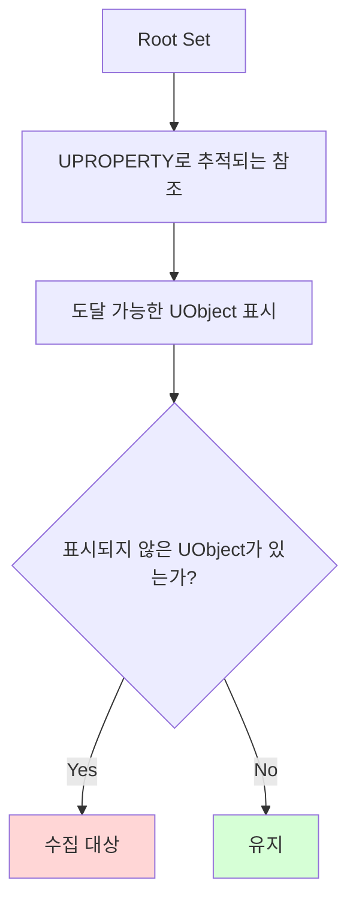

# Unreal Engine GC

> [!summary]
> Unreal Engine의 **GC(Garbage Collection)**는 더 이상 도달할 수 없는 `UObject`를 찾아 정리하는 메모리 관리 시스템이다.
> C++ 자체에는 일반적인 의미의 GC가 없기 때문에, Unreal은 `UObject`, [[Reflection]], `UPROPERTY`를 기반으로 자체 런타임 메모리 관리 체계를 만든다.

## UObject 포인터는 이것부터

```text
UPROPERTY
= 엔진이 이 멤버를 인식하고 추적할 수 있게 한다.

TObjectPtr<T>
= 로드된 UObject를 지속적으로 저장하는 UE5 권장 포인터 표현이다.

UPROPERTY() + TObjectPtr<T>
= GC가 추적하는 지속적인 강한 참조가 된다.
```

> [!important]
> 기준은 헤더인지 `.cpp`인지가 아니다. **오래 저장하는가, 잠깐 빌려 쓰는가, 대상의 수명을 유지할 것인가**로 포인터를 선택한다.

| 의도 | 기본 선택 |
| --- | --- |
| `UCLASS`/`USTRUCT` 멤버로 저장하고 대상을 살려둠 | `UPROPERTY() TObjectPtr<T>` |
| 함수 인수·반환값·지역 변수로 잠깐 사용 | `T*` |
| 멤버로 기억하지만 대상을 살려두지 않음 | `TWeakObjectPtr<T>` |
| 에셋을 지금 로드하지 않고 경로로 참조 | `UPROPERTY() TSoftObjectPtr<T>` |
| 비-UObject 소유자가 대상을 살려둠 | `TStrongObjectPtr<T>` |

## GC 동작 흐름

```text
Root Set
→ UPROPERTY로 표시된 TObjectPtr 같은 추적 가능한 참조를 따라감
→ 도달 가능: 유지
→ 도달 불가: 수집 대상
```

| 참조 | 역할 |
| --- | --- |
| `TObjectPtr` + `UPROPERTY` | 객체를 살려두는 멤버 참조 |
| `TWeakObjectPtr` | 객체를 살려두지 않고 유효성만 확인 |
| `TSoftObjectPtr` | 에셋 경로를 보관하고 필요할 때 로드 |

---

## 왜 Unreal에는 GC가 있을까

기본 C++에서는 RAII, 스마트 포인터와 명시적인 소유권으로 객체 수명을 설계한다. 도달 불가능한 객체를 자동으로 찾아 정리하는 일반적인 추적 GC는 제공하지 않는다.

게임에서는 Actor, Component, UI, 에셋 참조처럼 수많은 객체가 계속 생성되고 사라진다. 소유 관계를 잘못 설계하면 메모리 누수나 Dangling Pointer가 생기기 쉽다.

Unreal은 C++의 성능을 유지하면서도 엔진 객체를 안정적으로 관리하기 위해 `UObject` 기반 GC를 제공한다.

| 환경 | 런타임 타입 정보 | Reflection | GC |
| --- | --- | --- | --- |
| **순수 C++** | 제한적 RTTI 제공 | 일반적인 런타임 Reflection 없음 | RAII·스마트 포인터·명시적 소유권, 일반적인 추적 GC 없음 |
| **C# / Java** | 언어 차원에서 제공 | 언어 차원에서 제공 | 언어/런타임 차원에서 제공 |
| **Unreal C++** | `UCLASS` 기반 제공 | UHT와 메타데이터로 제공 | `UObject` 참조 그래프로 제공 |

---

## GC는 어떻게 객체를 판단할까

Unreal GC의 핵심은 **참조 그래프를 따라가며 도달 가능한 UObject를 표시하는 것**이다.

> [!note]
> **참조 그래프**는 UObject 사이의 참조 관계를 나타낸다.
> Unreal GC는 Root Set에서 출발해 `UPROPERTY`로 이어진 UObject들을 따라가며 아직 사용 중인 객체를 찾는다.
> 선을 따라 도달할 수 있는 객체는 유지되고, 도달할 수 없는 객체는 수집 대상이 된다.


```mermaid
flowchart TD
    A[Root Set] --> B[UPROPERTY로 추적되는 참조]
    B --> C[도달 가능한 UObject 표시]
    C --> D{표시되지 않은 UObject가 있는가?}
    D -- Yes --> E[수집 대상]
    D -- No --> F[유지]

    style E fill:#ffd6d6
    style F fill:#d6ffd6
```

GC는 Root Set에서 다음 참조를 따라간다.

- `UPROPERTY`로 노출된 UObject 참조
- 컨테이너 안의 추적 가능한 UObject 참조
- `AddReferencedObjects`로 보고된 참조

이 그래프에서 도달할 수 없는 UObject는 수집 대상이 된다.

> [!caution]
> UObject 포인터를 일반 C++ 멤버 변수로만 들고 있으면 GC가 그 참조를 추적하지 못한다. 객체를 살려야 하는 소유 참조라면 `UPROPERTY()`를 붙이거나 UE5에서는 `UPROPERTY()`와 `TObjectPtr` 조합을 사용한다.

예시:

```cpp
// GC가 추적하지 못하는 일반 포인터
UObject* CachedObject;

// 기존 코드에서 볼 수 있는 UPROPERTY raw pointer 형태
UPROPERTY()
UObject* CachedObjectForGC;

// UE5의 새 코드에서 우선 고려할 멤버 포인터 형태
UPROPERTY()
TObjectPtr<UObject> CachedObjectForGCInUE5;
```

`UPROPERTY()`가 붙은 raw pointer의 허용 여부와 권장 수준은 엔진 버전 및 UHT 설정에 따라 달라질 수 있다. UE5의 새 코드에서는 `UPROPERTY()`와 `TObjectPtr` 조합을 우선 확인한다.

---

## `TObjectPtr`을 사용하는 이유

`TObjectPtr<T>`는 `UObject`를 가리키기 위한 Unreal 전용 포인터 래퍼다. 객체를 직접 소유하거나 삭제하는 스마트 포인터라기보다, **UObject 참조를 UE5의 객체 핸들·GC 체계에 맞게 표현하는 타입**이다.

### `UPROPERTY`와 역할이 다르다

```cpp
UPROPERTY()
TObjectPtr<UWeaponObject> EquippedWeapon;
```

| 부분 | 역할 |
| --- | --- |
| `UPROPERTY()` | UHT가 이 멤버의 메타데이터를 만들고 엔진이 참조를 인식할 수 있게 함 |
| `TObjectPtr<UWeaponObject>` | 이 멤버가 로드된 UObject를 저장하는 참조임을 표현 |
| 둘의 조합 | 소유 객체가 도달 가능한 동안 대상을 살려두는 GC 강한 참조 |

`UPROPERTY`는 멤버를 리플렉션 시스템에 알리는 표식이다. GC 추적 외의 직렬화, 에디터 노출, 복제 같은 동작은 포인터 타입과 `EditAnywhere`, `Replicated`, `Transient` 등의 지정자에 따라 달라진다.

### 네 가지 경우를 구분한다

| 선언 | 지속적인 GC 강한 참조인가? | 해석 |
| --- | :---: | --- |
| `UObject* Object` | 아니요 | 엔진이 추적하지 않는 일반 C++ 포인터 |
| `UPROPERTY() UObject* Object` | 기존 코드·설정에 따라 가능 | 예전 코드에서 볼 수 있는 형태 |
| `TObjectPtr<UObject> Object` | 아니요 | 래퍼만 있고 리플렉션에 등록되지 않은 멤버 |
| `UPROPERTY() TObjectPtr<UObject> Object` | 예 | UE5 새 코드의 기본 형태 |

> [!important]
> `TObjectPtr`만 쓴다고 GC가 자동으로 추적하지 않는다. 지속적인 강한 멤버 참조라면 `UPROPERTY()`와 함께 사용한다.

기존의 `UPROPERTY() UObject*`도 프로젝트의 UE 버전과 UHT 설정에 따라 GC가 추적할 수 있다. 차이는 “raw pointer는 절대 추적 불가, `TObjectPtr`만 추적 가능”이 아니다. UE5 새 코드에서는 다음 이유로 `TObjectPtr` 조합을 권장한다.

- GC 쓰기 장벽과 증분 GC 마킹 지원
- cook-time 의존성 추적 지원
- 직렬화와 복제 지원
- 지속적인 UObject 멤버 참조라는 의도 표현

### 객체를 만들거나 삭제하지 않는다

`TObjectPtr`는 `TSharedPtr`처럼 참조 카운트가 0이 되면 객체를 삭제하지 않는다.

```text
TSharedPtr       → 참조 카운트로 일반 C++ 객체 수명 관리
TObjectPtr       → Unreal GC가 따라갈 UObject 참조 표현
```

객체 생성은 별도로 한다.

```cpp
EquippedWeapon = NewObject<UWeaponObject>(this);
```

`UObject`에 `delete EquippedWeapon`을 호출하면 안 된다. 대상 정리는 Unreal의 객체 생명주기와 GC가 담당한다.

`UPROPERTY()`가 붙었다고 해서 대상이 무조건 영원히 살아남는 것도 아니다. **Root Set에서 소유 객체까지 도달할 수 있고, 그 객체에서 대상까지 강한 참조가 이어질 때** GC가 대상을 유지한다.

---

## UObject 참조 유형 선택

| 참조 유형 | 객체를 살려두는가 | 주된 용도 |
| --- | --- | --- |
| `UPROPERTY() TObjectPtr<T>` | 예 | `UObject`/`USTRUCT` 멤버의 지속적인 강한 참조 |
| `TWeakObjectPtr<T>` | 아니요 | 사라질 수 있는 객체의 비소유 참조와 캐시 |
| `TSoftObjectPtr<T>` | 아니요 | 경로를 보관하고 필요할 때 로드할 에셋 참조 |
| `TStrongObjectPtr<T>` | 예 | `UPROPERTY`를 쓸 수 없는 비-UObject 소유자에서 강한 참조가 필요할 때 |

> [!note]
> “강한 참조”는 참조가 유지되는 동안 GC가 대상을 수집하지 못하게 한다는 뜻이다. `TWeakObjectPtr`과 `TSoftObjectPtr`은 대상을 살려두지 않으므로 사용 전에 유효성이나 로드 상태를 확인해야 한다.

---

## 저장하는 참조와 잠깐 쓰는 포인터

`TObjectPtr`를 선택하는 기준은 `.h`와 `.cpp`가 아니다. **함수가 끝난 뒤에도 참조를 저장할 것인지**가 핵심이다.

```cpp
UCLASS()
class UCombatComponent : public UActorComponent
{
    GENERATED_BODY()

private:
    // 여러 프레임 동안 저장하며 대상을 살려둔다.
    UPROPERTY()
    TObjectPtr<AActor> CurrentTarget;

public:
    // 함수가 실행되는 동안 잠깐 전달받고 반환한다.
    void SetTarget(AActor* NewTarget);
    AActor* GetTarget() const;
};
```

```cpp
void UCombatComponent::SetTarget(AActor* NewTarget)
{
    CurrentTarget = NewTarget;
}

AActor* UCombatComponent::GetTarget() const
{
    return CurrentTarget.Get();
}
```

```text
CurrentTarget  → 함수가 끝난 뒤에도 저장됨 → TObjectPtr<AActor>
NewTarget      → 함수에서 잠깐 빌려 씀     → AActor*
GetTarget()    → 주소를 잠깐 전달함         → AActor*
```

지역 변수와 함수 매개변수에는 `UPROPERTY()`를 붙일 수 없다. 이 자리에서 `TObjectPtr`를 쓴다고 대상을 GC로부터 보호하는 것도 아니므로 일반적으로 raw pointer를 사용한다.

```cpp
void UCombatComponent::FindTarget()
{
    AActor* FoundTarget = FindNearestEnemy();

    if (IsValid(FoundTarget))
    {
        CurrentTarget = FoundTarget;
    }
}
```

`if (Pointer)`는 null인지 확인한다. `IsValid(Pointer)`는 null이거나 Unreal 객체가 파괴 예정인 경우까지 확인한다. 대상이 `Destroy()`될 수 있는 Actor라면 `IsValid`가 필요한 상황이 있다.

---

## 컨테이너에 저장할 때

컨테이너 멤버 자체에 `UPROPERTY()`를 붙이고 원소 타입으로 `TObjectPtr`를 사용한다.

```cpp
UPROPERTY()
TArray<TObjectPtr<UItemObject>> Inventory;

UPROPERTY()
TSet<TObjectPtr<AActor>> TrackedActors;

UPROPERTY()
TMap<FName, TObjectPtr<UAbilityData>> Abilities;
```

중요한 것은 `TArray`는 안전하고 `TSet`/`TMap`은 위험하다는 구분이 아니다. **컨테이너가 리플렉션에 등록된 강한 UObject 참조를 담고 있는가**가 기준이다.

### `TMap::Find`의 반환 타입

```cpp
UPROPERTY()
TMap<FName, TObjectPtr<UItemObject>> Items;
```

이 Map의 값 타입은 `TObjectPtr<UItemObject>`다. `Find()`는 저장된 값의 주소를 반환하므로 반환 타입은 `TObjectPtr<UItemObject>*`가 된다.

```cpp
if (TObjectPtr<UItemObject>* Found = Items.Find(ItemId))
{
    if (UItemObject* Item = Found->Get())
    {
        Item->Use();
    }
}
```

```cpp
UItemObject** Found = Items.Find(ItemId); // 타입이 다르므로 오류
```

컨테이너 원소의 실제 타입을 직접 다루는 경우에는 `.cpp`에서도 `TObjectPtr<T>`가 나타날 수 있다.

---

## Actor와 UObject의 차이

`AActor`도 `UObject`의 자식이지만, Actor 생명주기는 월드와 레벨 시스템의 영향을 강하게 받는다.

`Destroy()`를 호출하면 보통 즉시 메모리가 해제되지 않는다. 파괴 예정 상태가 된 뒤 엔진 흐름과 GC를 통해 정리된다.

따라서 비동기 작업에서 Actor를 오래 붙잡을 때는 생 포인터 대신 `TWeakObjectPtr<AActor>`를 사용하고, GameThread로 돌아온 뒤 `IsValid()`를 확인하는 것이 안전하다.

---

## 비동기 코드와 `TWeakObjectPtr`

비동기 작업은 시작한 시점과 끝나는 시점이 다르다. 작업을 Worker Thread에 넘긴 뒤, 그 작업이 끝나기 전에 Actor가 `Destroy()`되거나 레벨 전환으로 사라질 수 있다.

이때 생 포인터를 람다에 그대로 캡처하면 문제가 생긴다.

```cpp
Async(EAsyncExecution::ThreadPool, [Actor]()
{
    const FVector Result = CalculateHeavyMath();

    AsyncTask(ENamedThreads::GameThread, [Actor, Result]()
    {
        // Actor가 이미 삭제되었거나 파괴 예정이면 위험하다.
        Actor->SetActorLocation(Result);
    });
});
```

`TWeakObjectPtr`은 객체를 강제로 살려두지 않는 약한 참조다. 대신 "아직 유효한 객체인지"를 확인할 수 있게 해준다.

```cpp
TWeakObjectPtr<AActor> WeakActor = Actor;

Async(EAsyncExecution::ThreadPool, [WeakActor]()
{
    const FVector Result = CalculateHeavyMath();

    AsyncTask(ENamedThreads::GameThread, [WeakActor, Result]()
    {
        if (!WeakActor.IsValid())
        {
            return;
        }

        WeakActor->SetActorLocation(Result);
    });
});
```

`TWeakObjectPtr`은 객체를 보호하지 않는다. **객체가 아직 살아 있는지 확인할 수 있는 안전장치**다.

비동기 작업에서는 UObject를 약한 참조로 들고 있다가 GameThread로 돌아온다. 객체가 유효하면 결과를 적용하고, 사라졌다면 작업 결과를 버린다.

> [!caution]
> `TWeakObjectPtr`을 사용해도 Worker Thread에서 UObject를 직접 읽거나 수정하면 안 된다. 유효성 확인과 결과 반영은 GameThread에서 수행한다.

---

## GC와 멀티스레드

Unreal의 UObject 생명주기와 GC는 GameThread 중심으로 설계되어 있다.

Worker Thread에서 UObject를 직접 읽거나 수정하면 GC, Destroy, 레벨 전환, GameThread의 상태 변경과 충돌할 수 있다.

이것이 [[Async & ThreadPool]] 작업에서 Worker Thread가 UObject를 직접 조작하면 안 되는 핵심 이유다. 필요한 값은 GameThread에서 미리 복사하고, Worker Thread는 복사된 순수 데이터만 처리하는 편이 안전하다.

---

## 정리

- GC는 `UObject` 참조 그래프를 기반으로 수집 대상을 판단한다.
- `UPROPERTY()`는 엔진이 멤버를 인식하게 하고, `TObjectPtr`는 지속적인 UObject 참조를 표현한다.
- `UPROPERTY() TObjectPtr<T>`는 GC가 추적하는 강한 멤버 참조이며 UE5 새 코드의 기본 형태다.
- 함수 인수·반환값·지역 변수처럼 잠깐 사용하는 참조에는 일반적으로 `T*`를 쓴다.
- `TObjectPtr`는 객체를 생성·삭제하거나 `TSharedPtr`처럼 참조 카운트를 관리하지 않는다.
- `TWeakObjectPtr`는 대상을 살려두지 않고, `TSoftObjectPtr`는 에셋 경로를 보관한다.
- Actor는 `Destroy()`와 월드 생명주기를 함께 고려해야 한다.
- 비동기 코드에서는 UObject 참조를 `TWeakObjectPtr`로 다루고 GameThread에서 유효성을 확인한다.

> [!note]
> 이 글은 UE5 계열의 일반적인 개념을 기준으로 한다. 포인터 권장 형태와 GC 구현 세부 사항은 엔진 버전에 따라 달라질 수 있다.

---

## 검증 자료

- [Epic Games: Object Pointers](https://dev.epicgames.com/documentation/en-us/unreal-engine/object-pointers-in-unreal-engine)
- [Epic Games: Unreal Object Handling](https://dev.epicgames.com/documentation/en-us/unreal-engine/unreal-object-handling-in-unreal-engine)

---

[[Unreal 정리 목차]] · [[Reflection]] · [[Async & ThreadPool]]
