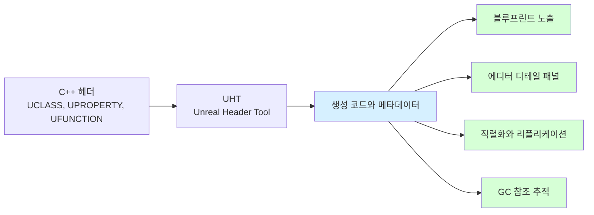

# Unreal Engine Reflection

> [!summary]
> Unreal Engine의 **Reflection**은 C++ 코드의 클래스, 프로퍼티, 함수 정보를 엔진이 런타임에 이해할 수 있도록 만드는 메타데이터 시스템이다.
> 이 시스템 덕분에 블루프린트 노출, 에디터 디테일 패널, 직렬화, 네트워크 리플리케이션, [[GC]] 참조 추적이 가능해진다.

> [!note]
> 이 글은 UE5 계열의 일반적인 개념을 기준으로 한다. 매크로 지정자와 생성 코드의 세부 형태는 엔진 버전에 따라 달라질 수 있다.

## 먼저 보는 전체 흐름

```text
C++ 헤더에 UCLASS·UPROPERTY·UFUNCTION 작성
        ↓
빌드 전에 UHT가 선언 분석
        ↓
생성 코드와 메타데이터 작성
        ↓
에디터·블루프린트·직렬화·리플리케이션·GC가 정보 사용
```

핵심은 매크로 자체가 모든 기능을 수행하는 것이 아니라, **UHT가 매크로가 붙은 선언을 수집해 Unreal 시스템이 사용할 정보를 만든다**는 점이다.

## C++과 Unreal Reflection의 차이

C#이나 Java는 언어와 런타임이 Reflection을 기본 제공한다. 반면 C++은 `typeid` 같은 제한적인 RTTI는 있지만, "이 클래스의 어떤 멤버가 에디터에 노출되는가", "이 프로퍼티를 GC가 추적해야 하는가" 같은 엔진 수준 메타데이터를 기본으로 제공하지 않는다.

Unreal은 이 빈틈을 `UHT(Unreal Header Tool)`와 매크로 기반 메타데이터로 채운다.

### 왜 C++의 기능만으로는 부족할까

전통적인 C++에는 C#이나 Java처럼 런타임에 클래스와 멤버 정보를 폭넓게 조회하는 Reflection이 기본 제공되지 않았다. C++26 작업 초안에는 정적 Reflection 기능이 반영되어 있지만, 이는 Unreal의 에디터 노출, 블루프린트 연동, GC 추적, 리플리케이션 메타데이터를 그대로 대체하는 시스템이 아니다. 표준 반영 여부와 실제 컴파일러 지원 범위도 구분해서 확인해야 한다.

C++은 사용하지 않는 기능의 비용을 강제하지 않는 방향을 중시하며, 네이티브 코드에는 소스의 모든 이름과 구조 정보가 자동으로 남지 않는다. 반면 Unreal은 타입 확인을 넘어 다음 정보가 필요하다.

- 어떤 멤버를 에디터에 보여줄지
- 어떤 함수를 블루프린트에서 호출할 수 있는지
- 어떤 UObject 참조를 GC가 따라가야 하는지
- 어떤 프로퍼티를 저장·복제·직렬화할지

따라서 Unreal은 **컴파일 전에 UHT로 선언을 분석하고 엔진용 메타데이터를 생성하는 방식**을 사용한다.

### typeid와 RTTI는 왜 부족할까

RTTI(Runtime Type Information)는 C++이 런타임에 일부 타입 정보를 확인할 수 있게 해주는 기능이다. 대표적으로 `typeid`를 사용하면 객체나 변수의 실제 타입 정보를 얻을 수 있다.

```cpp
UObject* Object = GetSomeObject();

if (Object && typeid(*Object) == typeid(UMyObject))
{
    // C++ RTTI 기준으로 타입 비교
}
```

다만 Unreal 프로젝트에서는 C++ RTTI에 기대지 않는 편이 일반적이다. Unreal Build 설정에서는 C++ RTTI가 꺼져 있는 경우가 많고, UObject 타입 판별은 Unreal Reflection 시스템을 기준으로 하는 것이 엔진의 흐름과 더 잘 맞는다.

또한 `typeid` 비교는 보통 정확한 C++ 타입 비교에 가깝기 때문에, Unreal의 클래스 상속 구조를 다룰 때는 `IsA()`나 `Cast<>`가 더 자연스럽다.

그래서 Unreal 코드에서는 보통 위 방식보다 Unreal Reflection 기반 API를 사용한다.

```cpp
UObject* Object = GetSomeObject();

if (Object && Object->IsA(UMyObject::StaticClass()))
{
    // Unreal Reflection 기준으로 타입 확인
}

UMyObject* MyObject = Cast<UMyObject>(Object);
```

하지만 C++ RTTI는 Unreal이 필요로 하는 정보에 비해 범위가 좁다.

| C++ RTTI로 알기 어려운 것 | Unreal Reflection이 제공하는 것 |
| --- | --- |
| 이 멤버 변수가 에디터에 노출되는지 | `UPROPERTY(EditAnywhere)` |
| 이 함수가 블루프린트에서 호출 가능한지 | `UFUNCTION(BlueprintCallable)` |
| 이 UObject 참조를 GC가 추적해야 하는지 | `UPROPERTY()` |
| 이 프로퍼티를 저장, 복제, 직렬화해야 하는지 | `UPROPERTY` 지정자와 메타데이터 |
| 클래스의 프로퍼티 목록을 엔진 시스템이 순회할 수 있는지 | `UClass`, `FProperty`, `UFunction` 메타데이터 |

즉, `typeid`는 "C++ 타입이 무엇인가"를 일부 확인하는 기능에 가깝고, Unreal Reflection은 "이 타입과 멤버를 엔진이 어떻게 다뤄야 하는가"까지 알려주는 시스템이다.

| 기능 | 순수 C++ | Unreal C++ |
| --- | --- | --- |
| 타입 식별 | 제한적 RTTI | `UCLASS`, `USTRUCT`, `UENUM` |
| 프로퍼티 메타데이터 | 직접 구현 필요 | `UPROPERTY` |
| 함수 메타데이터 | 직접 구현 필요 | `UFUNCTION` |
| GC 참조 추적 | 없음 | `UPROPERTY`와 참조 그래프 |
| 블루프린트/에디터 연동 | 없음 | 매크로와 메타데이터로 지원 |

---

## UHT와 generated.h

`UCLASS()`, `UPROPERTY()`, `UFUNCTION()` 같은 매크로를 달아두면, 컴파일 전에 UHT가 헤더를 분석하고 Unreal이 사용할 메타데이터 코드를 생성한다. 이 결과가 `.generated.h`와 UHT가 자동으로 만든 C++ 코드에 반영된다.

여기서 **생성 코드**란 개발자가 직접 손으로 작성하지 않고, UHT가 빌드 과정에서 자동으로 만들어주는 C++ 보조 코드를 말한다. 예를 들어 클래스 등록, 프로퍼티 목록, 함수 호출 정보, `StaticClass()` 같은 Unreal Reflection 연결 정보가 여기에 포함된다.

> [!note]
> 개발자는 보통 이 생성 코드를 직접 수정하지 않는다. 헤더에 매크로와 선언을 올바르게 작성하면, UHT가 필요한 코드를 다시 만들어준다.



즉, 이 매크로들은 단순한 문법 장식이 아니라 "이 타입과 멤버를 Unreal 런타임 시스템에 등록하라"는 신호다.

---

## 주요 매크로 역할

| 매크로 | 대상 | 역할 |
| --- | --- | --- |
| `UCLASS()` | `UObject` 기반 클래스 | 타입 등록, 블루프린트/에디터/직렬화 연동 |
| `USTRUCT()` | 값 타입 구조체 | 직렬화, 에디터 노출, 블루프린트 연동 |
| `UENUM()` | 열거형 | 에디터와 블루프린트에서 이름 기반 사용 |
| `UPROPERTY()` | 멤버 변수 | 에디터 노출, 저장/복제 옵션 부여, UObject 참조 GC 추적 |
| `UFUNCTION()` | 멤버 함수 | 블루프린트 호출, 이벤트/콘솔/RPC 연동 |

예시:

```cpp
UCLASS()
class AMyActor : public AActor
{
    GENERATED_BODY()

public:
    UPROPERTY(VisibleAnywhere, BlueprintReadOnly)
    TObjectPtr<UStaticMeshComponent> Mesh;

    UPROPERTY(EditAnywhere, BlueprintReadWrite)
    float MoveSpeed = 600.0f;

    UFUNCTION(BlueprintCallable)
    void ActivateActor();
};
```

---

## Reflection과 Thread Safety

Reflection 자체는 메타데이터 조회에 사용되지만, Reflection으로 접근하는 대상은 대부분 UObject와 그 프로퍼티다. UObject 상태는 GameThread 중심으로 관리되므로 Worker Thread에서 임의로 읽고 쓰면 안전하지 않다.

> [!caution]
> Worker Thread에서 UObject 프로퍼티를 직접 수정하지 않는다. 비동기 작업에서는 필요한 값을 미리 복사하고, 계산 결과만 GameThread로 돌려보내 반영한다.

이 규칙은 [[Async & ThreadPool]]과 [[GC]]를 이해할 때도 같은 기준으로 이어진다.

---

## 정리

- Unreal Reflection은 C++에 엔진용 런타임 메타데이터를 추가하는 시스템이다.
- UHT가 헤더를 분석해 `.generated.h`와 생성 코드를 만든다.
- `UPROPERTY`는 에디터 노출뿐 아니라 GC 참조 추적에도 중요하다.
- Reflection으로 다루는 UObject 상태는 GameThread 기준으로 접근하는 것이 안전하다.

---

[[GC]] · [[Async & ThreadPool]]
