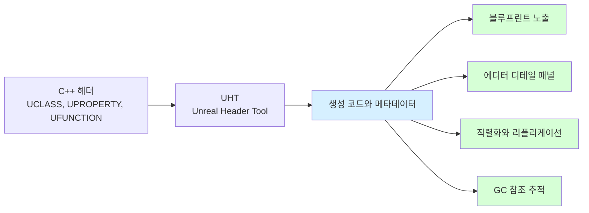

> [!summary]
> Unreal Engine의 **Reflection**은 C++ 코드의 클래스, 프로퍼티, 함수 정보를 엔진이 런타임에 이해할 수 있도록 만드는 메타데이터 시스템이다.
> 이 시스템 덕분에 블루프린트 노출, 에디터 디테일 패널, 직렬화, 네트워크 리플리케이션, [[GC]] 참조 추적이 가능해진다.

## C++과 Unreal Reflection의 차이

C#이나 Java는 언어와 런타임이 Reflection을 기본 제공한다. 반면 C++은 `typeid` 같은 제한적인 RTTI는 있지만, "이 클래스의 어떤 멤버가 에디터에 노출되는가", "이 프로퍼티를 GC가 추적해야 하는가" 같은 엔진 수준 메타데이터를 기본으로 제공하지 않는다.

Unreal은 이 빈틈을 `UHT(Unreal Header Tool)`와 매크로 기반 메타데이터로 채운다.

| 기능 | 순수 C++ | Unreal C++ |
| --- | --- | --- |
| 타입 식별 | 제한적 RTTI | `UCLASS`, `USTRUCT`, `UENUM` |
| 프로퍼티 메타데이터 | 직접 구현 필요 | `UPROPERTY` |
| 함수 메타데이터 | 직접 구현 필요 | `UFUNCTION` |
| GC 참조 추적 | 없음 | `UPROPERTY`와 참조 그래프 |
| 블루프린트/에디터 연동 | 없음 | 매크로와 메타데이터로 지원 |

---

## UHT와 generated.h

`UCLASS()`, `UPROPERTY()`, `UFUNCTION()` 같은 매크로를 달아두면, 컴파일 전에 UHT가 헤더를 분석하고 Unreal이 사용할 메타데이터 코드를 생성한다. 이 결과가 `.generated.h`와 생성 코드에 반영된다.



즉, 이 매크로들은 단순한 문법 장식이 아니라 "이 타입과 멤버를 Unreal 런타임 시스템에 등록하라"는 신호다.

---

## 주요 매크로 역할

| 매크로 | 대상 | 역할 |
| --- | --- | --- |
| `UCLASS()` | `UObject` 기반 클래스 | 타입 등록, 블루프린트/에디터/직렬화 연동 |
| `USTRUCT()` | 값 타입 구조체 | 직렬화, 에디터 노출, 블루프린트 연동 |
| `UENUM()` | 열거형 | 에디터와 블루프린트에서 이름 기반 사용 |
| `UPROPERTY()` | 멤버 변수 | GC 추적, 에디터 노출, 저장/복제 옵션 부여 |
| `UFUNCTION()` | 멤버 함수 | 블루프린트 호출, RPC, 콘솔/이벤트 연동 |

예시:

```cpp
UCLASS()
class AMyActor : public AActor
{
    GENERATED_BODY()

public:
    UPROPERTY(EditAnywhere, BlueprintReadWrite)
    TObjectPtr<UStaticMeshComponent> Mesh;

    UFUNCTION(BlueprintCallable)
    void ActivateActor();
};
```

---

## Reflection과 Thread Safety

Reflection 자체는 메타데이터 조회에 사용되지만, Reflection으로 접근하는 대상은 대부분 UObject와 그 프로퍼티다. UObject 상태는 GameThread 중심으로 관리되므로 Worker Thread에서 임의로 읽고 쓰면 안전하지 않다.

> [!caution]
> Worker Thread에서 UObject 프로퍼티를 직접 수정하지 않는다. 비동기 작업에서는 필요한 값을 미리 복사하고, 계산 결과만 GameThread로 돌려보내 반영한다.

이 규칙은 [[Async & ThreadPool]]과 [[GC]]를 이해할 때도 같은 기준으로 이어진다.

---

## 정리

- Unreal Reflection은 C++에 엔진용 런타임 메타데이터를 추가하는 시스템이다.
- UHT가 헤더를 분석해 `.generated.h`와 생성 코드를 만든다.
- `UPROPERTY`는 에디터 노출뿐 아니라 GC 참조 추적에도 중요하다.
- Reflection으로 다루는 UObject 상태는 GameThread 기준으로 접근하는 것이 안전하다.

---

[[언리얼 엔진]] · [[C++]] · [[GC]] · [[Async & ThreadPool]]
