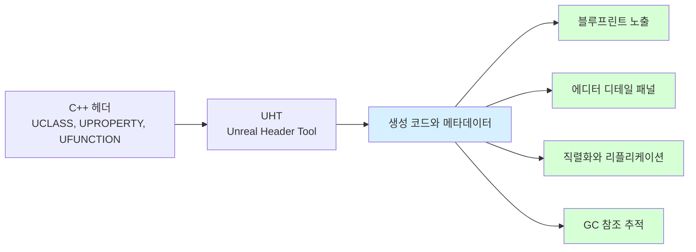

# Unreal Engine Reflection

> [!summary]
> Unreal Engine의 **Reflection**은 C++ 코드의 클래스, 프로퍼티, 함수 정보를 엔진이 런타임에 이해할 수 있도록 만드는 메타데이터 시스템이다.
> 이 시스템 덕분에 블루프린트 노출, 에디터 디테일 패널, 직렬화, 네트워크 리플리케이션, [[GC]] 참조 추적이 가능해진다.
> 이름은 C# Reflection과 비슷하지만, Unreal에서는 엔진 기능에 타입과 멤버를 등록하는 의미가 더 강하다.

## Reflection 생성 흐름

```text
C++ 헤더에 UCLASS·UPROPERTY·UFUNCTION 작성
        ↓
빌드 전에 UHT가 선언 분석
        ↓
생성 코드와 메타데이터 작성
        ↓
에디터·블루프린트·직렬화·리플리케이션·GC가 정보 사용
```

핵심은 매크로 자체가 모든 기능을 수행하는 것이 아니라, **UHT가 매크로가 붙은 선언을 수집해 Unreal 시스템이 사용할 정보를 만든다**는 점이다.

---

## 주요 매크로 역할

| 매크로 | 붙이는 대상 | 역할 |
| --- | --- | --- |
| `UCLASS()` | `UObject` 기반 클래스 | Unreal 타입으로 등록 |
| `USTRUCT()` | 값 타입 구조체 | 직렬화·에디터·블루프린트 연동 |
| `UENUM()` | 열거형 | 에디터와 블루프린트에서 이름 기반 사용 |
| `UPROPERTY()` | 멤버 변수 | 노출·저장·복제 옵션과 UObject 참조 추적 |
| `UFUNCTION()` | 멤버 함수 | 블루프린트 호출·이벤트·RPC 연동 |

```cpp
UCLASS()
class AMyActor : public AActor
{
    GENERATED_BODY()

public:
    UPROPERTY(VisibleAnywhere, BlueprintReadOnly)
    TObjectPtr<UStaticMeshComponent> Mesh;

    UPROPERTY(EditAnywhere, BlueprintReadWrite)
    float MoveSpeed = 600.0f;

    UFUNCTION(BlueprintCallable)
    void ActivateActor();
};
```

---

## UHT와 generated.h

`UCLASS()`, `UPROPERTY()`, `UFUNCTION()` 같은 매크로를 달아두면 컴파일 전에 UHT가 헤더를 분석한다. 그 결과 Unreal이 사용할 메타데이터 코드가 생성된다.

이 정보는 `.generated.h`와 UHT가 자동으로 만든 C++ 코드에 반영된다.

**생성 코드**는 개발자가 직접 작성하지 않는 C++ 보조 코드다. 다음과 같은 Reflection 연결 정보가 들어간다.

- 클래스 등록
- 프로퍼티 목록
- 함수 호출 정보
- `StaticClass()` 연결 정보

> [!note]
> 개발자는 보통 이 생성 코드를 직접 수정하지 않는다. 헤더에 매크로와 선언을 올바르게 작성하면, UHT가 필요한 코드를 다시 만들어준다.


```mermaid
flowchart LR
    A[C++ 헤더<br/>UCLASS, UPROPERTY, UFUNCTION] --> B[UHT<br/>Unreal Header Tool]
    B --> C[생성 코드와 메타데이터]
    C --> D[블루프린트 노출]
    C --> E[에디터 디테일 패널]
    C --> F[직렬화와 리플리케이션]
    C --> G[GC 참조 추적]

    style C fill:#d6f0ff
    style D fill:#d6ffd6
    style E fill:#d6ffd6
    style F fill:#d6ffd6
    style G fill:#d6ffd6
```

즉, 이 매크로들은 단순한 문법 장식이 아니라 "이 타입과 멤버를 Unreal 런타임 시스템에 등록하라"는 신호다.

---

## 더 깊게: C++ RTTI와 Unreal Reflection

| 필요한 정보 | C++ RTTI | Unreal Reflection |
| --- | --- | --- |
| 실제 C++ 타입 확인 | 제한적으로 가능 | `IsA()`, `Cast<>` |
| 에디터 노출 여부 | 알 수 없음 | `UPROPERTY` 지정자 |
| 블루프린트 호출 여부 | 알 수 없음 | `UFUNCTION` 지정자 |
| GC 참조 추적 | 제공하지 않음 | `UPROPERTY`와 참조 그래프 |
| 프로퍼티 목록 순회 | 일반적으로 제공하지 않음 | `UClass`, `FProperty`, `UFunction` |

```cpp
UObject* Object = GetSomeObject();

if (Object && Object->IsA(UMyObject::StaticClass()))
{
    // Unreal Reflection 기준 타입 확인
}

UMyObject* MyObject = Cast<UMyObject>(Object);
```

Unreal 프로젝트에서는 C++ RTTI보다 Unreal Reflection 기반 API를 사용하는 편이 엔진의 타입·에디터·GC 시스템과 잘 맞는다.

> [!note]
> C++26 작업 초안에는 정적 Reflection 기능이 반영되어 있지만, Unreal의 에디터·블루프린트·GC·리플리케이션 메타데이터를 그대로 대체하는 시스템은 아니다.

---

## C# Reflection과 다른 점

C# Reflection은 .NET 런타임이 가진 타입 정보를 코드에서 조회하는 기능이다.

Unreal Reflection은 표준 C++에 부족한 런타임 메타데이터를 **UHT와 매크로를 통해 엔진용으로 만들어두는 시스템**에 가깝다.

| 구분 | [[CSharp Reflection|C# Reflection]] | Unreal Reflection |
| --- | --- | --- |
| 정보가 만들어지는 위치 | C# 컴파일 결과물과 .NET 메타데이터 | UHT가 C++ 헤더를 분석해 생성한 코드와 메타데이터 |
| 기본 대상 | C# 타입, 필드, 프로퍼티, 메서드, Attribute | `UCLASS`, `UPROPERTY`, `UFUNCTION` 등이 붙은 Unreal 타입과 멤버 |
| 주된 목적 | 타입 정보 조회, Attribute 확인, 동적 호출 | 에디터 노출, 블루프린트, 직렬화, 리플리케이션, GC |
| 개발자가 표시하는 방식 | Attribute 사용 | Unreal 매크로와 지정자 사용 |
| 런타임과의 관계 | .NET 런타임 기능 | Unreal Engine의 UObject 시스템 기능 |

핵심 차이는 목적이다.

C# Reflection은 "이 타입이 무엇을 가지고 있는가?"를 런타임에 묻는 기능이고, Unreal Reflection은 "이 C++ 타입과 멤버를 Unreal 시스템이 알게 만들겠다"는 등록 시스템이다.

Unity 쪽에서는 C# 언어와 .NET 기반 Reflection을 이해하는 것이 중요하고, Unreal 쪽에서는 UHT·UObject·매크로 기반 Reflection을 이해하는 것이 중요하다.

---

## Reflection과 Thread Safety

Reflection 자체는 메타데이터 조회에 사용되지만, 접근 대상은 대부분 UObject와 그 프로퍼티다.

UObject 상태는 GameThread 중심으로 관리되므로 Worker Thread에서 임의로 읽고 쓰면 안전하지 않다.

> [!caution]
> Worker Thread에서 UObject 프로퍼티를 직접 수정하지 않는다. 비동기 작업에서는 필요한 값을 미리 복사하고, 계산 결과만 GameThread로 돌려보내 반영한다.

이 규칙은 [[Async & ThreadPool]]과 [[GC]]를 이해할 때도 같은 기준으로 이어진다.

---

## 정리

- Unreal Reflection은 C++에 엔진용 런타임 메타데이터를 추가하는 시스템이다.
- UHT가 헤더를 분석해 `.generated.h`와 생성 코드를 만든다.
- C# Reflection은 .NET 타입 정보를 조회하는 기능이고, Unreal Reflection은 엔진 시스템에 타입과 멤버를 등록하는 성격이 강하다.
- `UPROPERTY`는 에디터 노출뿐 아니라 GC 참조 추적에도 중요하다.
- Reflection으로 다루는 UObject 상태는 GameThread 기준으로 접근하는 것이 안전하다.

> [!note]
> 이 글은 UE5 계열의 일반적인 개념을 기준으로 한다. 매크로 지정자와 생성 코드의 세부 형태는 엔진 버전에 따라 달라질 수 있다.

---

[[GC]] · [[Async & ThreadPool]] · [[CSharp Reflection|C# Reflection]]
