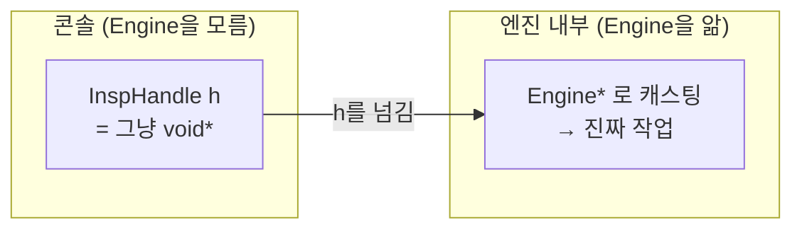

---
tags:
  - 학습
  - C++
  - DLL
  - C-API
  - M1
created: 2026-06-29
---

# 01. 공개 C API 헤더 개념 (Step 1)

> 상위: [[학습 방법]] · [[M1 implementation plan]]
> 이 노트: `InspectEngine/include/InspectEngine.h`를 직접 짜기 전에 알아야 할 **4가지 핵심 개념**.

> [!abstract] 한 줄 요약
> DLL(엔진)과 EXE(콘솔)가 **깨끗한 C 함수**로만 대화하게 만드는 헤더. 여기엔 OpenCV·STL 타입이 **단 하나도 없어야** 한다.

---

## 개념 1 — DLL이 뭐고, 왜 export/import가 필요한가


- DLL은 **컴파일된 함수 묶음**이다. EXE와 따로 빌드되고, 실행할 때 연결된다.
- 문제: DLL 안에 함수가 100개여도, EXE는 그중 **공개(export)된 것만** 불러 쓸 수 있다.
- 이 "공개" 표시가 `__declspec(dllexport)`.
- 같은 헤더를 **엔진은 "내보낸다(export)"**, **콘솔은 "가져온다(import)"** 로 읽어야 한다.
  → 그래서 `INSP_API` 매크로 **하나**로 상황에 따라 둘 다 되게 만든다.

```c
#ifdef INSPECTENGINE_EXPORTS      // 엔진 빌드할 때만 정의됨 (VS가 자동 설정)
  #define INSP_API __declspec(dllexport)   // 나는 내보내는 쪽
#else
  #define INSP_API __declspec(dllimport)   // 콘솔은 가져오는 쪽
#endif
```

> [!tip] `INSPECTENGINE_EXPORTS`는 누가 정의하나?
> Visual Studio가 DLL 프로젝트를 만들 때 **엔진 프로젝트 설정**(전처리기 정의)에 자동으로 넣어둔다. 그래서 엔진을 컴파일할 땐 `#ifdef`가 참 → export, 콘솔이 같은 헤더를 include하면 그 정의가 없으니 → import. 매크로 하나로 양쪽을 다 처리하는 흔한 패턴.

---

## 개념 2 — `extern "C"` : 이름 맹글링(name mangling) 끄기

C++ 컴파일러는 함수 이름을 내부적으로 변형한다(**name mangling**).
`Insp_Run`이 실제 심볼로는 `?Insp_Run@@YAHPEAX...` 같은 괴상한 이름이 된다.
(오버로딩·네임스페이스 때문에 C++이 어쩔 수 없이 하는 일)

→ 그러면 DLL 밖에서 이름으로 깔끔하게 못 찾는다.
→ `extern "C"`를 붙이면 **이름을 C 스타일 그대로(`Insp_Run`)** 유지 → **ABI 안정**.

```c
#ifdef __cplusplus
extern "C" {              // 여기서 열고
#endif

  // ... 함수 선언들 ...

#ifdef __cplusplus
}                         // 여기서 닫는다
#endif
```

> [!info] 왜 `#ifdef __cplusplus`로 감싸나?
> `extern "C"`는 **C++ 문법**이다. 순수 C 컴파일러가 이 헤더를 읽으면 `extern "C"`를 이해 못 해 에러난다. `__cplusplus`는 C++ 컴파일러일 때만 정의되는 표준 매크로 → C++일 때만 `extern "C"`가 켜진다. (이 헤더는 C++ 엔진/콘솔이 쓰지만, C에서도 안전하게 쓰이도록 만드는 관례)

---

## 개념 3 — `void*` 핸들 : 내부를 숨기는 손잡이

```c
typedef void* InspHandle;
```

- 콘솔은 엔진 내부의 `Engine` 클래스를 **몰라야 한다** (C++ 클래스가 DLL 경계를 넘으면 안 됨).
- 그래서 엔진은 `Engine*`를 **"정체불명 포인터(`void*`)"** 로 바꿔 콘솔에 건넨다.
- 콘솔은 이걸 "손잡이(handle)"로 들고만 있다가, 함수 부를 때 도로 넘긴다.
- 엔진 **내부에서만** `void*` → `Engine*`로 되돌려 진짜 작업을 한다.



> [!tip] 자동차 키 비유
> 키(handle)는 엔진 내부 구조를 몰라도 **시동만 걸면** 된다. `void*` 핸들도 똑같다 — 콘솔은 내부를 모른 채 손잡이만 들고 함수를 호출한다.

---

## 개념 4 — 결과를 "반환"이 아니라 "포인터로 채워주기"

```c
INSP_API int Insp_GetResult(InspHandle h, InspResult* out);
```

- 구조체를 통째로 `return`하지 않는다.
- **콘솔이 빈 구조체를 만들어 그 주소(`InspResult*`)를 넘기면 → 엔진이 거기에 값을 채운다.**
- 함수의 진짜 `return`값(`int`)은 **성공/실패 코드**로 쓴다.

> [!info] C API의 흔한 관례
> **데이터는 출력 포인터(out parameter)로, 상태는 반환값으로.**
> 이렇게 하면 호출 측이 메모리를 소유하므로 DLL 경계에서 누가 메모리를 해제할지 같은 골치 아픈 문제가 사라진다.

---

## 종합: 헤더에 들어갈 구조체 (계획서 기준)

```c
typedef void* InspHandle;

typedef struct {
    int    objectCount;
    double measuredValue[32];   // 픽셀 지름
    int    judgement[32];       // 0=OK, 1=NG (M1은 전부 0)
    double processMs;
    int    resultCode;          // 0=성공, 음수=에러
} InspResult;

INSP_API InspHandle  Insp_Create(void);
INSP_API int         Insp_Run(InspHandle h, const unsigned char* gray,
                              int width, int height, int stride);
INSP_API int         Insp_GetResult(InspHandle h, InspResult* out);
INSP_API const char* Insp_GetLastError(InspHandle h);
INSP_API void        Insp_Destroy(InspHandle h);
```

> [!warning] 고정 배열 `[32]`을 쓰는 이유
> 동적 길이(`std::vector` 등)는 STL 타입이라 DLL 경계를 넘으면 안 된다. M1은 **고정 크기 32**로 단순하게 간다. 동전 수 > 32는 초과분 무시 + 경고 (동적 확장은 v2).

---

## 직접 짤 때 체크리스트

- [ ] 헤더 가드 (`#pragma once` 또는 `#ifndef`)
- [ ] `INSP_API` 매크로 — `INSPECTENGINE_EXPORTS` 기준 export/import 전환
- [ ] `extern "C"` 블록을 `#ifdef __cplusplus`로 감싸기 (열고/닫고)
- [ ] `InspHandle = void*` typedef
- [ ] `InspResult` 구조체 (숫자 필드만, OpenCV/STL 없음)
- [ ] 함수 5개 선언, 전부 `INSP_API` 접두
- [ ] **이 헤더 어디에도 `cv::`·`std::`·`#include <opencv...>` 가 없는지 최종 확인**

> [!success] 다 짜면
> AI에게 리뷰 요청: "DLL 경계 규칙 안 깬 거 맞아? 타입·export 매크로 제대로 됐어?"

---

## 🕳️ 내가 직접 겪은 함정 (복습용)

> [!fail] 함정 1 — VS "필터"는 진짜 폴더가 아니다
> 솔루션 탐색기에서 우클릭으로 만든 **필터(filter)** 는 디스크에 폴더를 안 만든다. `.vcxproj.filters` 파일에 "보기 분류"로만 기록될 뿐. 그래서 `include` 필터 안에 헤더를 넣어도 파일은 프로젝트 루트에 저장돼 있었다.
> **해결:** 디스크에서 직접 `include/` 폴더를 만들고 파일을 옮긴 뒤, VS에서 참조를 다시 추가. (또는 솔루션 탐색기 상단 "모든 파일 표시"로 디스크 구조 그대로 보며 작업)
> **교훈:** VS는 "디스크 구조"와 "보기 구조"를 일부러 분리해 둔다. 폴더 구조 자체를 깔끔히 가져가려면 필터 말고 진짜 폴더를 써야 한다.

> [!fail] 함정 2 — `#ifdef` 블록의 여닫는 짝·범위
> 처음엔 `#ifdef INSPECTENGINE_EXPORTS` 하나가 **구조체·함수 선언 전부를** 감싸버렸다. 그러면 콘솔(=`INSPECTENGINE_EXPORTS` 미정의)에선 선언이 통째로 사라져 함수를 못 부른다. 또 `#else`(dllimport)도 빠져 있었다.
> **해결:** `#ifdef/#else/#endif`는 **`INSP_API` 매크로 정의 2줄만** 감싸고, 구조체·함수 선언은 그 **밖**으로 뺀다.
> **교훈:** 전처리기 지시문은 컴파일러처럼 짝을 손가락으로 짚어가며 맞춘다. "이 `#endif`는 어느 `#ifdef`를 닫나?"를 항상 확인.

> [!tip] 정석 패턴 — `extern "C"` 래퍼만 조건부로
> ```c
> #ifdef __cplusplus
> extern "C" {
> #endif
>     /* 구조체 + 함수 선언 (← #ifdef 밖) */
> #ifdef __cplusplus
> }
> #endif
> ```
> 여는 `{`와 닫는 `}`만 각각 `#ifdef __cplusplus`로 감싸고, 선언은 밖에 둔다. → C++이면 `extern "C"` 래퍼가 붙고, 순수 C면 래퍼만 빠지고 선언은 살아남는다. **공개 C API 헤더의 표준 모양.** (이 프로젝트는 C++만 쓰므로 전체를 한 번에 감싸도 동작은 같지만, 표준 패턴이 설명력이 좋다.)

> [!warning] 함정 3 — 소스 파일 인코딩 (CP949 vs UTF-8)
> VS에서 만든 파일이 **CP949(ANSI 한국어)** 로 저장돼 있었다. VS 에디터는 CP949로 잘 읽어서 **나한텐 한글이 안 깨져 보였지만**, UTF-8로 읽는 다른 도구·컴파일러·Git에선 `픽셀 지름` → `�ȼ� ����`로 깨졌다.
> - `file` 명령으로 확인하면 `ISO-8859 text`(=CP949 신호) vs `UTF-8 (with BOM) text`로 구분된다.
> - **해결:** UTF-8(BOM 포함)으로 다시 저장. VS에선 `파일 → 다른 이름으로 저장 → 저장 버튼 옆 ▼ → 인코딩하여 저장 → 유니코드(UTF-8, 서명 있음) 65001`.
> **교훈:** 소스 인코딩은 **UTF-8로 통일**한다. 콘솔 출력·협업·Git·CI 모두 UTF-8을 가정하므로, 한국어 주석을 쓸 거면 BOM 포함 UTF-8이 안전. (영어 주석은 인코딩 무관.)

---

## ✅ Step 1 완료 상태

- 파일: `InspectEngine/include/InspectEngine.h` (UTF-8 with BOM)
- export/import 매크로, `extern "C"` 정석 패턴, `void*` 핸들, 출력 포인터 구조체 모두 적용
- 헤더에 `cv::`·`std::`·OpenCV include 없음 (DLL 경계 깨끗)
- 다음: [[02 엔진 내부와 OpenCV 파이프라인]] (Step 2~3)
