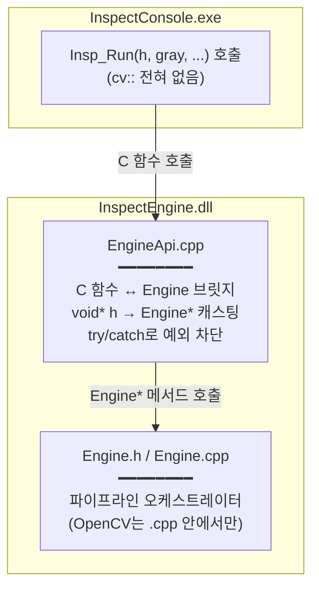

---
tags:
  - 학습
  - C++
  - DLL
  - C-API
  - M1
created: 2026-06-29
---

# 02. 엔진 내부와 핸들 브릿지 (Step 2-A)

> 상위: [[학습 방법]] · [[M1 implementation plan]]
> 이전: [[01 공개 C API 헤더 개념]]
> 이 노트: 헤더에 **선언만** 한 C 함수들을 실제로 동작하게 만드는 단계. **OpenCV는 아직 안 쓴다** — 구조(뼈대)부터.

> [!abstract] 한 줄 요약
> C 함수(`EngineApi.cpp`)는 **직접 일하지 않는다.** `void*` 핸들을 `Engine*`로 되돌려 **클래스에 떠넘기고**, 내부 예외가 DLL 밖으로 새지 않게 `try/catch`로 막는 **방파제** 역할만 한다.

---

## 전체 그림 — 3개의 층



새로 만들 파일:
- **`src/EngineApi.cpp`** — 헤더에 선언한 C 함수 5개의 **실제 구현**. 일은 안 하고 클래스에 떠넘김 + 예외 차단.
- **`src/Engine.h` / `src/Engine.cpp`** — 진짜 일꾼(클래스). 2-A에선 뼈대만, OpenCV는 2-B에서.

> [!question] `EngineApi.h`는 왜 안 만드나?
> `.h`는 **"다른 파일이 이걸 써야 할 때"** 만든다. `EngineApi.cpp`가 구현하는 함수들(`Insp_Run` 등)은 선언이 **이미 공개 헤더 `InspectEngine.h`에** 있고, 그 외에 `EngineApi.cpp` 바깥에서 부를 게 없다 → **전용 헤더 불필요.**
> 반대로 `Engine` 클래스는 `EngineApi.cpp`가 `new Engine` / `e->Run()` 하려면 클래스 선언을 **알아야** 하므로 → `Engine.h`가 **필요**하다.
>
> | 파일 | 전용 `.h`? | 이유 |
> |---|---|---|
> | `EngineApi.cpp` | ❌ | 선언이 `InspectEngine.h`에 이미 있음 |
> | `Engine.cpp` | ✅ `Engine.h` | `EngineApi.cpp`가 클래스를 알아야 함 |

---

## 왜 굳이 두 층으로 나누나? (C 함수 / C++ 클래스)

> "그냥 `Insp_Run` 안에 OpenCV 코드 다 넣으면 되지 왜 클래스를 또?"

| | `EngineApi.cpp` (C 함수층) | `Engine` (C++ 클래스층) |
|---|---|---|
| 역할 | DLL 경계 수문장 | 실제 검사 로직 |
| 쓰는 것 | `void*`, 반환코드, `try/catch` | `cv::Mat`, 멤버 변수, 메서드 |
| 왜 분리 | C++ 객체·예외가 DLL 밖으로 새지 않게 막는 **방파제** | 상태(결과·에러메시지)를 **객체로 깔끔히 보관** |

> [!tip] 핵심 개념 — "핸들 = 객체 하나"
> `Insp_Create()`가 `new Engine`으로 객체를 하나 만들어 그 주소를 `void*`로 콘솔에 준다. 콘솔은 그걸 `h`로 들고 다니다 `Insp_Run(h, ...)`처럼 매번 넘긴다. 엔진은 `h`를 `Engine*`로 되돌려 "이 객체구나" 하고 메서드를 부른다. 마지막에 `Insp_Destroy(h)`가 `delete`로 치운다.

---

## 개념 1 — `new` / `delete` 와 객체 수명 (C++ 메모리)

C++에서 `new Engine`은:
1. 힙(heap)에 `Engine` 객체 하나를 만들고
2. 그 **주소(포인터)** 를 돌려준다.

이 포인터를 `void*`로 바꿔 콘솔에 주는 게 핸들이다. **`delete` 하기 전까지 객체는 살아있다** → 그래서 `Insp_Run`, `Insp_GetResult`가 여러 번 호출돼도 같은 객체(=같은 상태)를 본다.

```cpp
// EngineApi.cpp 개념 (직접 채울 것)
InspHandle Insp_Create(void) {
    Engine* e = new Engine();      // 힙에 객체 생성
    return static_cast<InspHandle>(e);   // Engine* → void*
}

void Insp_Destroy(InspHandle h) {
    delete static_cast<Engine*>(h);      // void* → Engine* 후 해제
}
```

> [!warning] 짝 맞추기
> `new`로 만들었으면 반드시 `delete`로 치운다. `Insp_Create` 1번 : `Insp_Destroy` 1번. 안 치우면 **메모리 누수**.

---

## 개념 2 — `void*` ↔ `Engine*` 캐스팅

- `Engine* → void*` : 콘솔에 �‐줄 때. (`static_cast<InspHandle>(e)`)
- `void* → Engine*` : 함수 안에서 진짜 객체를 쓸 때. (`static_cast<Engine*>(h)`)

매 C 함수 첫 줄에서 핸들을 `Engine*`로 되돌리는 패턴이 반복된다.

```cpp
int Insp_Run(InspHandle h, const unsigned char* gray, int w, int hgt, int stride) {
    Engine* e = static_cast<Engine*>(h);   // 손잡이 → 진짜 객체
    // e 의 메서드를 부른다 ...
}
```

> [!info] 왜 `static_cast`?
> C 스타일 `(Engine*)h` 캐스팅도 되지만, C++에선 `static_cast`가 "의도된 변환"임을 명확히 하고 컴파일러 검사를 받아 더 안전하다.

---

## 개념 3 — `try/catch` 방파제 (예외가 DLL을 넘지 않게)

OpenCV 내부 코드나 `new`는 **예외(throw)** 를 던질 수 있다. 그런데 **예외가 DLL 경계를 넘으면 안 된다** — 호출 측(콘솔)이 다른 컴파일러/런타임이면 크래시 난다. (DLL 경계 = C 함수·반환코드만)

그래서 각 C 함수를 `try/catch`로 감싸 **예외를 반환 코드로 바꾼다.**

```cpp
int Insp_Run(InspHandle h, const unsigned char* gray, int w, int hgt, int stride) {
    try {
        Engine* e = static_cast<Engine*>(h);
        // ... 실제 작업 ...
        return 0;                         // 성공
    } catch (...) {
        // 에러 메시지를 핸들(객체) 안에 저장해두면 Insp_GetLastError로 노출 가능
        return -1;                        // 실패 (음수)
    }
}
```

> [!tip] 에러 메시지는 어디에?
> 객체(`Engine`) 안에 `lastError` 같은 멤버를 두고, `catch`에서 거기에 메시지를 적는다. `Insp_GetLastError(h)`는 그 멤버의 문자열 포인터를 돌려준다. (문자열도 STL `std::string`을 **반환**하지 말고, 내부에 보관한 버퍼의 `const char*`만 노출 → DLL 경계 안전)

---

## 개념 4 — `Engine.h` 엔 OpenCV가 없어야 한다

- `Engine.h` 는 `EngineApi.cpp`가 include 한다.
- 만약 `Engine.h` 에 `#include <opencv2/...>` 나 `cv::Mat` 멤버가 있으면, 그걸 include 하는 모든 곳에 OpenCV가 새어 나간다.
- **해결:** OpenCV가 필요한 멤버는 `Engine.cpp`(구현)에만 두거나, **전방 선언(forward declaration)** / **Pimpl** 같은 기법을 쓴다. M1에선 단순하게 — `Engine.h`엔 OpenCV 타입 멤버를 두지 말고, `Run()` 안의 **지역 변수**로만 `cv::Mat`을 쓴다.

```cpp
// Engine.h  (OpenCV 없음! 순수 멤버만)
class Engine {
public:
    int  Run(const unsigned char* gray, int w, int h, int stride);
    void FillResult(/* InspResult* */);   // 결과 복사
    const char* LastError() const;
private:
    // 결과 보관용 멤버 (숫자/문자 버퍼) — cv:: 없음
};
```

```cpp
// Engine.cpp  (여기서만 OpenCV)
#include "Engine.h"
#include <opencv2/opencv.hpp>   // ← .cpp 에만!

int Engine::Run(const unsigned char* gray, int w, int h, int stride) {
    cv::Mat img(...);   // 지역 변수로만 사용
    // 2-B 에서 파이프라인 채움
    return 0;
}
```

---

## 2-A 목표 (OpenCV 없이 골격만)

> [!success] DoD
> OpenCV 코드는 아직 없어도, `Insp_Create → Insp_Run → Insp_GetResult → Insp_Destroy` 가 **끝까지 호출되고 빌드/실행되는** 골격을 만든다. `Run`은 일단 더미 결과(objectCount=0 등)만 채워도 OK.

- [ ] `Engine.h` — 클래스 선언 (OpenCV/STL 노출 없음, 결과·에러 보관 멤버)
- [ ] `Engine.cpp` — 메서드 구현 (2-A는 더미, OpenCV는 2-B)
- [ ] `EngineApi.cpp` — C 함수 5개: 핸들 캐스팅 + 클래스 위임 + `try/catch`
- [ ] `Insp_GetLastError` 가 내부 버퍼의 `const char*` 만 노출
- [ ] 빌드 통과 (OpenCV 링크는 아직 불필요)

> [!note] 다음
> 2-B에서 `Engine::Run` 안에 OpenCV 파이프라인(블러→Otsu 이진화→findContours→minEnclosingCircle)을 채운다. 빌드 설정(OpenCV 링크)은 그 직전에. → [[03 OpenCV 파이프라인]]
