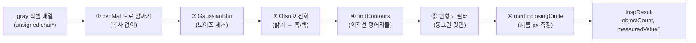

---
tags:
  - 학습
  - C++
  - OpenCV
  - 비전
  - M1
created: 2026-06-30
---

# 03. OpenCV 파이프라인 (Step 2-B)

> 상위: [[학습 방법]] · [[M1 implementation plan]]
> 이전: [[02 엔진 내부와 핸들 브릿지]]
> 이 노트: 02에서 만든 **빈 골격** `Engine::Run` 안을 **실제 비전 파이프라인**으로 채우는 단계. 드디어 OpenCV를 쓴다.

> [!abstract] 한 줄 요약
> 회색 픽셀 배열을 받아 → **흐리게(블러)** → **검정/흰색으로 가르고(이진화)** → **덩어리 외곽선을 찾고(contour)** → **동그란 것만 골라** → **그 동그라미의 지름(픽셀)을 잰다.** 결과 숫자만 `InspResult`에 담아 돌려준다.

---

## 전체 그림 — 입력 픽셀에서 지름까지



각 단계는 OpenCV 함수 한두 개에 대응한다. 아래에서 **왜** 그 단계가 필요한지를 하나씩 본다.

---

## 단계 ① — `unsigned char*` 를 `cv::Mat` 으로 감싸기

엔진에 들어오는 입력은 이렇다 (공개 헤더 그대로):

```cpp
int Engine::Run(const unsigned char* gray, int w, int h, int stride);
```

- `gray` : 픽셀 밝기 값(0~255)이 **쭉 늘어선 1차원 배열**의 시작 주소.
- `w`, `h` : 이미지 가로·세로 (픽셀 수).
- `stride` : **한 줄(row)의 바이트 수.** 보통 `w`와 같지만, 메모리 정렬 때문에 줄 끝에 패딩이 붙어 `stride > w`인 경우가 있다. 그래서 따로 받는다.

OpenCV는 이미지를 `cv::Mat`(행렬) 객체로 다룬다. 우리가 받은 **남의 메모리(`gray`)를 복사하지 않고** `Mat`으로 "감싸기만" 하는 생성자가 있다:

```cpp
// rows=h, cols=w, 8비트 1채널(CV_8UC1), 데이터 시작 = gray, 한 줄 바이트 = stride
cv::Mat src(h, w, CV_8UC1, const_cast<unsigned char*>(gray), stride);
```

> [!tip] 왜 복사를 피하나
> 이 `Mat`은 **`gray`가 가리키는 메모리를 그대로 가리킨다** (소유하지 않음). 큰 이미지를 매번 복사하면 느리고 메모리를 낭비한다. 단, `gray`는 호출하는 쪽(콘솔)의 메모리이므로 — **`Run`이 끝나기 전까지만 유효**하다고 생각해야 한다. 결과로 내보낼 건 숫자뿐이니 문제없다.

> [!warning] `CV_8UC1` 이 핵심
> `8U` = 8비트 unsigned (0~255), `C1` = 채널 1개(흑백). 우리 입력이 "회색(gray)"이니 채널 1개가 맞다. 컬러였다면 `CV_8UC3`.

---

## 단계 ② — GaussianBlur (노이즈 제거)

실제 카메라 이미지는 미세한 잡티(노이즈)가 있다. 바로 이진화하면 잡티가 작은 흰 점들로 남아 외곽선 검출을 방해한다. **가우시안 블러**로 살짝 흐리게 만들어 잡티를 뭉갠다.

```cpp
cv::Mat blurred;
cv::GaussianBlur(src, blurred, cv::Size(5, 5), 0);
```

- `cv::Size(5,5)` : 5×5 커널. 클수록 더 흐려진다 (보통 홀수).
- 마지막 `0` : 표준편차를 커널 크기에서 자동 계산.

> [!note] "왜 흐리게 만드는데 측정이 정확해지나?"
> 직관과 반대 같지만 — 우리가 재려는 건 **동전 전체 윤곽**이지 한두 픽셀의 잡티가 아니다. 잡티를 지워야 윤곽선이 깔끔하게 하나로 잡힌다. (M2의 sub-pixel 단계에서 정밀도를 더 끌어올린다.)

---

## 단계 ③ — Otsu 이진화 (밝기 → 흑/백)

검사하려면 "물체(동전)"와 "배경"을 갈라야 한다. **이진화**는 어떤 밝기 기준값(threshold)을 정해 그보다 밝으면 흰색(255), 어두우면 검정(0)으로 바꾼다.

문제: **그 기준값을 몇으로?** 조명마다 다르다. 하드코딩하면 다른 사진에서 깨진다(= CLAUDE.md "하드코딩 금지"와 같은 정신).

**Otsu 알고리즘**이 이미지 히스토그램을 분석해 **기준값을 자동으로** 정해준다.

```cpp
cv::Mat binary;
cv::threshold(blurred, binary, 0, 255,
              cv::THRESH_BINARY | cv::THRESH_OTSU);
```

- 세 번째 인자 `0` : Otsu를 쓰면 이 값은 무시되고 자동 계산된다.
- `THRESH_BINARY` : 기준 넘으면 255, 아니면 0.
- `THRESH_OTSU` : 기준값 자동 결정.

> [!question] 동전이 흰색? 검정색?
> 결과 영상에서 **동전이 흰(255)이고 배경이 검정(0)** 이어야 `findContours`가 동전을 "덩어리"로 찾는다. 만약 반대로 나오면(밝은 배경 + 어두운 동전) `THRESH_BINARY_INV`를 쓰거나 결과를 반전(`cv::bitwise_not`)한다. → **실제 사진으로 확인할 열린 결정.**

---

## 단계 ④ — findContours (외곽선 덩어리 찾기)

이진 영상에서 **흰 덩어리들의 경계선**을 모두 찾아낸다. 동전이 여러 개면 윤곽선도 여러 개 나온다.

```cpp
std::vector<std::vector<cv::Point>> contours;
cv::findContours(binary, contours, cv::RETR_EXTERNAL,
                 cv::CHAIN_APPROX_SIMPLE);
```

- 결과 `contours` : **윤곽선들의 목록.** 각 윤곽선은 다시 **점(`cv::Point`)들의 목록.**
  → "동전 3개" = `contours.size() == 3`, 각 원소가 그 동전 테두리를 이루는 점들.
- `RETR_EXTERNAL` : **바깥 외곽선만** (구멍/안쪽 무시). 동전 바깥 테두리만 필요하니 적합.
- `CHAIN_APPROX_SIMPLE` : 직선 구간은 끝점만 저장 (점 수 절약).

> [!tip] 02에서 약속한 설계가 여기서 빛난다
> [[작업일지]]의 **설계 결정 ②** — HoughCircles 대신 contour를 택한 이유가 이 줄이다. `contours`는 **윤곽선 점 전체**를 준다 → M1(지름), M2(sub-pixel 정밀화), 손상 판정이 **같은 데이터**에서 갈라져 나온다. HoughCircles는 중심·반지름만 주고 점을 숨겨서 M2로 못 잇는다.

---

## 단계 ⑤ — 원형도(circularity) 필터 (동그란 것만)

`findContours`는 동전뿐 아니라 **잡티·먼지·글자** 등 온갖 덩어리를 다 잡는다. 우리는 "동그란 것"만 원한다. 각 윤곽선이 얼마나 원에 가까운지를 **원형도**로 계산해 걸러낸다.

$$\text{원형도} = \frac{4\pi \times \text{넓이}}{\text{둘레}^2}$$

- 완전한 원이면 **1.0**, 찌그러지거나 길쭉할수록 작아진다.
- 보통 `0.8` 이상이면 "원"으로 본다 (기준은 튜닝 대상).

```cpp
double area      = cv::contourArea(contour);
double perimeter = cv::arcLength(contour, true);   // true=닫힌 곡선
double circularity = 4.0 * CV_PI * area / (perimeter * perimeter);

if (circularity < 0.8) continue;   // 동그랗지 않으면 버림
// 너무 작은 잡티도 area 최소값으로 같이 거른다
```

> [!warning] 0으로 나누기 주의
> `perimeter`가 0이면 나눗셈이 터진다. 아주 작은 윤곽선은 **먼저 area/perimeter 최소값으로 걸러내면** 자연히 방지된다.

---

## 단계 ⑥ — minEnclosingCircle (지름 측정)

원형 필터를 통과한 윤곽선에 대해, 그 점들을 **모두 감싸는 가장 작은 원**을 구한다. 그 원의 반지름×2가 **지름(픽셀)**.

```cpp
cv::Point2f center;
float radius;
cv::minEnclosingCircle(contour, center, radius);

double diameterPx = radius * 2.0;   // ← measuredValue 에 넣을 값
```

> [!note] 왜 minEnclosingCircle?
> 동전 테두리를 빈틈없이 감싸는 최소 원의 지름 = 동전의 바깥 지름. M1의 목표 산출물이 바로 이 **픽셀 지름**이다. (실제 mm 변환·분류는 이후 단계.)

---

## 결과를 `InspResult` 에 담기

측정한 값들을 02에서 본 결과 구조체에 채운다. **숫자만** 넣는다(OpenCV 타입은 절대 안 나감 — DLL 경계).

```cpp
// 공개 헤더의 구조체 (재확인)
// int    objectCount;
// double measuredValue[32];   // 픽셀 지름
// int    judgement[32];       // 0=OK, 1=NG
// double processMs;
// int    resultCode;

int count = 0;
for (auto& contour : contours) {
    // ... ⑤ 원형도 필터 통과한 것만 ...
    if (count >= 32) break;                  // 배열 크기 한도
    result_.measuredValue[count] = diameterPx;
    result_.judgement[count]     = 0;        // 판정 로직은 이후 단계
    count++;
}
result_.objectCount = count;
result_.resultCode  = 0;                     // 0 = 성공
```

> [!warning] 배열 크기 32 한도
> `measuredValue[32]`, `judgement[32]` 는 **고정 크기**다. 검출 개수가 32를 넘으면 배열 밖을 쓰는 버그가 된다 → 반드시 `count >= 32` 가드. (고정 크기 구조체는 DLL 경계를 단순하게 유지하려는 의도적 선택 — [[01 공개 C API 헤더 개념]] 참고.)

---

## 빌드 설정 — OpenCV 링크 (이미 처리됨 ✅)

2-B 코드가 컴파일·링크되려면 엔진 프로젝트가 OpenCV를 알아야 한다. **이건 빌드 삽질 구간이라 이미 설정 완료** ([[작업일지]] 2026-06-30):

| 설정 | 값 | 왜 |
|---|---|---|
| Include 경로 | `…\vcpkg\installed\x64-windows\include\opencv4` | `<opencv2/...>` 헤더를 찾으려고 |
| Lib 경로 | Debug: `…\debug\lib` / Release: `…\lib` | `.lib` 를 링크하려고 |
| 의존 lib | `opencv_core` + `opencv_imgproc` | 우리가 쓰는 함수가 이 두 모듈에 있음 |
| post-build | core·imgproc **DLL**을 출력 폴더로 복사 | 실행 시 DLL을 찾으려고 |

> [!info] 왜 imgcodecs / highgui 는 안 넣나
> 엔진은 **파일을 직접 읽지 않고**(`imread` 없음 → `imgcodecs` 불필요), **창을 띄우지 않는다**(`imshow` 없음 → `highgui` 불필요). 이미지 디코딩과 화면 표시는 **콘솔**의 책임이다. 엔진은 **이미 디코딩된 픽셀 배열**만 받는다 → 엔진엔 core·imgproc 2개로 충분. (DLL 경계 = 책임 분리.)

---

## 2-B 목표

> [!success] DoD
> 실제 동전 사진의 픽셀을 `Insp_Run`에 넣으면, `Insp_GetResult`로 받은 `InspResult`에 **검출된 동전 개수**와 **각 동전의 픽셀 지름**이 채워진다.

- [ ] `Engine.cpp` 2번째 줄 `#include <opencv2/opencv.hpp>` 주석 해제
- [ ] ① `cv::Mat`으로 입력 감싸기 (`CV_8UC1`, stride)
- [ ] ② GaussianBlur → ③ Otsu 이진화
- [ ] ④ findContours (`RETR_EXTERNAL`)
- [ ] ⑤ 원형도 필터 (0 나누기 가드 포함)
- [ ] ⑥ minEnclosingCircle 로 지름 측정
- [ ] 결과를 `result_`에 채우기 (32 한도 가드, `resultCode=0`)
- [ ] 빌드·실행 → 콘솔에서 개수·지름 출력 확인

> [!question] 직접 확인할 열린 결정
> - 동전이 흰색/검정 중 어느 쪽으로 이진화되는가? (③ — `THRESH_BINARY` vs `_INV`)
> - 원형도 기준값(0.8)과 최소 area는 실제 사진에서 몇이 적당한가? (튜닝)

> [!note] 다음
> 측정값을 **mm로 환산**(보정), 동전 종류 **분류**, **손상 판정** 으로 이어진다. M2에서는 윤곽선 점을 sub-pixel로 정밀화해 지름 정확도를 끌어올린다.
