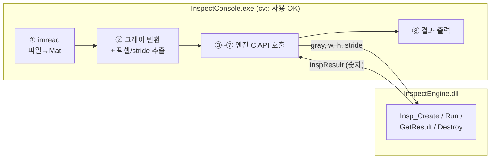
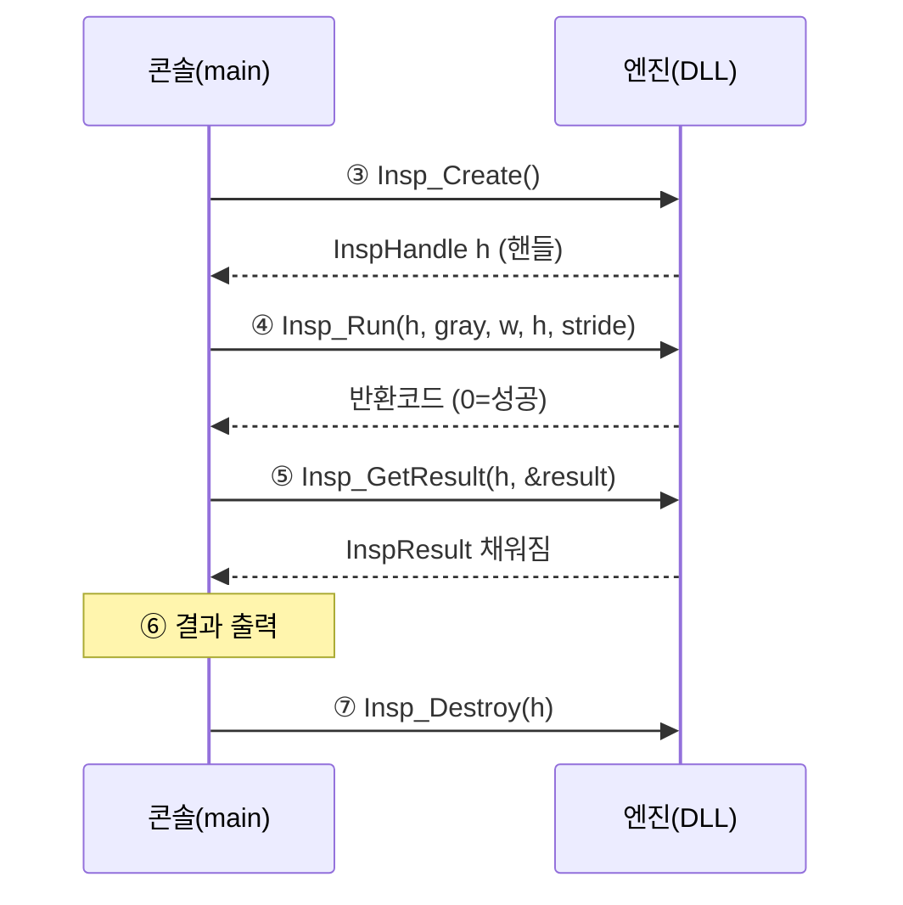

---
tags:
  - 학습
  - C++
  - C-API
  - DLL
  - M1
created: 2026-06-30
---

# 04. 콘솔에서 엔진 호출 (Step 3)

> 상위: [[학습 방법]] · [[M1 implementation plan]]
> 이전: [[03 OpenCV 파이프라인]]
> 이 노트: 02에서 **선언**하고 03에서 **속을 채운** 엔진을, 드디어 **콘솔에서 진짜로 호출**한다. C API 5개를 순서대로 부르고, 동전 사진에서 개수·지름이 나오는지 확인.

> [!abstract] 한 줄 요약
> 콘솔은 **이미지를 읽어 회색 픽셀로 만들어** 엔진에 넘기는 "심부름꾼"이다. 엔진을 `Create → Run → GetResult → Destroy` 순서로 부르고, OpenCV는 **콘솔 쪽에서 파일 읽기·화면 표시에만** 쓴다.

---

## 큰 그림 — 책임 분리



> [!tip] 왜 콘솔이 이미지를 읽나? (엔진이 아니라)
> 03 노트에서 정한 책임 분리 — 엔진은 **이미 디코딩된 픽셀 배열**만 받는다(`imgcodecs`/`highgui` 링크 안 함). 파일 포맷(PNG/JPG) 해석과 화면 표시는 **콘솔(소비자)의 일.** 이렇게 해야 엔진이 "어디서 온 픽셀이든" 검사할 수 있는 **범용 엔진**이 된다 (CLAUDE.md: 도메인 비종속).

---

## 단계 ⓪ — 경로를 인자로 받기 (`argc` / `argv`)

경로를 소스에 박지 않고, **실행할 때 뒤에 붙인 경로**를 프로그램 안으로 받아온다. 그래서 `main`을 인자 받는 형태로 바꾼다.

```cpp
int main(int argc, char* argv[])
```

터미널에서 이렇게 실행하면:

```
InspectConsole.exe  E:\test\coin.png
        ↑                  ↑
     argv[0]            argv[1]
```

- `argc` = **arg count**, 넘어온 단어 개수 (프로그램 이름 포함).
- `argv` = **arg vector**, 그 단어들의 배열 (`char*`들의 배열).
- 위 예시면 `argc == 2`, `argv[0]` = 실행 파일 경로(항상 들어옴), **`argv[1]` = 내가 넘긴 이미지 경로.**

핵심: 경로를 `"E:\\test\\coin.png"`로 박는 대신 **`argv[1]`을 `imread`에 넘기면** 하드코딩이 사라진다.

| | 하드코딩 | `argv` |
|---|---|---|
| 경로 | 소스에 박힘 | 실행 시 입력 |
| 다른 이미지 테스트 | **재컴파일** 필요 | 인자만 바꿔 재실행 |

> [!warning] 반드시 방어 코드 — `argv[1]`을 읽기 전에 `argc` 확인
> 경로를 **안 넘기면** `argc == 1`이라 `argv[1]`은 존재하지 않는다. 그걸 읽으면 크래시/쓰레기값. → `imread` **전에** "인자가 충분한가?"를 먼저 검사한다.
> ```cpp
> if (argc < 2) {
>     std::cerr << "Usage: InspectConsole.exe <image path>\n";
>     return 1;   // 사용법 안내 후 종료
> }
> const char* path = argv[1];   // 여기부터 안전
> ```

> [!tip] Visual Studio에서 인자 넘기기 (F5로 실행할 때)
> VS에서 F5(디버그 실행)하면 인자가 자동으로 안 붙는다. **프로젝트 속성 → 디버깅 → 명령 인수(Command Arguments)** 에 이미지 경로를 적어두면 그게 `argv[1]`로 들어온다. (터미널에서 직접 실행할 땐 exe 뒤에 경로만 붙이면 됨.)

---

## 단계 ① — 이미지 로드

```cpp
cv::Mat img = cv::imread(path);
if (img.empty()) { /* 경로 오류 처리 */ }
```

- `imread`는 기본적으로 **컬러(BGR 3채널)**로 읽는다.
- 엔진은 **회색 1채널**(`CV_8UC1`)을 기대한다 → 변환 필요 (다음 단계).

> [!warning] 경로 하드코딩 금지
> 기존 코드는 `cv::imread("E:\\test\\coin.png")`로 **경로가 박혀 있다.** CLAUDE.md "하드코딩 금지" 위반. → 단계 ⓪처럼 `argv[1]`을 경로로 쓴다. 여기선 그 경로를 `imread(path)`에 넘기기만 하면 된다.

---

## 단계 ② — 그레이 변환 + 픽셀 포인터·stride 추출 (핵심!)

엔진 시그니처를 다시 보자:

```cpp
int Insp_Run(InspHandle h, const unsigned char* gray,
             int width, int height, int stride);
```

엔진은 4가지를 원한다: **픽셀 시작 주소 / 가로 / 세로 / 한 줄 바이트수.** 이걸 `cv::Mat`에서 뽑아낸다.

```cpp
cv::Mat grayImg;
cv::cvtColor(img, grayImg, cv::COLOR_BGR2GRAY);   // 3채널 → 1채널

const unsigned char* gray = grayImg.data;   // 픽셀 배열 시작 주소
int w      = grayImg.cols;                  // 가로
int h      = grayImg.rows;                  // 세로
int stride = (int)grayImg.step;             // 한 줄의 바이트 수
```

> [!info] `.data` / `.step` 이 뭔가
> - `grayImg.data` : Mat이 들고 있는 **픽셀 메모리의 시작 포인터** (`unsigned char*`).
> - `grayImg.step` : **한 행(row)이 차지하는 바이트 수.** 03 노트에서 본 그 `stride`다. OpenCV가 메모리 정렬을 위해 줄 끝에 패딩을 넣을 수 있어 `step >= cols`. 그래서 `cols`가 아니라 `step`을 넘겨야 정확하다.

> [!question] 03의 `cv::Mat src(h,w,CV_8UC1,gray,stride)` 와 짝이 맞나?
> 맞다. 콘솔이 `grayImg`에서 뽑은 `(data, cols, rows, step)`을, 엔진이 받아서 다시 **같은 메모리를 가리키는** `cv::Mat`으로 감싼다. **복사 없이** 픽셀 메모리를 공유하는 셈. (단, `grayImg`가 `Run` 호출 동안 살아있어야 함 — `main`의 지역 변수라 OK.)

---

## 단계 ③~⑦ — C API 5개 호출 순서

02 노트의 "핸들 = 객체 하나" 개념을 실제로 쓰는 부분.



```cpp
InspHandle h = Insp_Create();                 // ③ 객체 생성 → 핸들
if (h == nullptr) { /* 생성 실패 */ }

int rc = Insp_Run(h, gray, w, h, stride);     // ④ 검사 실행
if (rc != 0) {
    std::cerr << Insp_GetLastError(h) << "\n"; // 실패 시 에러 메시지
    Insp_Destroy(h);                           //   치우고 종료
    return -1;
}

InspResult result;                            // ⑤ 결과 받기
Insp_GetResult(h, &result);

// ⑥ 출력 (아래)

Insp_Destroy(h);                              // ⑦ 짝 맞춰 해제
```

> [!warning] `Create` 1번 : `Destroy` 1번
> 02에서 본 `new`/`delete` 짝. **어느 경로로 빠져나가든**(에러 return 포함) `Destroy`를 부르도록 신경 쓴다. 위 코드처럼 에러 분기마다 `Destroy` 후 `return`. (나중엔 RAII 래퍼로 깔끔하게 만들 수 있지만 지금은 명시적으로.)

---

## 단계 ⑥ — 결과 출력

`InspResult` 구조체(02/03 참고)에서 개수와 지름을 꺼내 찍는다.

```cpp
std::cout << "검출 개수: " << result.objectCount << "\n";
for (int i = 0; i < result.objectCount; ++i) {
    std::cout << "  [" << i << "] 지름 = "
              << result.measuredValue[i] << " px"
              << " (judgement=" << result.judgement[i] << ")\n";
}
std::cout << "처리시간: " << result.processMs << " ms\n";
```

> [!note] 지금은 숫자만 — 시각화는 나중
> 검출 원을 사진 위에 그려 `imshow`로 보여주면 직관적이지만, 그건 디버그 편의 기능. **먼저 숫자(개수·지름)가 맞는지**부터 확인하는 게 우선. 시각화는 선택적으로 뒤에 붙인다.

---

## 빌드 설정 — 콘솔이 엔진을 알게 하기 (셋업, AI가 처리)

콘솔이 `Insp_*`를 부르려면 두 가지가 필요하다:

| 설정 | 무엇 | 왜 |
|---|---|---|
| **Include 경로** | `InspectEngine\include` 추가 | `#include "InspectEngine.h"` 를 찾으려고 (함수 **선언**) |
| **엔진 .lib 링크** | `InspectEngine.lib` (import lib) | `Insp_*` 함수의 **주소**를 링크하려고 |
| **엔진 .dll 위치** | 콘솔 실행 폴더에 `InspectEngine.dll` | 실행 시 실제 코드를 찾으려고 |

> [!info] .lib 인데 왜 DLL이 또 필요한가
> DLL 프로젝트는 빌드 시 **두 개**를 만든다 — `.dll`(실제 코드)과 `.lib`(어떤 함수가 들었는지 알려주는 **import 라이브러리**, 껍데기). 콘솔은 **링크할 땐 .lib**를, **실행할 땐 .dll**을 쓴다. 그래서 둘 다 필요.
> → 가장 깔끔한 방법: 콘솔이 엔진 프로젝트를 **"참조(References)"** 하도록 하면 VS가 .lib 링크와 빌드 순서를 자동 처리. DLL은 03에서 만든 post-build 복사 흐름으로 실행 폴더에 둔다.

---

## Step 3 목표

> [!success] DoD
> `InspectConsole.exe <이미지경로>` 를 실행하면, 동전 사진에서 **검출 개수**와 **각 동전의 픽셀 지름**이 콘솔에 출력된다.

- [ ] `main(int argc, char* argv[])`로 바꾸고 경로를 `argv[1]`로 받기 (하드코딩 제거)
- [ ] `imread` **전에** `argc < 2` 방어 코드 (사용법 안내 후 종료)
- [ ] `imread` → `cvtColor(BGR2GRAY)` → `data/cols/rows/step` 추출
- [ ] `Insp_Create` → `Insp_Run` → `Insp_GetResult` → `Insp_Destroy` 순서 호출
- [ ] 에러 경로마다 `Insp_Destroy` 챙기기 (`new`/`delete` 짝)
- [ ] 개수·지름·judgement 출력
- [ ] 빌드 설정: 콘솔 → 엔진 참조(include + .lib), DLL 실행 폴더 확보

> [!question] 실행해보고 확인할 것
> - 검출 개수가 사진의 동전 수와 맞나? (안 맞으면 03의 이진화 방향/원형도 기준 튜닝으로 되돌아감)
> - 지름(px)이 동전 크기 비율과 그럴듯한가?

> [!note] 다음
> 픽셀 지름 → **실제 mm 환산**(보정 계수), 동전 **분류**, **손상 판정**. 그리고 M2에서 윤곽선 sub-pixel 정밀화.
