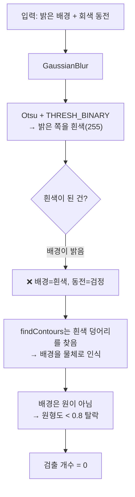

---
tags:
  - 학습
  - OpenCV
  - 비전
  - 디버깅
  - M1
created: 2026-07-01
---

# 05. 검출 0개 디버깅 — 이진화 방향·튜닝

> 상위: [[학습 방법]] · [[M1 implementation plan]]
> 이전: [[04 콘솔에서 엔진 호출]]
> 이 노트: 04에서 콘솔→엔진 호출을 완성하고 **실제 동전 사진으로 처음 돌렸더니 `검출 개수: 0`.** 왜 0인지 단계별로 추적하고, 원인(이진화 방향)과 튜닝 지점을 정리한다. 이것이 04 DoD의 "안 맞으면 03 이진화/원형도 튜닝으로 되돌아감" 실제 상황.

> [!abstract] 한 줄 요약
> `findContours`는 **흰색 덩어리**를 찾는다. 밝은 배경 이미지에서 `THRESH_BINARY`를 쓰면 **배경이 흰색**이 되어 엔진이 동전이 아니라 배경을 물체로 본다 → 원형도 필터에서 탈락 → **0개.** 동전이 흰색이 되도록 이진화 방향을 뒤집어야 한다.

---

## 무슨 일이 있었나

빌드·실행은 성공했는데 결과가 이랬다:

```
InspectConsole.exe E:\test\coin.png
→ 검출 개수: 0
  처리시간: 0 ms
```

이미지는 **밝은 흰색 배경 + 회색 500원 동전 하나**, 동전이 프레임을 거의 꽉 채운 사진.

> [!question] 검출 0개는 보통 어디서 나오나
> 파이프라인 어느 단계에서 후보가 다 사라졌다는 뜻. 흔한 원인 3가지:
> 1. **이진화 방향이 반대** — 물체 대신 배경이 흰색이 됨 (이번 범인)
> 2. **원형도 기준(0.8)이 너무 빡셈** — 살짝 찌그러진 윤곽이 전부 탈락
> 3. **물체가 프레임에 꽉 참** — 윤곽이 가장자리에서 잘려 원이 아니게 됨

---

## 원인 추적 — 파이프라인을 따라가기

`Engine::Run`(03에서 작성)을 이 이미지에 대입해 한 단계씩 따라간다.



### 문제 1 — 이진화 방향 (진짜 범인)

03 코드의 이 줄:

```cpp
cv::threshold(blurred, binary, 0, 255, cv::THRESH_BINARY | cv::THRESH_OTSU);
```

- `THRESH_BINARY`는 **임계값보다 밝은 픽셀을 흰색(255)**, 어두운 픽셀을 검정(0)으로 만든다.
- 이 사진은 **배경이 밝고 동전이 회색** → 배경이 흰색, 동전이 검정이 된다.
- 그런데 `findContours(RETR_EXTERNAL)`는 **흰색 덩어리**의 외곽선을 찾는다. → 엔진이 **배경을 물체로** 보고 있다.
- 배경(사각 프레임에서 동전을 뺀 모양)은 원이 아니므로 원형도 필터(`< 0.8`)에서 탈락 → **0개.**

> [!tip] 해결 — 동전이 흰색이 되도록 뒤집기
> `THRESH_BINARY` → `THRESH_BINARY_INV`. 이제 **어두운(회색) 동전이 흰색**, 밝은 배경이 검정이 된다. `findContours`가 동전 덩어리를 잡는다.
> ```cpp
> cv::threshold(blurred, binary, 0, 255, cv::THRESH_BINARY_INV | cv::THRESH_OTSU);
> ```
> **원리:** "물체 = 흰색"으로 만드는 게 목표. 물체가 배경보다 **밝으면 `BINARY`**, **어두우면 `BINARY_INV`.** 이번 이미지는 동전이 배경보다 어두우니 `INV`.

### 문제 2 — 동전이 프레임에 꽉 참 (2차 후보)

동전 윤곽이 이미지 **가장자리에 닿아** 있으면, `findContours`가 잡는 윤곽이 온전한 원이 아니라 **잘린 모양**이 될 수 있다. 그러면 원형도가 낮아져 탈락할 수 있음.

> [!note] 지금은 문제 1부터
> 방향(문제 1)만 고쳐도 잡힐 가능성이 높다. 방향을 고쳤는데도 안 잡히면 그때 이걸 의심 — 대응책: **원형도 기준을 0.8보다 낮추기**, 또는 이미지에 **여백(border) 추가** 후 검출. 한 번에 하나씩 바꿔서 원인을 분리한다.

---

## `처리시간: 0 ms` 는?

`result_.processMs`를 아직 안 채웠을 가능성. 파이프라인이 실제로 도는데 반올림으로 0일 수도 있지만, **측정 코드 자체가 없으면** 항상 0이다. 검출이 잡히기 시작하면 이 값도 점검한다. (측정은 03의 파이프라인 시작~끝을 `cv::getTickCount`/`std::chrono`로 감싸면 됨 — 나중에.)

---

## 디버깅 원칙 (이번에 쓴 방법)

> [!important] 0개가 나오면 "어느 단계에서 죽었나"를 본다
> 최종 숫자(0)만 보면 원인을 모른다. 파이프라인을 **입력→이진화→윤곽→필터** 순서로 되짚으며 "여기까지 후보가 살아있나?"를 확인. 눈으로 보고 싶으면 **이진화 결과(`binary`)를 이미지로 저장**해 확인하는 게 가장 빠르다.
> 단, 엔진은 `imgcodecs`(`imwrite`) 링크 안 하는 게 원칙(04) → 저장은 **콘솔 쪽**에서 하거나, 임시 디버그로만 쓰고 뺀다.

> [!warning] 한 번에 하나씩만 바꾼다
> 방향·원형도 기준·블러 크기를 동시에 바꾸면 뭐가 효과였는지 모른다. **한 변수만** 바꾸고 재실행 → 결과 비교.

---

## 이번에 할 것 (튜닝 순서)

- [ ] `Engine.cpp` 이진화 방향 `THRESH_BINARY` → `THRESH_BINARY_INV`
- [ ] 재빌드 → `InspectConsole.exe E:\test\coin.png` 재실행
- [ ] 검출 개수 = 1 나오는지 확인 (동전 1개)
- [ ] 지름(px)이 동전 크기와 그럴듯한지 확인
- [ ] 여전히 0이면 → 원형도 기준 0.8 낮추기 / 프레임 꽉 참(border) 의심
- [ ] `처리시간 0ms` → 나중에 시간 측정 코드 추가

> [!success] 이 노트의 교훈
> `findContours`의 전제는 **"물체 = 흰색"**. 이진화 방향은 파이프라인 정확도의 첫 갈림길이고, **이미지가 밝은 배경이냐 어두운 배경이냐**에 따라 `BINARY`/`BINARY_INV`를 골라야 한다. 도메인 비종속 엔진이라면 이 방향을 **설정으로 뺄지**도 나중 고민거리.

> [!note] 다음
> 검출이 잡히면 → 픽셀 지름 → **실제 mm 환산**(보정 계수), 동전 **분류**, **손상 판정**. 그리고 M2에서 윤곽선 sub-pixel 정밀화. [[04 콘솔에서 엔진 호출]]의 다음 단계로 복귀.
