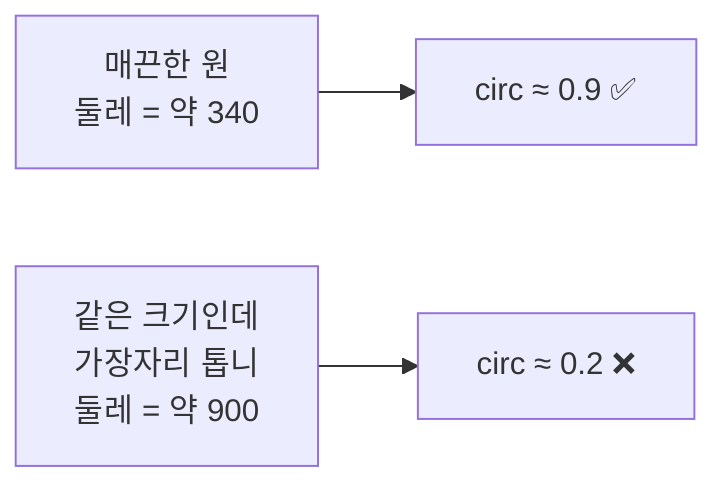
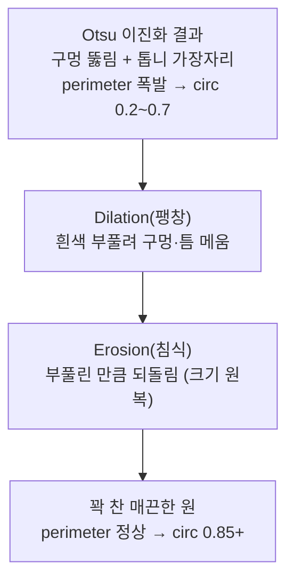

---
tags:
  - 학습
  - OpenCV
  - 비전
  - 모폴로지
  - M1
created: 2026-07-02
---

# 07. 모폴로지로 이진화 다듬기 — 죽은 원형도 살리기

> 상위: [[학습 방법]] · [[M1 implementation plan]]
> 이전: [[06 검출 0개 재디버깅 (진짜 원인은 브릿지 미연결)]]
> 이 노트: 06에서 브릿지·이진화 방향을 고치고 area 필터로 노이즈까지 제거했더니, **동전 8개가 다 윤곽으로 잡히긴 하는데 원형도가 낮아 3개만 통과**. 진짜 동그란 동전인데 왜 원형도가 0.2~0.75로 죽는지, 그리고 **모폴로지 연산**으로 어떻게 살리는지 원리를 정리한다.

> [!abstract] 한 줄 요약
> 이진화 이미지가 지저분하면(안쪽 구멍·톱니 가장자리) 넓이는 그대로인데 **둘레(perimeter)가 폭발**한다. 원형도 = `4π·area / perimeter²`라서 둘레가 커지면 원형도가 급락. **모폴로지 close**로 구멍을 메우고 가장자리를 매끄럽게 만들면 둘레가 정상으로 돌아오고 원형도가 살아난다.

---

## 지금 무슨 상황인가

동전 8개짜리 `test2.jpg`, area 필터로 노이즈 제거 후:

```
[DEBUG] contours = 14   (findContours 원본 개수)
area=7810.0   circ=0.216  bbox=(320,171 108x102)  ❌
area=10528.5  circ=0.514  bbox=(183,165 120x117)  ❌
area=10153.0  circ=0.871  bbox=(444,156 118x113)  ✅
area=13359.5  circ=0.626  bbox=(28,155 134x134)   ❌
area=8433.5   circ=0.686  bbox=(310,37 107x101)   ❌
area=10212.5  circ=0.892  bbox=(433,27 117x113)   ✅
area=10510.5  circ=0.891  bbox=(179,25 120x114)   ✅
area=13018.0  circ=0.751  bbox=(35,13 133x128)    ❌
```

**8개 다 잡혔는데(area·bbox는 전부 동전 크기), 원형도 0.8 필터에서 3개만 통과.** bbox가 108×102처럼 멀쩡히 동그란데 circ=0.216인 놈까지 있다.

---

## 왜 동그란 동전인데 원형도가 죽나

### 원형도 공식 복습

$$\text{circularity} = \frac{4\pi \cdot \text{area}}{\text{perimeter}^2}$$

- 완벽한 원: 값이 **1.0**
- 찌그러지거나 가장자리가 복잡할수록 **0에 가까워짐**

핵심은 분모의 **perimeter(둘레)가 제곱**으로 들어간다는 것. 둘레가 조금만 늘어도 원형도는 확 떨어진다.

### 지저분한 이진화가 둘레를 폭발시킨다

동전 표면에는 각인(숫자·그림·글자)이 있다. Otsu 이진화는 이 무늬 때문에:

- 동전 **안쪽이 흰 구멍**으로 뚫리거나 (표면 밝은 부분)
- 가장자리가 **톱니처럼 우글우글**해진다

`findContours(RETR_EXTERNAL)`가 이 우글우글한 바깥선을 따라가면:



> [!danger] 핵심 원인
> **넓이(area)는 거의 그대로인데 둘레(perimeter)만 길어진다.** 원형도 = 4π·area / perimeter² 이므로, 둘레가 2배가 되면 원형도는 1/4로 떨어진다. → 진짜 동전인데 circ 0.216, 0.514 같은 값이 나오는 이유.

> [!note] 왜 area 필터로는 못 잡나
> area(넓이)는 지저분해도 크게 안 변한다. 그래서 06의 area 하한 필터는 **티끌 노이즈**는 걸렀지만, "동전 크기인데 가장자리만 지저분한" 놈은 못 거른다(=걸러서도 안 된다, 진짜 동전이니까). 이 문제는 **필터를 조정할 게 아니라, 이진화 이미지 자체를 매끄럽게** 만들어야 풀린다.

---

## 해결: 모폴로지 연산 (Morphological Operations)

모폴로지는 이진 이미지의 **모양을 다듬는** 연산이다. 작은 **커널(구조 요소)** 을 이미지 위에 굴리며 흰색 영역을 부풀리거나 깎는다.

### 4가지 기본 연산

| 연산 | 하는 일 | 효과 |
|---|---|---|
| **Erosion(침식)** | 흰색을 깎아냄 | 흰 영역이 줄고, 얇은 돌기·작은 흰점 제거 |
| **Dilation(팽창)** | 흰색을 부풀림 | 흰 영역이 커지고, 작은 검은 구멍 메움 |
| **Opening(열림)** | 침식 → 팽창 | **바깥의 작은 흰 노이즈 제거** (튀어나온 돌기 정리) |
| **Closing(닫힘)** | 팽창 → 침식 | **안쪽의 작은 검은 구멍 메움** (내부 채우기) |

> [!tip] 우리에게 필요한 건 Closing(닫힘)
> 지금 문제는 동전 **안쪽이 뚫리고 가장자리가 우글거리는** 것. **Closing = 팽창 후 침식**이라:
> 1. 팽창으로 안쪽 구멍·톱니 틈을 먼저 **메우고**
> 2. 침식으로 부풀린 만큼 **되돌려** 크기를 원래대로
>
> → 안쪽은 꽉 찬 상태로 남고, 가장자리는 매끄러워진다. **둘레가 정상화 → 원형도 회복.**

### Closing이 원형도를 살리는 그림



---

## OpenCV에서 쓰는 법 (개념)

두 가지 준비물이 필요하다:

1. **커널(구조 요소)** — 얼마나 큰 붓으로 다듬을지. `cv::getStructuringElement`로 만든다.
   - 모양: 보통 `MORPH_ELLIPSE`(타원/원형) — 동전이 원이니 원형 커널이 자연스럽다.
   - 크기: `cv::Size(k, k)`. **작으면 효과 미미, 크면 디테일이 뭉개지고 붙은 동전끼리 합쳐질 위험.** 홀수(3,5,7…)로 시작해 튜닝.

2. **연산 적용** — `cv::morphologyEx(입력, 출력, cv::MORPH_CLOSE, 커널)`

> [!note] 파이프라인에서의 위치
> **이진화(threshold) 직후, findContours 앞**에 넣는다.
> `blur → threshold → [여기! morphologyEx CLOSE] → findContours → 필터`
> 이유: findContours가 보는 이진 이미지를 미리 깨끗하게 만들어야 둘레가 정상화된다.

> [!warning] 하드코딩·튜닝 주의
> 커널 크기(k)는 임계값처럼 나중에 설정으로 빼야 할 값. 지금은 이름 붙인 상수(`const int kMorphSize = 5;` 등)로 두고, **한 번에 하나씩** 값만 바꿔가며 원형도 변화를 로그로 관찰한다. 너무 키우면 옆 동전과 붙어 윤곽이 합쳐질 수 있으니 작은 값부터.

---

## 직접 해볼 것 (다음 세션)

- [ ] `getStructuringElement(MORPH_ELLIPSE, Size(k,k))`로 커널 만들기 **(직접 코딩)**
- [ ] threshold 직후에 `morphologyEx(binary, binary, MORPH_CLOSE, kernel)` 한 줄 추가
- [ ] 재빌드·재실행 → `[DEBUG]` 로그에서 낮던 원형도(0.2~0.75)들이 0.8+ 로 올라오는지 확인
- [ ] 8개 다 통과하는 최소 커널 크기 찾기 (작은 값부터: 3 → 5 → 7…)
- [ ] 커널을 너무 키우면 붙은 동전이 합쳐져 contours가 줄어드는지도 관찰 (부작용 확인)
- [ ] 콘솔 임시 디버그 저장(`imwrite`)도 INV+모폴로지로 맞춰야 눈으로 정확히 보임

> [!success] 기대 결과
> Closing 후 8개 동전의 원형도가 대부분 0.85+ 로 올라와 **검출 개수 8** 달성. 그러면 이진화·전처리 파이프라인이 "지저분한 실제 이미지"에도 견디게 된다 (포폴 서사: 단순 임계값 낮추기 대신 전처리로 근본 해결).

---

## 관련 노트
- [[03 OpenCV 파이프라인]] — 이진화·findContours·원형도 기본
- [[06 검출 0개 재디버깅 (진짜 원인은 브릿지 미연결)]] — area 필터·이진화 방향까지의 경위
- 대안이었던 (B-1) "원형도 기준만 낮추기"는 근본 해결이 아니라 보류. 전처리(B-2)를 우선.
