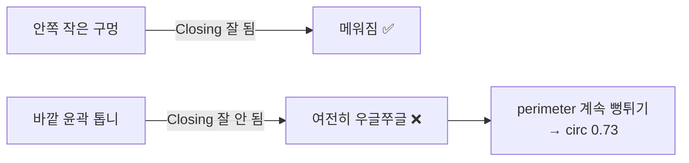
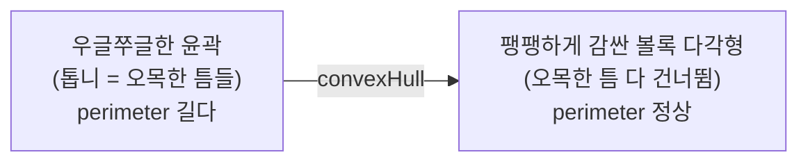

---
tags:
  - 학습
  - OpenCV
  - 비전
  - convexHull
  - 원형도
  - M1
created: 2026-07-06
---

# 08. convexHull로 원형도 보정 — 톱니 둘레를 펴서 진짜 원형도 재기

> 상위: [[학습 방법]] · [[M1 implementation plan]]
> 이전: [[06 모폴로지로 이진화 다듬기 (원형도 살리기)]]
> 이 노트: 06에서 모폴로지 Closing으로 원형도를 대부분 살렸지만(3개→7개 통과), **동전 하나(백원)만 원형도 0.73으로 여전히 탈락**. 커널을 5→7로 키워도 안 고쳐졌다. 원인은 "안쪽 구멍"이 아니라 **바깥 윤곽선 자체가 우글쭈글**한 것 → 모폴로지로는 한계. 이걸 **convexHull(볼록껍질)** 로 어떻게 푸는지 정리한다.

> [!abstract] 한 줄 요약
> 모폴로지 Closing은 **안쪽 구멍**은 잘 메우지만 **바깥 윤곽선의 톱니**는 잘 못 편다. 톱니가 남으면 둘레(perimeter)가 계속 뻥튀기돼 원형도가 죽는다. `convexHull`은 윤곽점들을 **팽팽한 고무줄로 감싼 볼록 다각형**으로 바꿔 톱니를 펴준다. 이 hull의 둘레로 원형도를 다시 재면, 진짜 동그란 모양이 반영돼 값이 회복된다.

---

## 지금 무슨 상황인가 (06 이후)

모폴로지 Closing(커널 5, 그리고 7까지 시도) 적용 후 `test2.jpg`:

```
커널 5 → 검출 7개
커널 7 → 검출 7개  (거의 그대로)

area=10731.5  circ=0.732  bbox=(183,164 120x118)  ❌  ← 백원 동전, 혼자만 탈락
area= 8639.5  circ=0.832  ✅
area=10155.5  circ=0.874  ✅
area=13490.0  circ=0.862  ✅
area= 8519.5  circ=0.884  ✅
area=10212.5  circ=0.892  ✅
area=10513.5  circ=0.892  ✅
area=13123.0  circ=0.896  ✅
```

**7개는 원형도 0.83~0.90으로 깔끔하게 통과. 백원 동전 딱 하나만 0.73으로 탈락.**
커널 5(0.714) → 7(0.732)로 찔끔 올랐을 뿐, 0.8을 못 넘는다.

> [!danger] 커널을 더 키우는 건 답이 아니다
> 커널 7로도 안 고쳐졌다 = 문제는 "작은 안쪽 구멍"이 아니다. 커널을 9, 11로 키우면 동전 모양이 뭉개지고, 붙어 있는 동전끼리 합쳐질 위험만 커진다. **모폴로지 방향은 여기까지가 한계.**

---

## 왜 백원 동전만 안 살아나나

이진화 이미지(`debug_binary.png`)를 눈으로 보면:
- 매끈한 동전(500원 등) → 이진화가 **꽉 찬 검은 원** → 둘레 정상 → circ 0.85+
- **백원 동전(인물 각인)** → 각인이 밝아 Otsu 임계 위로 올라가버림 → 안쪽이 흰 얼룩·구멍 + **가장자리가 톱니처럼 삐죽삐죽**



> [!note] Closing의 한계
> Closing = 팽창→침식. 안쪽으로 파고든 **작은 검은 구멍**은 팽창이 메워준다. 하지만 바깥으로 뻗친 **톱니(볼록한 돌기+오목한 틈이 섞인 복잡한 경계)** 는 팽창·침식이 서로 상쇄돼 잘 안 펴진다. → 둘레가 안 줄어든다.

---

## 해결: convexHull (볼록껍질)

### 개념

**볼록껍질(convex hull)** = 주어진 점들을 **모두 포함하는 가장 작은 볼록 다각형**.
직관적으로: 못들(윤곽점)을 판에 박고 **고무줄을 바깥에서 탁 놓으면** 생기는 팽팽한 테두리.



- **볼록(convex)**: 다각형 안의 두 점을 이은 선이 항상 다각형 안에 있음 = 움푹 파인 곳(오목)이 없음.
- 톱니의 **오목하게 파인 틈**들을 hull이 직선으로 가로질러 **건너뛴다** → 둘레가 확 짧아짐.

### 왜 이게 원형도를 살리나

원형도 공식 복습:

$$\text{circularity} = \frac{4\pi \cdot \text{area}}{\text{perimeter}^2}$$

- 톱니 윤곽: area는 그대로인데 **perimeter가 뻥튀기** → circ 급락 (06에서 배운 것)
- hull 윤곽: 톱니를 펴서 **perimeter가 정상화** → **circ 회복**
- area는 hull로 재도 거의 안 변함(볼록화해도 넓이는 그대로). → **관건은 둘레를 hull로 재는 것.**

> [!tip] 이건 "기준 낮추기"가 아니라 "측정 고치기"
> 원형도 기준을 0.8 → 0.75로 내리는 건 **증상 회피**다("왜 낮은지"를 안 고침). 게다가 나중에 진짜 찌그러진(손상된) 동전도 슬쩍 통과시켜 **손상 판정과 충돌**한다.
> convexHull은 다르다 — 동전은 원래 동그란 게 맞으니, **톱니 노이즈만 걷어내고 진짜 원형도를 재는** 것. 필터 기준은 엄격하게 유지한 채, 측정값만 정확하게 만든다.

> [!warning] convexHull의 부작용도 알아둘 것
> hull은 **오목한 곳을 무조건 메운다.** 그래서 진짜로 한 귀퉁이가 크게 찌그러지거나 깨진(손상) 동전도 hull을 씌우면 다시 동그래져 원형도가 높게 나올 수 있다. → **M2 이후 손상 판정 단계에서는 오히려 hull을 안 쓰거나, "원본 윤곽 vs hull의 차이(볼록성 결함, convexity defects)"를 손상 지표로 써야 한다.** 지금 M1(개수·지름)에서는 hull이 유리하지만, 이 트레이드오프를 기억해 둔다.

---

## OpenCV에서 쓰는 법 (개념만)

```cpp
std::vector<cv::Point> hull;
cv::convexHull(contour, hull);   // contour → 볼록껍질 꼭짓점들

// 원형도는 hull 기준으로 다시 계산
double area      = cv::contourArea(hull);
double perimeter = cv::arcLength(hull, true);
double circularity = 4.0 * CV_PI * area / (perimeter * perimeter);
```

> [!note] 파이프라인에서의 위치
> **원형도 계산 직전**, 각 contour 루프 안에서 hull을 만든다.
> `findContours → (루프) contour → convexHull → area/perimeter → circularity → 필터`
> minEnclosingCircle(지름 측정)은 hull로 해도 되고 원본 contour로 해도 결과 거의 같다(최소 외접원은 바깥 점들로 정해지므로).

---

## 직접 해볼 것 (이번 세션)

- [ ] 원형도 계산 부분에서 `contour`로부터 `hull`을 구하기 **(직접 코딩)**
- [ ] `perimeter`를 **hull 기준**으로 계산하도록 변경 (area도 hull로 통일해도 됨)
- [ ] 재빌드·재실행 → 백원 동전(bbox 183,164)의 circ가 **0.73 → 0.8+** 로 올라오는지 확인
- [ ] 나머지 7개 원형도가 망가지지 않았는지도 확인 (원래 잘 나오던 것들이 hull로도 0.85+ 유지되는지)
- [ ] **검출 개수 8** 달성 확인
- [ ] 달성되면 임시 디버그 코드(`fprintf`, `boundingRect`, 콘솔 `imwrite`) 전부 제거 + 커밋

> [!success] 기대 결과
> convexHull로 둘레를 정상화해 8개 동전 모두 원형도 0.8+ → **검출 개수 8** 달성. 원형도 기준(0.8)은 엄격하게 유지 → 나중에 손상 판정 잣대로 재사용 가능.
> 포폴 서사: "기준을 낮춰서 봐준 게 아니라, 톱니 노이즈로 과대평가된 둘레를 convexHull로 정정해 **측정 정확도를 올렸다**."

---

## 관련 노트
- [[03 OpenCV 파이프라인]] — 이진화·findContours·원형도 기본
- [[06 모폴로지로 이진화 다듬기 (원형도 살리기)]] — Closing으로 원형도 대부분 회복, 이 노트의 직전 단계
- (예정) 손상 판정 노트 — hull과 원본 윤곽의 차이(convexity defects)를 손상 지표로 뒤집어 쓰는 이야기
