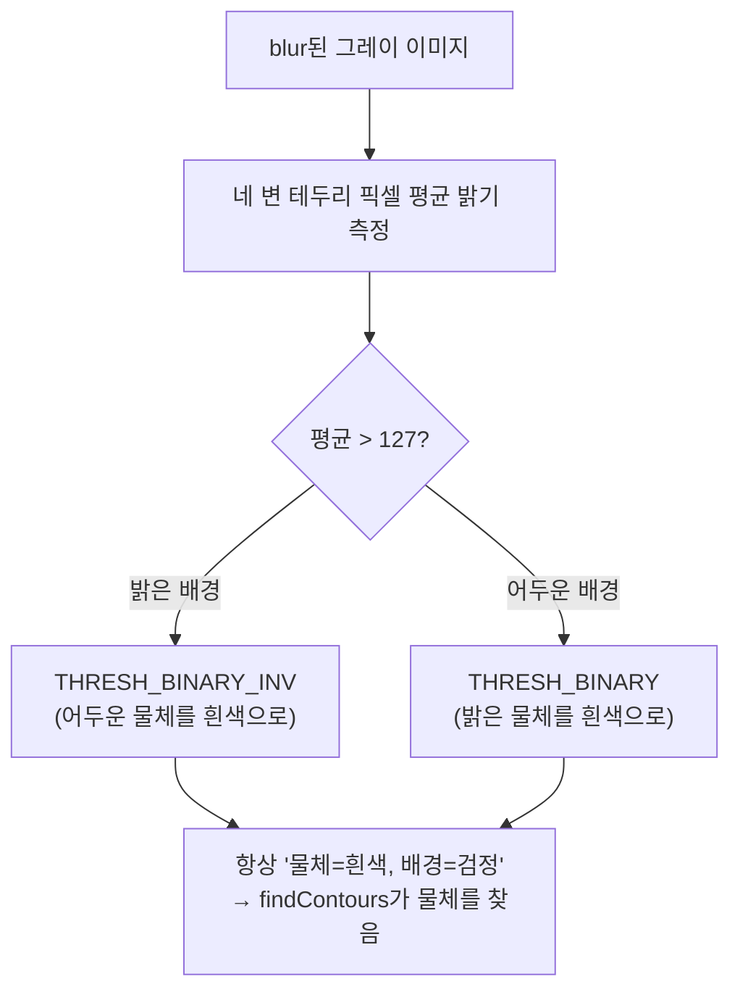

---
tags:
  - 학습
  - OpenCV
  - 비전
  - 이진화
  - 범용엔진
  - M1
created: 2026-07-06
---

# 09. 배경색 자동 판별 — 테두리 픽셀로 이진화 방향 결정하기

> 상위: [[학습 방법]] · [[M1 implementation plan]]
> 이전: [[07 convexHull로 원형도 보정 (톱니 둘레 펴기)]]
> 이 노트: convexHull까지 적용해 `test2.jpg`에서 **검출 8개 달성**. 그런데 `coin.png`(동전 1개, 투명 배경)를 넣으니 **검출 0개**. 원인을 추적하다 두 가지를 배운다 — ① **디버그 이미지가 엔진과 다른 이진화를 써서 우릴 속인 것**, ② **배경색에 따라 이진화 방향을 자동으로 바꿔야 범용 엔진이 된다**는 것.

> [!abstract] 한 줄 요약
> 이진화 방향(`BINARY` vs `BINARY_INV`)을 하나로 고정하면, 배경이 밝은 이미지와 어두운 이미지 중 한쪽에서만 동작한다. **이미지 테두리 픽셀의 평균 밝기**로 배경이 밝은지 어두운지 판별해, 항상 "물체=흰색, 배경=검정"이 되도록 방향을 자동 선택하면 둘 다 견딘다.

---

## 상황: test2는 8개인데 coin은 0개

- `test2.jpg` (동전 8개, **밝은 배경**) → convexHull 적용 후 **검출 8개** ✅
- `coin.png` (동전 1개, **투명→검정 배경**) → **검출 0개** ❌

같은 코드인데 이미지만 바꿨더니 결과가 갈렸다. 로그:

```
[DEBUG] contours = 1
[DEBUG]   area=638401.0  circ=0.785  bbox=(0,0 800x800)
검출 개수: 0
```

`bbox=(0,0 800x800)` = **이미지 전체**를 하나의 덩어리로 잡음. area 638401 ≈ 800×800의 거의 전부. → **배경 전체가 흰색(물체)으로 이진화됐다**는 신호.

---

## 함정 ①: 디버그 이미지가 거짓말을 했다

`debug_binary.png`를 열어보니 **동전이 예쁜 흰 원**으로 잡혀 있었다. "이진화 멀쩡한데 왜 0개지?" 하고 한참 헷갈렸다.

> [!danger] 범인 — 콘솔 디버그 이진화 ≠ 엔진 이진화
> 콘솔의 디버그 저장 코드와 엔진의 실제 이진화가 **방향이 반대**였다.
> ```cpp
> // 콘솔 디버그 저장 (InspectConsole.cpp)
> cv::threshold(..., cv::THRESH_BINARY | cv::THRESH_OTSU);      // 흰 원으로 보임
> // 엔진 실제 (Engine.cpp)
> cv::threshold(..., cv::THRESH_BINARY_INV | cv::THRESH_OTSU);  // 실제로 도는 것 (반대!)
> ```
> 우리가 눈으로 본 예쁜 흰 원은 콘솔의 `BINARY`가 그린 것이고, **엔진 안에서 실제로 도는 건 그걸 뒤집은 `BINARY_INV`**. 엔진 눈에는 배경이 흰색, 동전이 검정으로 보였다.

> [!warning] 교훈 — 디버그 코드는 실제 파이프라인과 "똑같이" 유지해야 한다
> 디버그용으로 따로 이진화를 돌리면, 그게 엔진 실제 로직과 조금이라도 다를 때 **틀린 확신**을 준다. "눈으로 확인"의 원칙([[06 검출 0개 재디버깅 (진짜 원인은 브릿지 미연결)]])은 옳지만, **확인하는 이미지가 진짜 파이프라인 것이어야** 의미가 있다. 일지에 "콘솔 디버그는 아직 BINARY 하드코딩이라 엔진(INV)과 안 맞음"이라고 이미 적어둔 미정리 항목이 실제로 우릴 물었다.

---

## 진짜 원인: 이진화 방향을 고정할 수 없다

두 이미지의 **배경색이 반대**라서 하나의 방향으론 둘 다 못 잡는다.

| 이미지 | 배경 | 동전 | Otsu가 나누면 | `BINARY_INV` 결과 |
|--------|------|------|--------------|-------------------|
| `test2.jpg` | **밝음(흰색)** | 어두움 | 배경=밝, 동전=어둠 | INV → **동전이 흰색** ✅ |
| `coin.png` | **투명→검정** | 밝은 회색 | 배경=어둠, 동전=밝 | INV → **배경이 흰색** ❌ |

`coin.png`는 투명 배경이라 `cvtColor(BGR2GRAY)` 후 배경이 **검정(0)** 이 된다. 동전(밝은 회색)보다 배경이 어둡다. `BINARY_INV`는 "어두운 걸 흰색으로" 만드니 → **배경을 흰색 물체로** 잡아버린다 → bbox가 이미지 전체.

> [!note] 이건 버그가 아니라 "범용 엔진"이 반드시 만나는 문제
> CLAUDE.md의 목표는 "도메인 비종속 **범용** 검사 엔진". "밝은 배경만 가정"하면 범용이 아니다. 배경이 밝을 수도, 어두울 수도 있다는 걸 엔진이 스스로 처리해야 한다.

---

## 해결: 테두리 픽셀로 배경색 자동 판별

### 핵심 아이디어

전제: **물체(동전)는 이미지 가운데 있고, 가장자리(테두리)는 거의 배경이다.** 검사 이미지에서 대체로 성립하는 합리적 가정.

→ **네 변의 테두리 픽셀 평균 밝기**를 내면 배경이 밝은지 어두운지 알 수 있다.



목표는 언제나 **"물체=흰색, 배경=검정"** 인 이진화. findContours가 흰색 덩어리를 물체로 찾기 때문.

우리 두 이미지 대입:

| 이미지 | 테두리 배경 | 판별 | 선택 |
|--------|------------|------|------|
| `test2.jpg` | 밝음 | >127 | `BINARY_INV` ✅ |
| `coin.png` | 검정 | <127 | `BINARY` ✅ |

### 개념 짚기 — Otsu는 "방향"을 정하지 않는다

> [!tip] THRESH_OTSU ≠ 방향
> `THRESH_OTSU`는 **임계값(threshold 숫자)을 자동으로 찾아라**는 뜻이지, 어느 쪽을 흰색으로 할지가 아니다. **방향은 `BINARY` vs `BINARY_INV`가 따로 정한다.**
> → 우리가 방향만 조건부로 바꿔주면 되고, 임계값은 Otsu가 계속 알아서 찾는다. `THRESH_OTSU`는 두 경우 다 그대로 `|`로 붙인다.

---

## OpenCV에서 쓰는 법 (개념)

```cpp
// 1) 테두리 네 변의 평균 밝기
//    위 한 행, 아래 한 행, 왼쪽 한 열, 오른쪽 한 열의 cv::mean() 평균
//    cv::mean(...)은 cv::Scalar 반환, 그레이 값은 [0]에 들어있음
double top    = cv::mean(blurred.row(0))[0];
double bottom = cv::mean(blurred.row(h - 1))[0];
double left   = cv::mean(blurred.col(0))[0];
double right  = cv::mean(blurred.col(w - 1))[0];
double borderMean = (top + bottom + left + right) / 4.0;

// 2) 방향 결정 (매직넘버는 이름 붙이기 — CLAUDE.md 하드코딩 금지)
const double kBgBrightThreshold = 127.0;
int threshType = (borderMean > kBgBrightThreshold)
                   ? cv::THRESH_BINARY_INV   // 밝은 배경 → 어두운 물체를 흰색으로
                   : cv::THRESH_BINARY;      // 어두운 배경 → 밝은 물체를 흰색으로
threshType |= cv::THRESH_OTSU;

cv::threshold(blurred, binary, 0, 255, threshType);
```

> [!note] 위치
> `blur → [여기: 테두리 평균 → 방향 결정] → threshold → morphology → findContours`
> 테두리 측정은 blur된 이미지에서 하면 노이즈에 덜 흔들린다.

---

## 직접 해볼 것 (이번 세션)

- [ ] `Engine.cpp` threshold 부분에서 **테두리 네 변 평균 밝기** 계산 **(직접 코딩)**
- [ ] 평균에 따라 `BINARY` / `BINARY_INV` 자동 선택하도록 변경 (Otsu는 그대로 유지)
- [ ] `127.0` 매직넘버는 이름 붙인 상수로
- [ ] 재빌드 후 **두 이미지 다** 실행:
  - `test2.jpg` → 여전히 **8개** 나오는지 (기존 동작 안 깨졌는지)
  - `coin.png` → 이제 **1개** 나오는지
- [ ] (정리) 콘솔의 디버그 이진화도 엔진과 같은 자동 판별로 맞추거나, 아예 디버그 코드 제거

> [!success] 기대 결과
> 배경색 자동 판별로 밝은 배경(test2)·어두운 배경(coin) 둘 다 검출 성공. 엔진이 "밝은 배경만" 가정하던 한계를 벗고 진짜 **범용**에 한 걸음. 포폴 서사: "이진화 방향을 하드코딩하지 않고, 테두리 통계로 배경을 추정해 방향을 자동 결정 — 도메인 비종속 설계."

> [!warning] 한계도 기억
> "물체가 가운데, 테두리는 배경"이라는 가정이 깨지면(물체가 프레임을 꽉 채우거나 테두리에 걸치면) 이 판별도 틀린다. 그럴 땐 히스토그램 기반·adaptiveThreshold 등 다른 전략 필요. 지금 단계에선 충분하지만 가정을 명시해 둔다.

---

## 관련 노트
- [[05 검출 0개 디버깅 (이진화 방향·튜닝)]] — 이진화 방향 문제를 처음 만난 곳
- [[06 검출 0개 재디버깅 (진짜 원인은 브릿지 미연결)]] — "추측 말고 눈으로" 원칙 (단, 보는 이미지가 진짜 파이프라인 것이어야 함 — 이번에 그 함정을 겪음)
- [[07 convexHull로 원형도 보정 (톱니 둘레 펴기)]] — 직전 단계, test2 8개 달성
