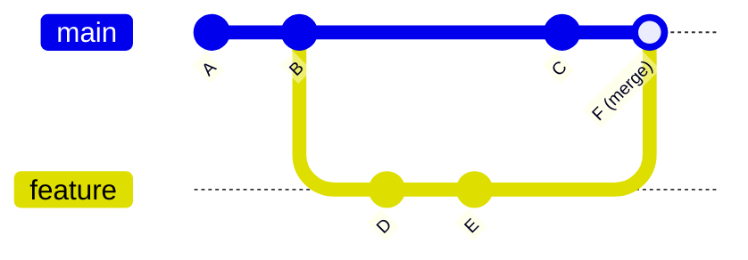
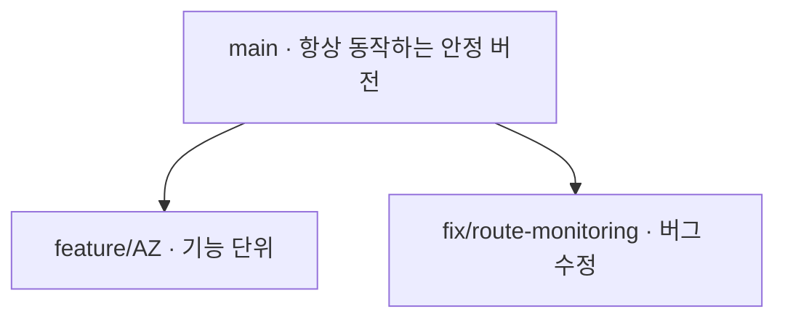
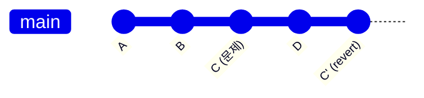
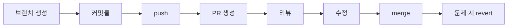

---
tags:
  - 학습
  - git
  - 협업
created: 2026-06-29
---

# Git & 협업 기본 개념 정리

## 1. Git과 GitHub의 차이

가장 많이 헷갈리는 부분인데, 둘은 완전히 다른 층위다.

| | Git | GitHub |
|---|---|---|
| **정체** | 버전 관리 **프로그램** (내 PC에서 돎) | Git 저장소를 올려두는 **웹 서비스** |
| **위치** | 로컬 (오프라인 가능) | 원격 서버 (클라우드) |
| **역할** | 변경 이력 기록·관리 | 협업·공유·백업·리뷰 |
| **대체재** | Mercurial 등 | GitLab, Bitbucket 등 |

> [!tip] 비유로 기억하기
> **Git은 워드의 "변경 내용 추적" 기능**, **GitHub는 그 파일을 공유하는 "구글 드라이브"**.
> Git 없이 GitHub는 의미 없고, GitHub 없이도 Git은 혼자 잘 돈다.

로컬에서 `git`으로 커밋하고, 이걸 GitHub에 `push`하면 원격 백업·공유가 되는 구조다.

---

## 2. commit, branch, merge 기본 개념

**commit (커밋)** — 변경사항을 하나의 "스냅샷"으로 저장하는 것. 의미 있는 작업 단위마다 찍는다.
- 각 커밋은 고유 ID(해시, `a81ed6f` 같은)를 가진다.
- "이 시점으로 되돌릴 수 있는 세이브 포인트"라고 생각하면 된다.

**branch (브랜치)** — 커밋들이 이어진 **독립된 작업 줄기**. `main`에서 가지를 쳐서 따로 작업한다.

**merge (병합)** — 갈라진 브랜치를 다시 하나로 합치는 것.



---

## 3. Pull Request의 목적

PR은 **"내 브랜치를 main에 합쳐주세요"라고 제안하는 요청서**다. GitHub의 기능이지 Git 자체 기능이 아니다.

핵심 목적 4가지:
1. **리뷰** — 합치기 전에 다른 사람(또는 미래의 나)이 코드를 본다
2. **토론** — 변경 의도를 설명하고 코멘트로 논의한다
3. **자동 검증** — CI(테스트/빌드)가 자동으로 돌아 깨진 코드를 차단한다
4. **기록** — "왜 이렇게 바꿨는지"가 영구히 남는다

---

## 4. 좋은 PR 작성법

> [!important] 핵심 한 줄
> **작게, 하나의 목적만.** 거대한 PR은 리뷰가 불가능하다.

좋은 PR 체크리스트:
- **제목**: 무엇을 했는지 한 줄로 (예: `feat: Route Planning 인라인 웨이포인트 테이블 수정 기능 추가`)
- **본문**: *왜* 필요한지, *어떻게* 했는지, *무엇을* 테스트했는지
- **스코프**: 한 PR = 한 가지 일 (리팩토링 + 기능을 섞지 않기)
- **자기 리뷰**: 올리기 전에 내 diff를 먼저 읽기
- **근거 자료**: 동작 결과를 보여주는 스크린샷이나 측정 수치 같은 정량 지표

본문 템플릿 예시:

```markdown
## 무엇을 (What)
무엇을 변경했는지 한 줄 요약

## 왜 (Why)
이 변경이 필요한 이유 / 해결하는 문제

## 어떻게 (How)
- 핵심 구현 방식 / 접근 방법

## 테스트 (Test)
- 어떻게 검증했는지 (테스트 케이스, 결과 수치 등)
```

---

## 5. 코드 리뷰 코멘트 받고 처리하는 법

리뷰어가 특정 코드 줄에 코멘트를 남기면:

1. **읽고 이해** — 방어적으로 받지 말고, 질문이면 답하고 지적이면 검토
2. **수정** — 동의하면 코드 고쳐서 **같은 브랜치에 새 커밋** push (PR이 자동 업데이트됨)
3. **답글** — 각 코멘트에 "고쳤습니다" 또는 "이건 이런 이유로 유지하겠습니다" 답변
4. **Resolve** — 해결된 코멘트는 `Resolve conversation`으로 닫기

> [!warning] 가장 나쁜 건 "무시"
> **모든 코멘트에 반응**하기. 동의하지 않아도 이유를 남기면 된다. 그냥 넘기는 게 제일 나쁘다.

---

## 6. 브랜치를 나누는 이유

1. **격리** — 실험하다 망쳐도 `main`은 안전
2. **병렬 작업** — 기능 A, 버그 B를 동시에 따로 진행
3. **안정성** — `main`은 항상 "동작하는 상태" 유지
4. **리뷰 단위** — 브랜치 = PR = 하나의 논리적 변경

흔한 전략 (포트폴리오에 적합):



> [!tip] 브랜치 이름 컨벤션
> `feature/`, `fix/` 같은 접두사로 종류를 표시하면 깔끔하다.

---

## 7. Conflict가 생기는 이유와 기본 대응

**왜 생기나** — 두 브랜치가 **같은 파일의 같은 줄**을 서로 다르게 고쳤을 때. Git이 "둘 중 뭐가 맞는지" 자동으로 판단 못 해서 사람에게 물어본다.

충돌 표시는 이렇게 파일에 나타난다:

```
<<<<<<< HEAD
int threshold = 10;
=======
int threshold = 20;
>>>>>>> feature
```

**기본 대응 순서:**
1. 당황하지 말기 (정상적인 일이다)
2. `<<<<<<<` ~ `>>>>>>>` 구간을 찾아서
3. **둘 중 올바른 코드를 선택**(또는 둘을 합침)하고 표시 마커 삭제
4. 저장 → `git add` → 커밋으로 충돌 해결 완료

> [!tip] 예방법
> 브랜치를 작게 유지하고, `main`을 자주 끌어와(`merge`/`rebase`) 동기화하면 충돌이 작아진다.

---

## 8. Merge 전 확인할 것

- [ ] **테스트/빌드 통과** — CI가 초록불인가
- [ ] **리뷰 승인** — 코멘트가 모두 해결됐는가
- [ ] **최신 main 반영** — main의 최신 변경을 내 브랜치가 포함했는가 (안 그러면 합친 뒤 깨질 수 있음)
- [ ] **스코프 확인** — 의도한 변경만 들어있나 (실수로 들어간 디버그 코드/파일 없나)
- [ ] **충돌 없음** — conflict가 해결됐나

> [!tip] 프로젝트 규칙도 함께 점검
> 코딩 컨벤션, 아키텍처 경계 같은 **프로젝트 고유 규칙**을 어기지 않았는지도 merge 전 확인 포인트다.

---

## 9. Revert와 안전한 복구 개념

> [!important] 핵심 원칙
> **역사를 지우지 말고, 되돌리는 새 기록을 남긴다.**

**`git revert`** — 특정 커밋의 변경을 **취소하는 새 커밋**을 만든다. 역사는 그대로 보존.



✅ 공유된(push된) 브랜치에서 안전. 협업의 정석.

**`git reset`** — 커밋을 **아예 없던 일로** 되돌린다(역사 변경).

⚠️ 혼자 작업한 로컬에서만. **이미 push해서 남과 공유된 브랜치엔 절대 쓰지 말 것** (남의 역사가 꼬인다).

| 상황 | 도구 |
|---|---|
| 공유된 브랜치에서 잘못된 커밋 되돌리기 | `git revert` ✅ |
| 로컬에서 아직 push 안 한 커밋 정리 | `git reset` |
| 실수로 reset 했는데 복구하고 싶다 | `git reflog`로 잃어버린 커밋 찾기 |

---

## 전체 흐름 한눈에



> [!note] 다음 단계
> 위 흐름을 **실제로 한 번 연습**해보면 개념이 확실히 박힌다.
> 작은 브랜치를 하나 만들어 커밋 → push → PR → merge까지 직접 밟아보는 게 가장 좋은 연습이다.
