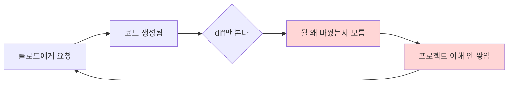
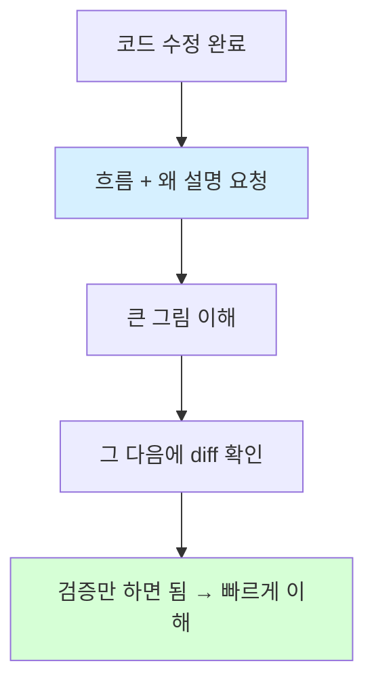
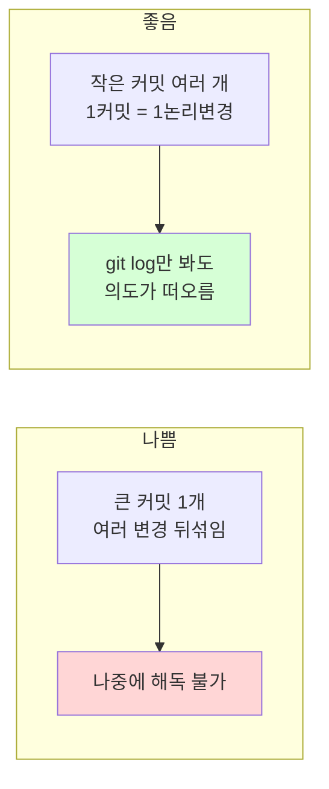
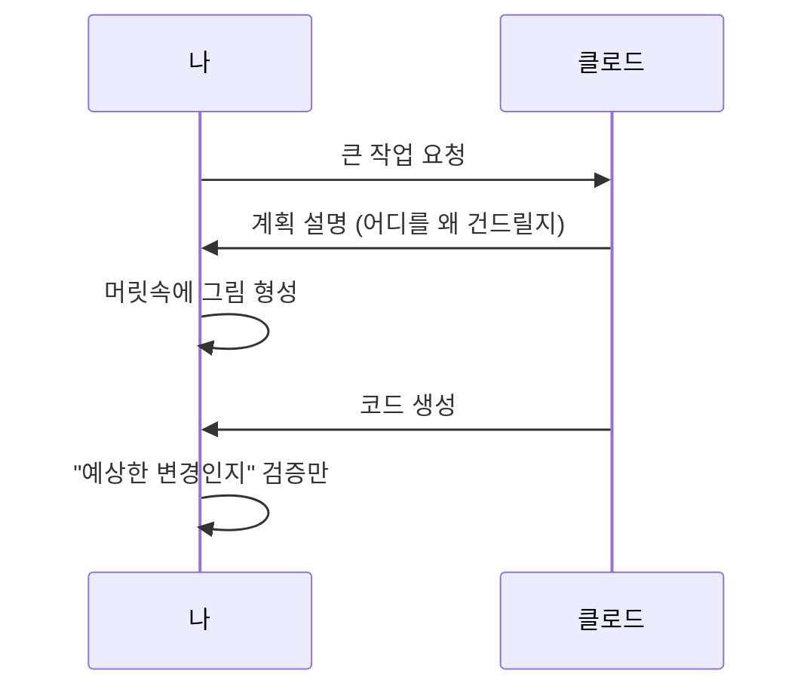

> [!summary]
> 바이브코딩의 핵심 문제는 **"코드는 늘어나는데 머릿속 모델은 안 늘어난다"**는 것.
> diff를 혼자 해독하지 말고 ① 작업 직후 흐름+이유 설명받기 → ② 작은 커밋 + "왜" 남기기 → ③ 큰 작업은 계획 먼저 받기,
> 이 세 가지 습관으로 "코드 이해"와 "프로젝트 이해"를 동시에 쌓는 것이 목표.

## 왜 파악이 어려운가 — 먼저 큰 그림부터

말로 풀면: 코드를 받아서 diff만 들여다보는 루프는, 결과물(코드)은 쌓이지만 **이해(머릿속 모델)는 제자리**다.
끊어내려면 "코드를 받는 행위"와 "이해하는 행위"를 분리해서, 이해 단계를 의도적으로 끼워 넣어야 한다.

---

## 1. 작업 직후 "설명 받기"를 루틴으로 (효과 가장 큼)

코드를 받자마자 diff를 읽지 말고, **먼저 설명을 시킨다.**

요청 예시:

| 목적 | 요청 문구 |
| --- | --- |
| 변경 이유 | "방금 수정한 거 한 줄씩 왜 그렇게 했는지 설명해줘" |
| before/after | "이 변경 없으면 무슨 일이 벌어지고, 있으면 어떻게 흐르는지 비교해줘" |
| 호출 경로 추적 | "이 함수가 호출되는 경로를 추적해서 보여줘" |

> [!tip]
> Route Monitoring 버그 분석 때 받았던 **"표 + 호출 흐름"** 형태가 바로 이것.
> `RouteMonitoringDialog.qml → stopRouteMonitoring() → SessionStore` 처럼 흐름을 그려받고 나서 diff를 보면 훨씬 빨리 들어온다.

---

## 2. 커밋을 "이해의 단위"로 쪼개기

- **한 커밋 = 한 가지 논리적 변경**으로 작게 유지. (예: Route Monitoring Unload 1줄 수정)
- 커밋 본문에 **"왜"**를 남긴다. "~하지 않아 ~되던 문제를 수정" 형태면, 코드를 안 읽어도 의도를 안다.

> [!note]
> 커밋 메시지를 꼼꼼히 챙기는 습관은 이미 좋은 방향. 여기서 "작게 쪼개기"와 "왜 남기기"만 더하면 된다.

---

## 3. 변경 전에 "계획"을 먼저 받기

코드부터 받지 말고, 큰 작업은 **"바로 고치지 말고 어떻게 할지 계획부터 설명해줘"**라고 요청한다.

- 어디를 왜 건드릴지 미리 그림이 생긴다.
- 받은 코드가 "예상했던 그 변경"인지 **검증만** 하면 되니 이해가 쉽다.

---

## 4. 프로젝트 자체 이해 — 문서를 같이 만들기

diff가 안 읽히는 근본 원인은 "프로젝트 구조를 모름". 이건 코드 이해와 별개로 **누적**해야 한다.

> [!info]
> 새 기능/모듈을 만질 때마다 머메이드 다이어그램 + 쉬운 설명으로 문서를 만들어 `docs/`(또는 Obsidian)에 누적한다.

요청 예시:
- "이 기능 흐름을 머메이드 다이어그램이랑 쉬운 설명으로 문서 만들어줘"
- "이 모듈이 프로젝트 어디에 속하고 누가 호출하는지 지도 그려줘"

---

## 5. 받은 코드는 "한 군데라도 직접 손대보기"

작더라도 변수명을 바꿔보거나 로그를 한 줄 넣어본다.

> [!important]
> 직접 타이핑한 코드는 머리에 남고, 복붙만 한 코드는 안 남는다.

---

## 정리 — 우선순위

| 순위 | 습관 | 한 줄 요약 |
| --- | --- | --- |
| 1 | 작업 직후 설명받기 | diff 읽기 전에 "흐름 + 왜"부터 |
| 2 | 작은 커밋 + "왜" | 1커밋 1변경, 본문에 의도 |
| 3 | 계획 먼저 | 코드 전에 그림부터 |
| 4 | 흐름 문서 누적 | 프로젝트 이해는 별도로 쌓기 |
| 5 | 직접 손대보기 | 복붙은 안 남는다 |

---

[[작업일지]] · [[리팩토링]]
